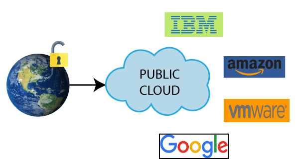

## [1] 클라우드 서비스의 필요성

몇 년 전까지만 하더라도 웹 서비스를 만들기 위해서는 서버를 구매하고,
서버를 물리적으로 구축해야 했습니다. '물리적으로 구축한다'는 말은
사무실이나 가정에서 서버용 컴퓨터를 구매해 설치하고, 컴퓨터에 운영
체제와 함께 필요한 프로그램 등을 세팅하는 것을 의미합니다. 그리고 서버를
구축하고 나면, 이제는 서버를 관리하기 위한 인력이 필요합니다. 서버
관리가 필요한 이유는 정말 다양합니다. 가장 심각한 경우는 서버 컴퓨터
자체가 고장나거나 서버가 위치한 장소에서 화재가 발생하는 상황 등이
있습니다. 이외에도 서버의 성능을 높이기 위해 하드웨어를 업그레이드하거나
서버의 운영 체제 또는 프로그램의 버전을 업그레이드해야 하는 경우도
있습니다. 특히, 소프트웨어 개발 과정에서 서버에 설치된 프로그램을 자주
업데이트하게 되는데, 이럴 때마다 운영 체제와의 충돌 또는 다른
라이브러리나 프로그램과의 충돌 때문에 업그레이드 과정에서 많은 시간이
소요되는 경우가 많습니다.

물리적인 서버의 가장 결정적인 문제는 바로 서비스를 운영하는 데 필요한
컴퓨팅 자원을 예측하고, 그에 맞는 서버를 구성하기가 어렵다는 점입니다.
예를 들어, 서비스 초기에는 보통 성능의 서버 컴퓨터 1대로도 서비스를
원활하게 운영할 수 있었지만 서비스가 발전하고 고객이 늘어나면서 서버를
증설해야 하는 경우가 발생합니다. 하지만 필요한 서버의 성능을 정확히
예측하기 힘들고 때로는 구축한 서버의 성능보다 적은 규모의 연산량만
필요하게 되어서 자원을 낭비하게 되기도 합니다. 결론적으로 물리적인
서버를 사용해 웹 서비스를 만들기 위해서는 많은 비용과 시간, 그리고
노력이 필요합니다.

이런 문제를 해결하기 위해 등장한 것이 클라우드 서비스입니다. 클라우드
서비스는 물리적인 서버를 구매하고 설치하는 과정을 생략하고, 인터넷을
통해 가상의 컴퓨터, 즉 가상 서버를 대여하는 방식입니다. 몇 번의
클릭만으로 전 세계 어디에든 서버를 바로 구축할 수 있고, 언제든 서버를
늘리고 줄일 수 있어 웹 서비스 개발자들에게 큰 인기를 얻고 있습니다.
이처럼 가상의 서버를 제공하는 업체를 클라우드 서비스 제공 업체라고
합니다. 클라우드를 이용하면 서버를 구매하고 설치하는 과정을 생략할 수
있고, 가상 서버들이 동작하는 실제 물리적 서버의 관리는 클라우드 서비스
제공 업체에서 전담하기 때문에 비용과 시간을 절약할 수 있습니다. 이러한
장점 때문에 많은 기업에서 클라우드 서비스를 사용하고 있습니다.

