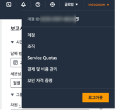
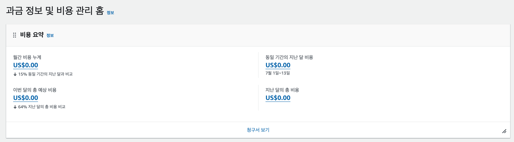
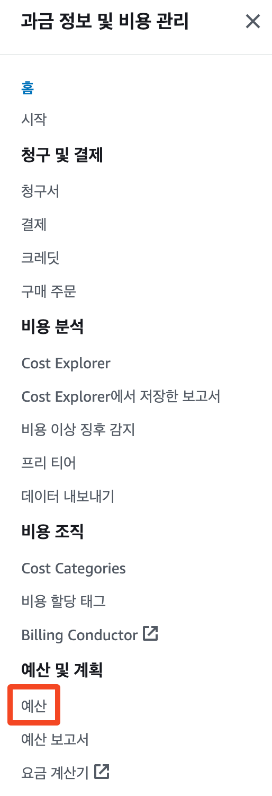
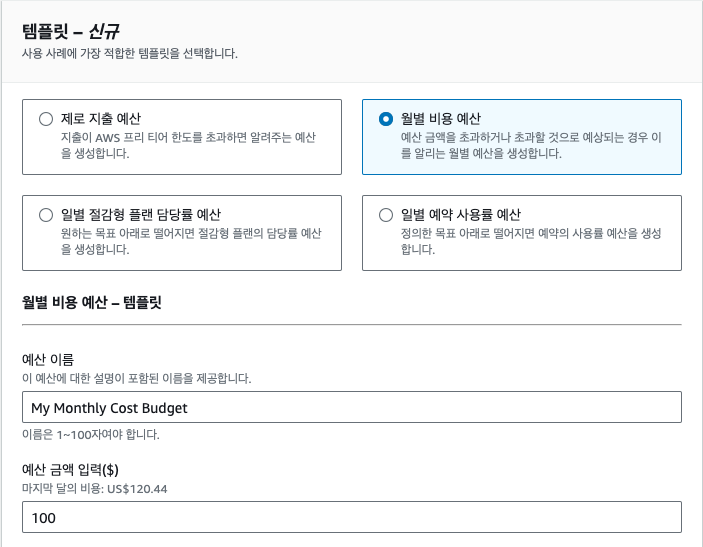
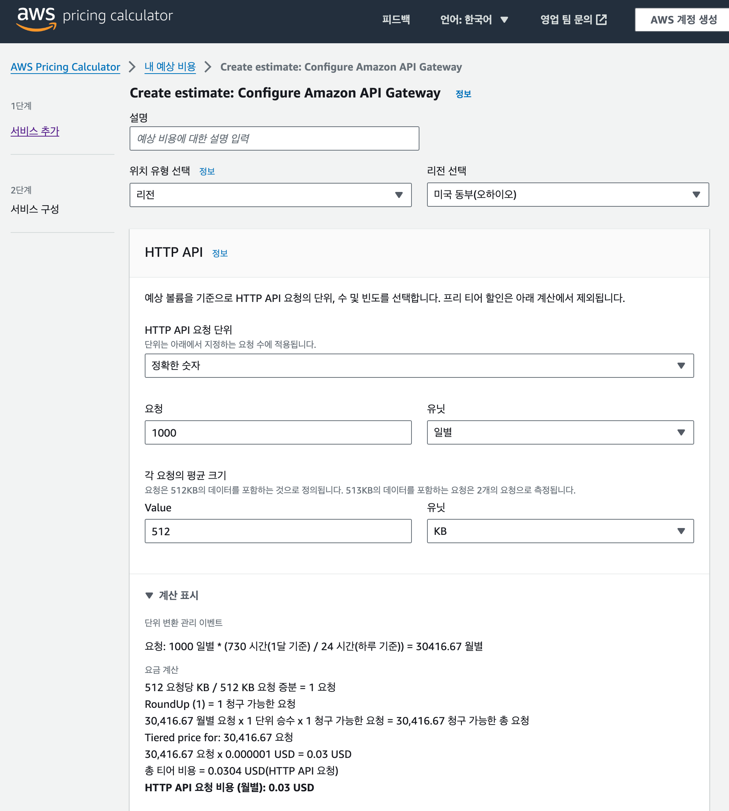

## [4] 비용 모니터링

AWS에서는 비용을 효과적으로 관리하기 위한 다양한 도구와 기능을
제공합니다. 이 중에서도 Cost Explorer는 사용자가 AWS 비용과 사용량
데이터를 시각적으로 볼 수 있게 제공해 주는 강력한 도구입니다. 이를
활용하면 과금 항목별로 비용을 분석하고, 예상 비용을 산정하는 등의 작업을
수행할 수 있습니다.

### 실시간 비용 확인

AWS 콘솔의 상단 메뉴에서 "결제 및 비용 관리"를 클릭하면 현재까지의
비용을 확인할 수 있습니다. 화면에서는 현재까지의 비용을 확인할 수 있을
뿐만 아니라, 예상 비용을 확인할 수도 있습니다. 예상 비용은 현재까지의
사용량을 기반으로 현재 달의 예상 비용을 계산한 값입니다. 만일 서비스
사용량이 없는 경우 당연히 예상 비용도 0원으로 표시됩니다.

만일 어떤 서비스로부터 요금이 부과되었는지를 자세히 살펴보고 싶다면 메뉴
좌측의 Cost Explorer를 클릭하면 됩니다. Cost Explorer는 AWS 비용과
사용량 데이터를 시각적으로 볼 수 있는 강력한 도구입니다. Cost Explorer를
사용하면 과금 항목별로 비용을 분석하고, 예상 비용을 산정하는 등의 작업을
수행할 수 있습니다.

### 월 사용 예산 제한하기

AWS를 사용할 때 주의할 점은 의도치 않게 설정된 서비스로 인해 과다한
요금이 청구되는 것입니다. 이를 막기 위해서는 월 사용 예산을 설정해 두는
것이 좋습니다. 월 사용 예산을 설정하면 예산을 초과하는 경우 알림을 받을
수 있습니다. 또한, 예산을 초과하는 경우에는 AWS에서 자동으로 서비스를
중단시켜 비용을 절감할 수 있습니다. 추가적으로 알림을 받을 이메일을
입력해 경고 메일을 받을 수 있습니다.

좌측 메뉴에서 '예산'을 클릭하면 예산 목록 대시보드로 이동합니다. 여기서
'예산 생성'을 클릭합니다. 예를 들어 한 달에 100달러 이상 지출하고 싶지
않다면 다음과 같이 설정할 수 있습니다.

### 비용 계산기

만일 내가 만들고자 하는 서비스가 대략적으로 어느 정도의 비용을
부과할지를 알고 싶다면 AWS에서 제공하는 비용 계산기를 사용하면
편리합니다. 각 서비스의 구성을 선택하면 해당 서비스를 사용하는데 필요한
비용을 계산해 줍니다. 비용 계산기는 다음 링크에서 확인할 수 있습니다.

https://calculator.aws/#/

