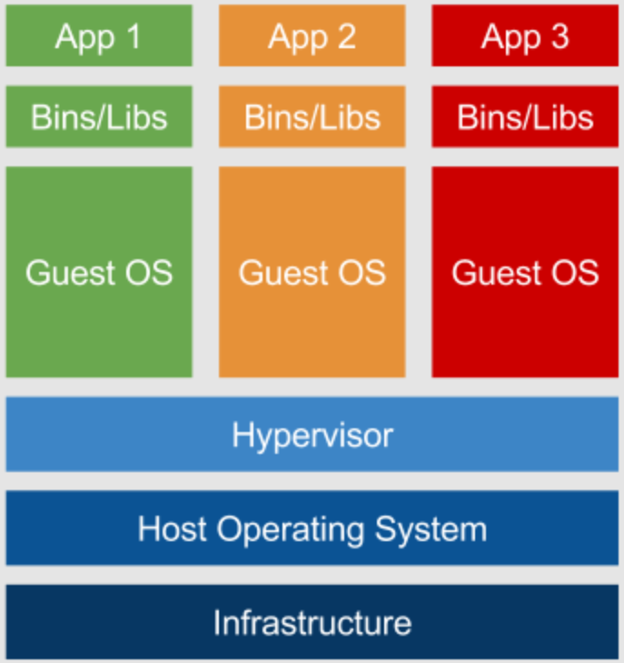
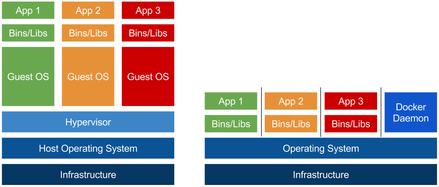
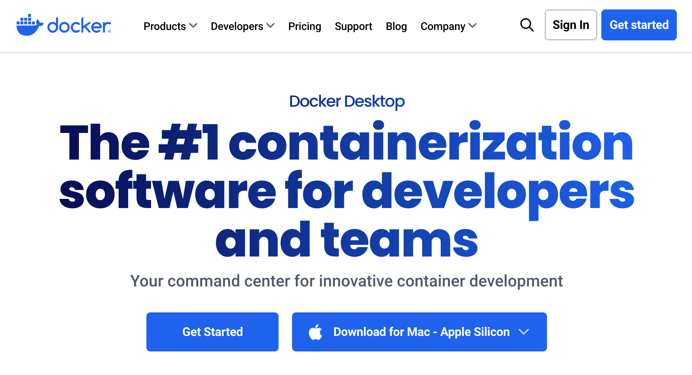
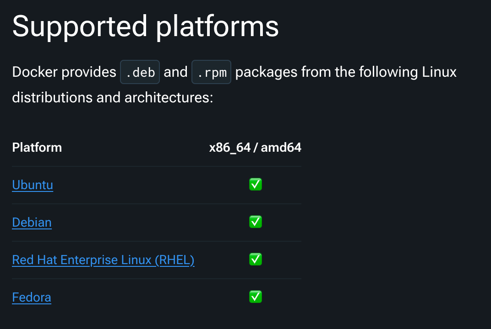
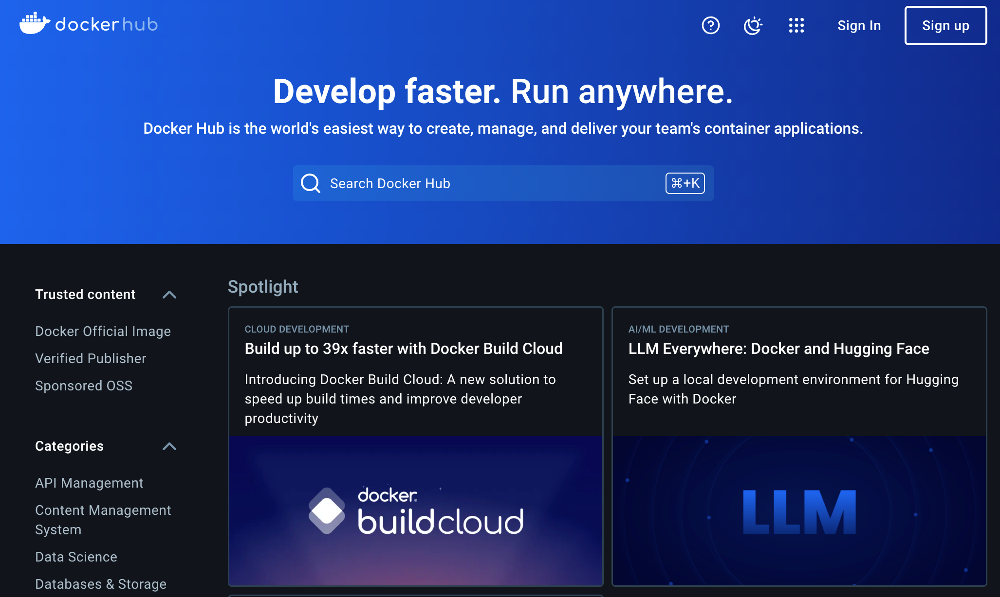

## [5] 클라우드와 도커

### 가상화 기술

클라우드 서비스를 배우기 전에 현대 서버 개발에서 필수로 사용되는 기술인
가상화 기술에 대해 알아야 합니다. 가상화 기술이란 하나의 컴퓨터에서 여러
개의 컴퓨터를 동시에 사용할 수 있도록 하는 기술입니다. 해당 기술을
사용하면 하나의 컴퓨터를 여러 개의 컴퓨터처럼 사용할 수 있기 때문에
하나의 컴퓨터에서 여러 개의 운영 체제를 설치하고, 여러 개의 프로그램을
실행할 수 있습니다.



고전적인 가상화 기술은 컴퓨터에서 하이퍼바이저(Hypervisor)라는
소프트웨어를 실행하는 방식을 사용합니다. 이때 하이퍼바이저를 실행하는
컴퓨터를 호스트, 실행되는 가상 컴퓨터를 게스트라고 부릅니다.
하이퍼바이저는 호스트 컴퓨터에서 여러 개의 운영 체제를 실행할 수 있도록
해주는 소프트웨어입니다. 하이퍼바이저는 호스트의 CPU, 메모리, 디스크와
같은 하드웨어를 여러 개의 가상 머신, 또는 VM(Virtual Machine)이라는
가상의 컴퓨터로 분할하고, 각 가상 머신에 운영 체제를 설치합니다. 이렇게
하이퍼바이저를 사용하면 하나의 컴퓨터에서 여러 개의 운영 체제를 실행할
수 있고, 각각의 운영 체제에서 여러 개의 프로그램을 실행할 수 있습니다.

하지만 하이퍼바이저를 사용하면 여러 개의 운영 체제를 실행하기 위해
호스트 하드웨어를 여러 개의 가상 머신으로 분할한 다음 각 게스트 운영
체제에서 사용할 수 있도록 하드웨어를 가상화하는 단계를 거칩니다. 이러한
과정에서 게스트에서 사용하는 하드웨어는 실제 하드웨어보다 성능이
저하됩니다. 한 가지 문제는 호스트의 하드웨어가 분할되기 때문에 각 가상
머신에 할당된 하드웨어를 다른 가상 머신에서는 사용할 수 없습니다. 위의
그림에서 호스트가 CPU 코어를 9개 가지고 있다고 가정할 때 각 게스트가
CPU를 3개씩 할당 받았다고 생각해 보겠습니다. 이때, App1이 실제로 코어를
1개만 사용한다면 2개의 코어는 사용하지 않는 상태로 남게 됩니다. 하지만
이렇게 남는 코어를 다른 게스트에서 사용할 수 없기 때문에 이 CPU 자원은
그대로 낭비됩니다. 서버의 하드웨어 성능은 곧 서버 비용과도 직결되는
문제이기 때문에 가상화 과정에서 발생하는 성능 저하는 상당한 비용
부담으로 이어지게 됩니다.

### 도커(Docker)의 등장

이러한 문제를 해결하기 위해 등장한 것이 컨테이너(Container)입니다.
컨테이너는 하이퍼바이저와 달리 운영 체제를 가상화하지 않고, 운영 체제의
커널을 공유하는 방식으로 사용합니다. 컨테이너는 운영 체제에서 하나의
프로세스로 동작하기 때문에 컨테이너에서 사용하는 하드웨어는 실제
하드웨어와 동일한 성능을 가집니다. 만일, 한 컨테이너에서 CPU를 많이
사용하지 않는다면 남은 CPU를 다른 컨테이너에서 사용할 수도 있습니다.



컨테이너 기술 자체는 오래 전에 나왔지만, 도커(Docker)는 컨테이너 기술을
일반 사용자가 쉽게 사용할 수 있도록 만든 덕분에 컨테이너 기술이 대중화될
수 있었습니다. 도커는 컨테이너를 사용하기 위한 플랫폼으로 컨테이너를
쉽게 만들고 실행할 수 있도록 도와줍니다. 도커를 사용하면 컨테이너 사용을
위한 복잡한 설정 과정을 생략할 수 있습니다. 또한, 리눅스 운영 체제에서
실행되고, 컨테이너가 호스트의 커널을 공유하기 때문에 도커에서 실행되는
컨테이너는 리눅스 운영 체제를 사용합니다.

#### 도커 설치와 도커 CLI

사용하는 컴퓨터에 도커를 설치하려면 Docker Desktop을 설치하면 도커
사용에 필요한 모든 도구가 한꺼번에 설치되기 때문에 매우 편리합니다.

https://www.docker.com/products/docker-desktop/

위 주소로 접속하면 자신의 운영체제에 맞는 프로그램이 이미 선택되어 있을
것입니다. 만일 올바르지 않은 운영체제라면 드롭다운 버튼을 통해 자신의
운영체제에 맞는 프로그램을 선택하세요. 버튼을 누르면 설치 파일이
다운로드됩니다.



다만 리눅스의 경우는 각 리눅스 배포판마다 지원 여부와 설치 방법이 약간씩
다르기 때문에 다운로드 버튼을 눌렀을 때 이동되는 페이지에서 자신의
리눅스 배포판에 맞는 설치 방법을 별도로 확인하시기 바랍니다.



다음은 도커를 사용하기 위해 알아야 할 기본적인 CLI(Command Line
Interface) 명령어들을 소개하겠습니다. 도커 CLI는 터미널에서 도커를
제어하는 데 사용되는 명령어입니다. 가장 기본적인 명령어로는 `docker
run`이 있습니다. 이 명령어는 도커 이미지를 실행하여 컨테이너를
생성합니다. 예를 들어, `docker run hello-world`는 `hello-world`
이미지를 실행하여 간단한 메시지를 출력합니다.

다음으로 알아야 할 명령어는 `docker ps`입니다. 이 명령어는 현재 실행
중인 모든 컨테이너의 목록을 보여줍니다. `docker ps -a` 명령어를
사용하면 중지된 컨테이너를 포함한 모든 컨테이너의 목록을 볼 수 있습니다.

`docker images` 명령어는 로컬에 저장된 모든 도커 이미지의 목록을
보여줍니다. 이를 통해 사용 가능한 이미지들을 확인할 수 있습니다. 새로운
이미지를 다운로드하려면 `docker pull` 명령어를 사용합니다. 예를 들어,
`docker pull ubuntu`는 Ubuntu의 최신 이미지를 다운로드합니다.

이러한 기본적인 명령어들을 익히면 도커를 사용하여 컨테이너를 생성하고
관리하는 데 큰 도움이 될 것입니다. 도커를 더 깊이 이해하고 활용하기
위해서는 이 외에도 많은 명령어와 개념들을 학습해야 하지만, 이러한
기초적인 명령어들만으로도 도커의 기본적인 사용이 가능합니다.

#### 도커 이미지

도커 이미지는 우리가 컴퓨터에서 사용하는 어플리케이션을 실행하기 위해
필요한 모든 파일과 설정 정보를 하나의 패키지처럼 묶어놓은 것을 말합니다.
마치 컴퓨터 프로그램을 설치할 때, 설치 파일 하나로 모든 것을 설치하듯이,
도커 이미지 하나로 어플리케이션 실행에 필요한 모든 환경을 구축할 수
있습니다.

이미지를 더 자세히 설명하자면, 이미지는 어플리케이션 코드, 라이브러리,
시스템 도구, 환경 변수 등 어플리케이션 실행에 필요한 모든 것을 포함하고
있습니다. 이렇게 이미지를 만들어 놓으면, 언제 어디서든 동일한 환경에서
어플리케이션을 실행할 수 있다는 장점이 있습니다. 마치 레고 블록을
조립하듯이, 미리 만들어진 이미지를 이용하여 다양한 어플리케이션을 쉽고
빠르게 실행할 수 있습니다.

도커 이미지는 변경할 수 없는 읽기 전용 파일이기 때문에, 한번 만들어진
이미지는 안전하게 보관하고 재사용할 수 있습니다. 또한, 도커 이미지는
다른 사람들과 공유할 수도 있어서, 누구나 쉽게 동일한 환경을 구축하고
어플리케이션을 실행할 수 있습니다.

#### 도커파일

Dockerfile은 마치 레고 조립 설명서처럼, 도커 이미지를 만드는 과정을
순서대로 정의하는 텍스트 파일입니다. 이 파일 안에 어떤 명령어들을
적느냐에 따라 최종적으로 만들어지는 이미지의 구성이 달라집니다.

Dockerfile의 기본적인 문법은 매우 간단합니다. 각 명령어는 한 줄에 하나씩
작성하며, 명령어 앞에는 해당 명령어의 기능을 나타내는 키워드가 옵니다.
간단한 Dockerfile 예시는 다음과 같습니다.

- FROM: 새로운 이미지를 만들 때 기반이 되는 이미지를 지정합니다.

- RUN: 이미지 빌드 시 실행할 명령어를 지정합니다.

- COPY: 호스트 컴퓨터의 파일을 이미지 내부로 복사합니다.

- WORKDIR: 이미지 내에서 작업할 디렉토리를 설정합니다.

- EXPOSE: 컨테이너 내에서 실행되는 서비스의 포트를 노출시킵니다

- CMD: 컨테이너가 시작될 때 기본적으로 실행할 명령어를 지정합니다.

```bash
# 기본 이미지로 Ubuntu를 사용
FROM ubuntu:latest

# 시스템 업데이트 및 Python 설치
RUN apt-get update && apt-get install -y python3

# 작업 디렉토리 설정
WORKDIR /app

# 현재 디렉토리의 모든 파일을 /app 디렉토리로 복사
COPY . /app

# 컨테이너 시작 시 실행할 명령어
CMD ["python", "app.py"]
```

클라우드에서 작업하려면 도커 이미지를 빌드하기 위해 도커파일을 직접
작성해야 하는 경우가 많습니다. 따라서 기본적인 도커 이미지 문법을
이해하고 파일을 작성하는 방법을 익혀 놓는 것이 좋습니다.

#### 도커 컨테이너

도커 컨테이너는 미리 만들어 놓은 도커 이미지를 실행하는 독립적인
공간이라고 생각하면 됩니다. 마치 컴퓨터에서 프로그램을 설치하고 실행하는
것과 비슷하지만, 도커 컨테이너는 훨씬 가볍고 빠르게 실행됩니다.

도커 이미지가 어플리케이션 실행에 필요한 모든 파일과 설정을 담고 있다면,
도커 컨테이너는 이 이미지를 기반으로 실제로 어플리케이션을 실행하는
공간입니다. 컨테이너는 각각 고립된 환경을 가지고 있어서, 하나의
컨테이너에서 문제가 발생하더라도 다른 컨테이너에 영향을 미치지 않습니다.
이는 여러 개의 어플리케이션을 동일한 서버에서 안전하게 실행할 수 있도록
해줍니다.

또한, 도커 컨테이너는 만들고 삭제하는 데 필요한 과정이 빠르게
수행됩니다. 컨테이너는 컴퓨터 프로그램과 동일하기 때문에 프로그램을
실행하고 종료하는 것처럼 간단하게 컨테이너를 관리할 수 있습니다. 이러한
컨테이너의 특징 덕분에, 개발 환경 구축, 테스트, 배포 등 다양한 분야에서
활용되고 있습니다.

#### 도커 레지스트리

도커 레지스트리는 도커 이미지를 저장하고 관리하는 서버를 의미합니다.
마치 컴퓨터의 파일을 저장하는 저장소처럼, 도커 레지스트리는 다양한 도커
이미지들을 모아두는 역할을 합니다. 이렇게 저장된 이미지들은 필요할 때
언제든지 꺼내 사용할 수 있습니다.



도커 허브는 가장 많이 사용되는 공개 도커 레지스트리 중 하나입니다. 마치
이미지를 공유하는 거대한 도서관과 같이, 도커 허브에는 전 세계 개발자들이
만들어 공유한 수많은 도커 이미지들이 저장되어 있습니다. 즉, 도커 허브를
통해 누구나 자신이 만든 이미지를 공유하고, 다른 사람들이 만든 이미지를
가져다 사용할 수 있습니다.

도커 허브 외에도 개인이나 기업에서 운영하는 사설 도커 레지스트리가
존재합니다. 사설 레지스트리는 보안이 중요하거나 특정 환경에 맞춰
커스터마이징된 이미지를 관리하는 경우에 유용하게 사용됩니다.

<blockquote>
[TIP] 윈도우 운영 체제에서의 사용

예외적으로 윈도우 운영 체제에서는 윈도우 커널을 사용해 윈도우 컨테이너를
실행합니다. 윈도우에서 리눅스 컨테이너를 실행하게 되면 가상 머신에서
실행되는 리눅스 커널을 사용하게 됩니다. 하지만 윈도우와 리눅스
컨테이너를 동시에 실행하려면 WSL(Windows Subsystems for Linux)라는
기능을 추가로 설치해야 합니다. 물론, 컨테이너가 호스트 운영 체제의
커널을 공유하기 때문에 리눅스 운영 체제에서 커널이 다른 윈도우
컨테이너를 실행할 수는 없습니다. 클라우드에서 도커를 사용하는 환경은
대부분 리눅스 운영 체제입니다.

<blockquote>
