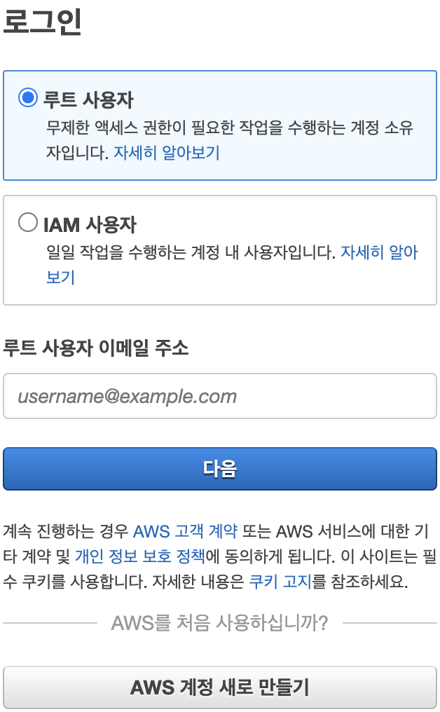

## [1] IAM(Identity and Access Management)의 개념

AWS의 사용자 계정에는 두 가지 종류가 있습니다. 결제 관리를 포함한 계정의
모든 권한을 가지고 있는 루트 사용자와 AWS를 사용해 서비스를 관리 및
개발하는 IAM 사용자입니다. 이런 이유에서 AWS 콘솔에 로그인할 때도 두
가지 사용자 중 하나를 선택하도록 되어 있습니다.

루트 사용자는 관리 목적 이외에 다른 용도로는 사용하지 않아야 보안 위협을
줄일 수 있습니다. 특히, 루트 사용자 계정이 탈취되면 고객센터를 통해
복구해야 하는데 그 과정이 매우 복잡하고 까다롭습니다. 따라서 루트
사용자에는 MFA(Multi-factor authentication)를 설정해 두고 평상시에는
사용하지 않도록 합니다.

지금과 같이 AWS의 다양한 기능을 사용해 서비스를 관리하고 개발하는
경우에는 IAM 사용자 계정을 사용하면 됩니다. IAM 사용자 계정은 AWS
콘솔에서 IAM 메뉴를 통해 생성하는 사용자이고, IAM 사용자는 한 사람 또는
하나의 AWS 애플리케이션을 의미합니다. 각각의 IAM 사용자 계정은 AWS
서비스에 접근할 때 사용되는 키로 ID에 해당하는 액세스 키(Access Key)와
비밀번호에 해당하는 비밀 액세스 키(Secret Access Key)가 주어집니다.
IAM은 AWS 리소스에 대한 접근 권한을 안전하게 제어하는데 사용되는
서비스로 이것을 사용하면 사용자가 접근할 수 있는 AWS 리소스를 중앙에서
쉽게 관리할 수 있습니다.