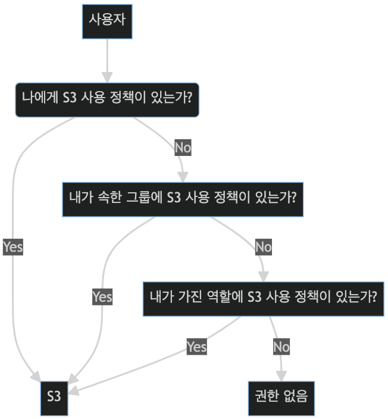

## [3] 현업에서의 IAM 사용 예시

AWS 서비스 중 하나인 S3을 사용자 또는 애플리케이션이 사용할 수 있는지의
여부에 대해 특정 과정을 통해 확인해 보겠습니다. S3이란 문서나 사진 같은
파일을 저장하고. 각 파일에 부여된 URL로 파일을 다운로드 받을 수 있는
서비스입니다.

### 사용자에게 정책이 있는지 확인

사용자에게 정책이 있는지를 확인하는 순서는 다음과 같습니다. 가장 먼저
사용자 자체에 부여된 정책이 있는지를 확인합니다. 정책이 있다면 곧바로
S3을 사용하고, 정책이 없다면 사용자가 속한 사용자 그룹에 정책이 있는지를
확인합니다. 정책이 있다면 S3을 사용할 수 있고, 없다면 본인이 가진 역할
중에서 S3의 사용 정책이 있는 역할 유무를 확인합니다. 만일, 역할 중
정책이 있는 역할이 있다면 사용이 가능하지만 없다면 해당 사용자는 S3에
대한 사용 권한이 없습니다.

### 서비스에 정책이 있는지 확인

여기에서는 도커 컨테이너를 실행하는 서비스인 람다가 S3를 사용할 수
있는지 확인하는 방법을 살펴보겠습니다. 서비스의 경우, 유일한 판단 기준은
역할입니다. 즉, 서비스가 부여받은 역할이 사용하고자 하는 리소스에 대해
정책을 가지고 있는지만 확인합니다. 역할에 사용 정책이 부여되어 있다면
사용이 가능하지만, 없다면 접근 권한이 없습니다.

