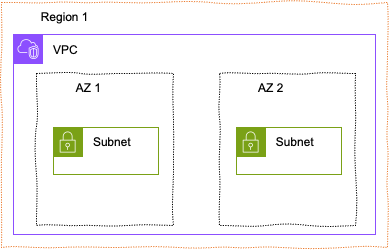
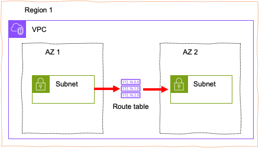

## [3] 서브넷(Subnet)의 개념

서브넷은 큰 네트워크 안에 있는 작은 네트워크를 의미하는데 IP 네트워크를
논리적으로 세분화한 것으로 하나의 네트워크를 두 개 이상의 네트워크로
나누는 작업입니다. 서브넷을 사용하면 한 서버에서 다른 서버의 경로를
단순화해서 네트워크를 더욱 효율적으로 만들 수 있습니다.

서브넷 내부의 네트워크 트래픽은 불필요한 라우터를 거치지 않고 짧은
거리를 이동해 목적지에 도달할 수 있습니다. 만일, 외부 네트워크에서
데이터가 수신되는 경우에는 데이터가 목적지까지 효율적으로 도달하도록
서브넷별로 데이터를 라우팅하게 됩니다. 이때, 사용되는 것이 라우팅
테이블로 서로 다른 네트워크 사이를 어떻게 연결할지를 정의해 놓은
테이블입니다. 라우팅 테이블은 서브넷에 연결된 인스턴스가 다른 서브넷에
있는 인스턴스와 통신할 수 있도록 합니다. VPC 내부에서 다른 서브넷으로
네트워크를 연결하는 경우에는 자동적으로 로컬 라우팅이 생성되기 때문에
별도의 라우팅 테이블을 생성할 필요가 없습니다.

