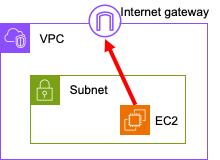

## [4] 인터넷 게이트웨이(Internet Gateway)

AWS VPC에서 인터넷 게이트웨이는 마치 건물의 현관문과 같이 VPC 내부의
리소스들이 외부 인터넷과 소통할 수 있도록 연결해주는 가상 네트워크
장치입니다. 이는 VPC 내부의 서브넷과 외부 인터넷 사이의 트래픽을
중계하는 역할을 수행합니다.

퍼블릭 서브넷은 인터넷 게이트웨이에 직접 연결되어 있어 외부 인터넷과의
통신이 가능한 서브넷입니다. 퍼블릭 서브넷에 위치한 인스턴스는 인터넷에서
직접 접근할 수 있으며, 웹 서버, 로드밸런서 등 외부에서 접근해야 하는
서비스를 위한 인스턴스를 배치하는 데 적합합니다.

반면, 프라이빗 서브넷은 인터넷 게이트웨이에 직접 연결되어 있지 않아 외부
인터넷과의 직접적인 통신이 제한됩니다. 프라이빗 서브넷에 위치한
인스턴스는 주로 내부 시스템이나 다른 AWS 서비스와의 통신을 위한 목적으로
사용됩니다. 데이터베이스 서버, 내부 애플리케이션 서버 등 보안이 중요한
서비스를 위한 인스턴스를 배치하는 데 적합합니다.

인터넷 게이트웨이를 구성할 때는 퍼블릭 서브넷과 프라이빗 서브넷을 적절히
분리하여 사용해야 합니다. 퍼블릭 서브넷에는 인터넷에 노출되어도 문제가
없는 서비스를 위한 인스턴스를 배치하고, 프라이빗 서브넷에는 보안이
중요한 서비스를 위한 인스턴스를 배치하여 보안을 강화할 수 있습니다.

구체적인 예시를 들어 설명하면, 웹 서버를 운영하고 싶은 경우 웹 서버
인스턴스를 퍼블릭 서브넷에 배치하고, 인터넷 게이트웨이를 통해 외부에서
접근할 수 있도록 설정하면 됩니다. 반면, 데이터베이스 서버는 외부에서
직접 접근할 필요가 없으므로 프라이빗 서브넷에 배치하고, 필요한 경우 VPN
연결이나 VPC 엔드포인트를 통해 다른 서비스와 연결할 수 있습니다.

요약하면, 인터넷 게이트웨이는 VPC와 외부 인터넷 사이의 연결을 담당하고,
퍼블릭 서브넷과 프라이빗 서브넷은 각각 외부 인터넷과의 접근성에 따라
구분되는 서브넷입니다. 이들을 적절히 활용하여 안전하고 효율적인 클라우드
환경을 구축할 수 있습니다.

