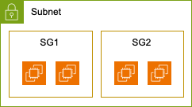

# [5] 보안 그룹

보안 그룹은 AWS VPC에서 리소스에 대한 인바운드 및 아웃바운드 트래픽을
제어하는 가상 방화벽입니다. 인스턴스 수준에서 작동하며, 프로토콜, 포트,
IP 주소 등을 기반으로 매우 세밀한 트래픽 제어 규칙을 설정할 수 있습니다.
예를 들어, 웹 서버에 대한 HTTP 및 HTTPS 트래픽만 허용하도록 설정해
보안을 강화할 수 있습니다.

보안 그룹은 동적으로 변경할 수 있으며, 여러 보안 그룹을 하나의
인스턴스에 연결해 복잡한 보안 정책을 구현할 수 있습니다. 뒤에서 설명할
네트워크 ACL과 함께 사용하면 더욱 강력한 네트워크 보안 체계를 구축할 수
있습니다. NACL은 서브넷 수준에서 작동하며, 보안 그룹보다 더 광범위한
제어를 제공합니다.

보안 그룹의 주요 활용 사례는 다음과 같습니다.

- 웹 서버: 특정 IP 주소에서만 접근 허용

- 데이터베이스 서버: 특정 포트(예: 3306)를 통한 접근만 허용

- VPN 연결: VPN 트래픽만 허용

보안 그룹은 강력한 보안 기능을 제공하지만, DDoS 공격과 같은 고급
위협으로부터 완벽하게 보호하지 못할 수 있습니다. 따라서 다른 보안 조치와
함께 사용해야 합니다.

