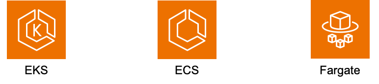

## [2] AWS의 컴퓨팅 서비스

백엔드 서버를 구성하기 위해서는 서버가 구동될 컴퓨팅 환경을 먼저
구축해야 합니다. 만일, 노트북이나 데스크톱에서 서버를 구성하고자 한다면,
먼저 리눅스 운영 체제를 설치하고, 리눅스 환경에서 서버를 구성해야
합니다. 그러나 AWS에서는 운영 체제와 필요한 라이브러리가 설치된 서버
컴퓨터를 바로 제공하기 때문에 이러한 과정을 생략할 수 있습니다. 몇 번의
클릭으로 AWS에서 제공하는 컴퓨팅 환경에서 서버를 구축할 수 있다는 점이
AWS 컴퓨팅 서비스의 장점입니다. 이외에도 AWS 컴퓨팅 서비스의 장점을
정리하면 다음과 같습니다.

- 신속성 : 클라우드를 사용하면 서버를 빠르게 만들 수 있기 때문에
  새로운 기술을 좀더 쉽고 빠르게 사용할 수 있습니다. 컴퓨팅, 스토리지,
  데이터베이스와 같은 인프라 서비스부터 사물 인터넷(IoT), 머신 러닝
  등에 필요한 리소스를 신속하게 생성할 수 있습니다.

- 탄력성 : 클라우드를 사용하면 순간적으로 늘어나는 높은 트래픽을
  처리하기 위해 미리 리소스를 준비할 필요가 없습니다. 대신 필요한
  만큼의 리소스를 실시간으로 생성하면 됩니다. 즉, 리소스를 유연하게
  확장하거나 축소해서 비즈니스 요구사항을 빠르게 충족시킬 수 있습니다.

- 비용 절감 : 클라우드를 사용하면 데이터 센터 또는 물리적 서버를
  유지하는데 소모되는 고정 비용을 변동 비용으로 바꿀 수 있습니다.
  사용한 만큼만 비용을 지불하기 때문에 매우 낮은 초기 비용으로
  서비스를 시작할 수 있습니다.

- 빠른 배포 : 클라우드를 사용하면 몇 분 안에 서비스를 전 세계에 배포할
  수 있습니다. AWS는 전 세계에 인프라를 보유하고 있으므로 클릭 몇
  번으로 여러 물리적 위치에 애플리케이션을 배포할 수 있습니다. 예를
  들어, 한국 세어 서비스를 개발했지만 사용자가 미국에 있는 경우 미국에
  서버를 구축해 두면 고객의 요청에 좀더 신속하게 반응할 수 있습니다.

### EC2(Elastic Compute Cloud)

AWS EC2는 클라우드 컴퓨팅 환경에서 탄력적인 컴퓨팅 자원을 제공하는
서비스입니다. 다양한 인스턴스 유형과 운영체제를 지원하며, 자동 확장
기능을 통해 처리 능력이 변화하는 경우에도 유연하게 대응할 수 있습니다.
특히, 99.99%의 높은 가용성 SLA를 제공하여 서비스 중단 없이 지속적인
운영이 가능합니다.

<blockquote>

<h3>NOTE: SLA(Service Level Agreement)</h3>

SLA는 서비스 제공자와 고객 간에 서비스의
품질, 가용성, 성능 등에 대한 약정을 담은 계약입니다. 쉽게 말해, 서비스
제공자가 고객에게 약속하는 서비스 수준을 명시한 계약서라고 할 수
있습니다. SLA에는 서비스 다운타임 허용 시간, 응답 시간, 문제 해결 시간
등이 포함됩니다.

SLI(Service Level Indicator)는 SLA에서 약속된 서비스 수준을 측정하기
위한 지표입니다. 예를 들어, 웹 사이트의 응답 시간, 시스템 가용성, 오류
발생 횟수 등이 SLI에 해당합니다. SLA에서 정의된 목표를 달성하고 있는지
확인하기 위해 SLI를 지속적으로 모니터링하고 관리해야 합니다. 정리하자면
SLA가 서비스 수준에 대한 목표라면, SLI는 그 목표를 달성하고 있는지
확인하기 위한 측정 지표라고 할 수 있습니다.

</blockquote>

EC2는 일반적으로 컴퓨터 한 대를 빌리는 것과 비슷합니다. 윈도우, 리눅스,
맥OS등 원하는 운영 체제를 선택하면 해당 운영 체제가 설치된 컴퓨터를 받게
됩니다. 특히 리눅스의 경우 아마존에서 직접 관리하는 Amazon Linux 2를
비롯해 다양한 리눅스 배포판과 버전을 사용할 수 있습니다. 서버 구동에
필요한 설정과 소프트웨어를 설치하는 것은 사용자가 직접 해야합니다.

### Lambda

Lambda는 EC2와는 다른 형태의 컴퓨팅 서비스로 서버리스(Serverless) 컴퓨팅
환경을 제공합니다. 서버리스 컴퓨팅 환경은 실제로 서버가 없다는 의미가
아니고, 사용자 입장에서 EC2와 같이 항상 작동중인 서버를 직접 관리할
필요가 없다는 의미입니다. Lambda는 사용자가 원하는 시점에 원하는
시간만큼만 컴퓨팅을 사용할 수 있는 서비스로 함수를 만들어서 필요할
때마다 함수를 실행하는 방식입니다. 만일, API 요청이 많지 않고 각 요청을
처리하는데 드는 시간이 길지 않다면 EC2의 경우 대부분의 시간을 아무런
작업도 하지 않는 상태로 있게 됩니다. EC2는 아무 작업을 하지 않더라도
작동 시간만큼 비용을 지불해야 하는 반면, Lambda는 사용한 시간만큼만
비용을 지불하면 됩니다. 따라서 이런 경우에는 Lambda를 사용하는 것이
EC2에 비해 비용을 절약할 수 있습니다.

다음의 3가지 컴퓨팅 서비스는 대규모 컨테이너 실행 환경이 필요할 때
사용하는 도구들로 각 서비스에 대해 자세히 설명하는 것은 이 책의 범위를
벗어납니다. 따라서 간략하게만 설명하고 넘어가겠습니다.

### ECS(Elastic Container Service)

컨테이너화된 애플리케이션의 배포, 관리, 확장을 간소화하는 완전 관리형
컨테이너 오케스트레이션 서비스입니다. 컨테이너 오케스트레이션이란
컨테이너의 생성, 삭제, 상태 관리 등을 수행하는 작업을 말합니다.
애플리케이션과 필요한 리소스를 정의하기만 하면 ECS가 애플리케이션에
필요한 다른 AWS 서비스와 자동적으로 연결되어 작동합니다.

### EKS(Elastic Kubernetes Service(EKS)

컨테이너 오케스트레이션 시스템의 한 종류인 쿠버네티스(Kubernetes)를
실행하기 위한 관리형 쿠버네티스 서비스입니다. 클라우드에서 EKS는
컨테이너 스케줄링, 애플리케이션 가용성 관리, 클러스터 데이터 저장 및
기타 주요 작업을 담당하는 쿠버네티스 컨트롤 플레인 노드의 가용성 및
확장성을 자동으로 관리합니다. EKS를 사용하면 AWS 인프라의 모든 성능,
확장성, 안정성 및 가용성을 활용할 수 있을 뿐만 아니라 AWS 네트워킹 및
보안 서비스와의 통합을 활용할 수 있습니다.

### Fargate

서버를 관리할 필요 없이 애플리케이션 구축에만 집중할 수 있는 서버리스
종량제 컴퓨팅 엔진입니다. Fargate는 ECS 또는 EKS 위에서 동작합니다. OCI
호환 컨테이너 이미지를 선택하고, 메모리와 컴퓨팅 리소스를 정의하며
서버리스 컴퓨팅으로 컨테이너를 실행할 수 있습니다.

### EC2 VS Lambda의 비교

API를 제공하는 백엔드 서버를 만들기 위해서 EC2와 Lambda 중 어떤 것을
사용해야 할까요? 두 가지 판단 기준을 적용해 볼 수 있습니다.

**작동 시간에서** EC2는 항상 작동하는 서버를 사용하는 반면, Lambda는
필요한 시점에만 서버를 사용합니다. 따라서 항상 작동 중인 서버가 필요한
경우에는 EC2를 사용하고, 필요한 시점에만 서버가 필요한 경우에는 Lambda를
사용합니다. 예를 들어, 매일 정해진 시간 동안만 서버가 필요한 경우는
Lambda를 사용하면 됩니다. 반면 백그라운드 작업과 같이 지속적으로 작업을
수행하다가 사용자 요청에 응답해야 하는 경우에는 EC2가 적합합니다.

**연산 능력에서** AWS Lambda의 최대 메모리는 3GB에 불과합니다. 함수에서
복잡한 연산을 수행하거나 많은 메모리가 필요한 경우 실행 시간이 길어져
비용이 증가할 수 있습니다. 여기에 시간 초과 문제가 발생하거나 메모리
부족으로 함수가 예상치 못하게 종료될 수도 있습니다. 반면 EC2는 이러한
제한이 없으므로 높은 성능이 필요한 상황에서 유용합니다.
