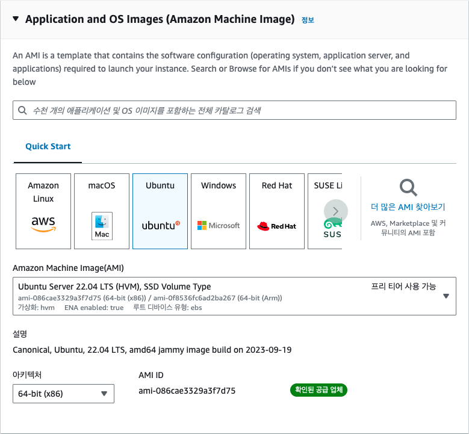
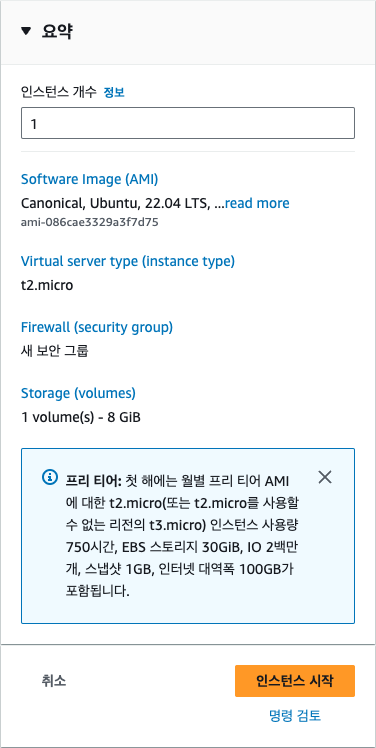

## [3] EC2 우분투 서버 만들기

EC2를 이용해서 우분투 리눅스를 운영 체제로 사용하는 서버를 만들어
보겠습니다. 여기에서부터는 생성된 가상 서버를 인스턴스라고 부르겠습니다.
웹 브라우저에서 AWS Management Console에 로그인합니다. 검색란에 "EC2"를
검색해서 해당 서비스를 엽니다.

대시보드 링크 https://console.aws.amazon.com/ec2/home


### EC2 인스턴스 생성하기

대시보드에서는 현재 리전이 올바르게 선택이 되었는지를 확인해야 합니다.
대한민국이 아닌 지역에 서버를 생성하고 싶은 경우가 아니라면, 서울 리전인
'ap-northeast-2'를 선택하면 됩니다.


리전이 올바르게 선택되었다면 EC2 대시보드로 이동한 다음 [인스턴스
시작] 버튼을 클릭합니다. 여기서는 새로운 EC2 인스턴스 생성을 위한
설정을 입력하게 됩니다.


인스턴스 이름에 "my_app"를 입력하겠습니다. 인스턴스 이름은 나중에
인스턴스를 구분할 때 사용되므로 적절한 이름을 지정합니다.


인스턴스 생성에 필요한 여러 가지 설정을 해야 합니다. 먼저, 사용할 운영
체제를 선택하되 여기에서는 가장 널리 사용되는 리눅스 배포판 중 우분투
리눅스를 사용해 보겠습니다. 우분투 리눅스를 선택한 후 AWS에서 EC2 사용을
쉽게 하기 위해 제공하는 운영 체제 이미지 AMI(Amazon Machine Image)를
선택합니다. 집필 시점에서 가장 최신 이미지인 22.04 LTS를 선택합니다.
LTS(Long Term Service)는 우분투 재단에서 일정 기간 동안 해당 버전의
리눅스가 제대로 동작하도록 지원하는 안정화된 버전입니다. 22. 10과 같은
좀더 최신 버전의 이미지도 있지만, LTS 버전을 선택하는 것이 서비스를
운영할 때에는 좀더 안정적입니다. 그 다음으로 아키텍처는
[64-bit(x86)]을 선택합니다.



그 다음으로 인스턴스 유형을 선택합니다. 인스턴스 유형이란 AWS에서 CPU,
메모리 크기에 따라 미리 지정해 놓은 인스턴스의 종류를 의미합니다. AWS
EC2 인스턴스 유형은 하드웨어 유형과 제공하는 기능에 대한 정보에서 명명
규칙을 따릅니다. 이름을 기준으로 인스턴스 유형을 분류하는 방법은 다음과
같습니다.

- 유형 접두사 : 첫 글자는 적합한 또는 최적화된 용도를 나타냅니다(-
  c=컴퓨트, m=일반/메인, r=메모리, i=IOPS/스토리지, g=그래픽, p=GPU,
  f=FPGA).
- 세대 : 숫자는 최신/고급 세대를 나타내며, 숫자가 높을수록 최신
  세대입니다. 예를 들어, m4보다 m5가 최신 세대입니다.
- 유형 크기 : 점 뒤의 부분은 nano, micro, small, medium, large,
  xlarge, 2xlarge 등 제품군 내의 상대적인 크기를 나타냅니다. X가
  많을수록 더 큰 크기를 나타냅니다.
- 특수 유형 : 일부 접미사는 특수 하드웨어 또는 기능을 나타냅니다(n -
  네트워크 최적화, x - 고용량(Extreme) 메모리, i - IOPS 최적화, e -
  추가 저장 공간, a - ARM 기반 프로세서).

이를 적용한 몇 가지 예시는 다음과 같습니다.

```bash
-   c5.9xlarge : 컴퓨팅 최적화, 5세대, 9xlarge 크기
-   g4dn.xlarge : 그래픽 최적화, 4세대, 네트워크 최적화, 대형 사이즈
-   r6i.32xlarge : 메모리 최적화, 지역 스토리지, 6세대, 32xlarge 크기
```

접두사, 세대 번호, 크기 용어 및 특수 접미사를 알고 있으면 EC2 인스턴스
유형이 제공하는 하드웨어 유형, 기능 및 특성을 대략적으로 파악할 수
있습니다. 여기에서는 인스턴스 유형을 t2.micro로 선택합니다. 앞에서
설명한 것처럼 AWS 프리 티어에서 t2.micro를 사용하면 1년 동안 무료로
사용할 수 있습니다. t2.micro는 메모리가 1GB이고, CPU는 1개입니다. 이
정도 사양이면 일반적인 웹 서비스를 구축하는데 충분합니다. 만일, 더 높은
사양의 인스턴스를 사용하고 싶다면 CPU나 메모리가 더 큰 인스턴스 유형을
선택하면 되지만 이런 경우에는 추가적인 비용이 발생합니다.


EC2 인스턴스는 가상 컴퓨터이기 때문에 EC2에 로그인해 작업을 하기 위한
인증 수단인 키 페어(Key pair)가 필요합니다. 키 페어란 공개 키(Public
key)와 개인 키(Private key)로 구성된 쌍으로 공개 키는 EC2에 저장되고,
개인 키는 사용자가 보관합니다. EC2에 접속할 때는 개인 키를 사용합니다.
기존에 생성해둔 키 페어가 없다면 새로운 키 페어를 생성해야 합니다. 키
페어를 생성하려면 우측의 '새 키 페어 생성'을 클릭합니다.


키 페어 이름은 기억하기 쉬운 이름으로 지정하는데 여기에서는 'my_app'으로
정했습니다. 키 페어 유형은 키에 저장되는 인증 정보에서 암호화할
알고리즘을 선택하는 것인데, 여기에서는 RSA 방식을 선택했지만 ED25519를
선택해도 됩니다. 프라이빗 키 파일 형식으로는 추후 SSH 연결을 위해
'.pem'을 선택합니다. [키 페어 생성] 버튼을 클릭하면 my_app.pem 파일이
다운로드됩니다. pem 키 파일은 한 번 다운로드하면 다시 발급받을 수
없으므로 반드시 안전한 위치에 저장해 둡니다. 만일, 키 파일을 분실한
경우는 기존 키 페이를 삭제하고, 새로운 키 페어를 생성해야 합니다.


그 다음으로는 EC2에 네트워크를 연결하기 위해 보안 그룹을 선택해야
합니다. 보안 그룹은 EC2 인스턴스에 접근할 수 있는 IP 주소를 제한하는
방화벽 역할을 합니다. 여기에서는 모든 IP 주소에서 접근을 허용하도록
설정했습니다. 이렇게 설정하면 어디서든 EC2 인스턴스에 접근할 수
있습니다. 보안 그룹은 나중에 필요에 따라 수정할 수 있으므로 지금은 모든
IP 주소에서 접근을 허용하는 것으로 설정합니다.


스토리지는 컴퓨터에서 파일을 저장할 수 있는 공간으로 EC2 인스턴스에는
여러 가지 스토리지 옵션을 선택할 수 있습니다. 여기에서는 기본적으로
제공되는 8GB의 스토리지를 사용하겠습니다. 프리 티어에서는 최대 30GB까지
무료로 사용할 수 있습니다.


인스턴스 개수는 동일한 설정으로 여러 개의 인스턴스를 생성할 때 사용하는
옵션입니다. 여기에서는 1개만 생성하겠습니다. [인스턴스 시작] 버튼을
클릭하면 인스턴스가 생성됩니다.



[모든 인스턴스 보기] 버튼을 클릭하면 생성된 인스턴스를 확인할 수
있습니다.


생성된 서버에 접속하기 위해 방금 생성한 인스턴스를 선택하고, [연결]
버튼을 클릭합니다.


[EC2 인스턴스 연결] 탭의 하단에서 [연결] 버튼을 클릭하면 해당
인스턴스 터미널에 접속하게 됩니다.


방금 다운로드 받은 pem 키를 사용해 SSH(Secure Shell) 접속을 할 수도
있습니다. SSH를 사용하면 AWS 콘솔에 로그인할 필요 없이 EC2 머신에 바로
연결할 수 있어 편리합니다. 다만, 접속할 컴퓨터의 22번 포트가 열려 있어야
접속이 가능합니다. AWS EC2의 경우 기본적으로 22번 포트가 열려 있습니다.
SSH 접속은 대부분의 리눅스와 맥 운영 체제의 터미널에서 기본적으로
제공되기 때문에 다음과 같이 입력하면 됩니다.

```bash
$ ssh -i my_app.pem ubuntu@my_server_ip
```

만일, 윈도우 사용자 중 `ssh` 명령어가 없다는 에러가 발생하면 명령
프롬프트가 아닌 'PowerShell' 또는 'PowerShell Core'를 사용합니다.
PowerShell은 윈도우에서 기본적으로 제공되는 터미널 프로그램입니다.
PowerShell에서 위의 명령어를 그대로 사용하면 됩니다. 만일, Powershell
Core를 설치하려면 다음의 링크로 접속합니다.

https://github.com/PowerShell/PowerShell


일부 블로그나 강의 등에서는 PuTTy라는 도구를 사용하라고 알려주는 경우가
있는데 이는 사용법도 불편하고 오래된 프로그램인 데다, 윈도우가 아닌 다른
운영 체제에서는 사용할 수 없는 방법이라 추천하지 않습니다.

### 파이썬으로 FastAPI 서버 만들기

이번에는 EC2 인스턴스에 파이썬 FastAPI 서버를 만들고 실행시켜
보겠습니다. 먼저 우분투 리눅스의 패키지를 업데이트합니다. 처음
업데이트는 시간이 약간 소요됩니다. 코드의 첫 번째 줄 sudo
update-alternatives \--install /usr/bin/python python /usr/bin/python3
10은 python 명령어에 대한 대체 프로그램을 설정합니다. 이 명령어는 python
명령어를 실행할 때 python3를 사용하도록 지정합니다. 많은 리눅스
운영체제에서는 python 명령어를 파이썬 2.7버전에 사용하고 python3을
파이썬 3.X 버전에 사용하고 있기 때문에 python 명령을 입력하면 python3를
실행하도록 편의성을 위해 바꾸어주는 것입니다. 마지막의 숫자 10은
우선순위를 나타내며, 더 높은 숫자, 즉 높은 우선순위를 갖는 프로그램이
있다면 해당 프로그램이 대신 사용됩니다.

두 번째 줄 sudo apt-get update는 패키지 목록을 업데이트하고, 세 번째 줄
sudo apt-get install -y python3-pip은 python3-pip 패키지를 설치합니다.
이 패키지는 Python 3용 pip 패키지 관리자를 설치합니다.

마지막 줄 sudo update-alternatives \--install /usr/bin/pip pip
/usr/bin/pip3 10은 pip 명령어에 대한 대체 프로그램을 설정합니다. 이
명령어는 pip 명령어를 실행할 때 pip3를 사용하도록 지정합니다. 파이썬과
마찬가지로 pip3 대신 pip이라는 짧은 이름을 사용하기 위해 이렇게
지정합니다.

```bash
# python3 -> python
$ sudo update-alternatives --install /usr/bin/python python /usr/bin/python3 10

# pip3 -> pip
$ sudo apt-get update
$ sudo apt-get install -y python3-pip

$ sudo update-alternatives --install /usr/bin/pip pip /usr/bin/pip3 10
```

진행 중 다음과 같은 화면이 나타나면 'OK'를 선택한 후 [Enter] 키를 눌러
창을 닫기 합니다. 운영 체제에 백그라운드로 실행 중인 프로그램을
재시작한다는 말인데, 우리는 아직 아무 프로그램도 실행중이지 않기 때문에
재시작해도 상관이 없습니다. 아래 그림에 대한 설명이 맞나요?


다음으로는 FastAPI와 uvicorn를 설치합니다. FastAPI는 파이썬으로 작성된
현대적이고 빠른 웹 프레임워크입니다. API 개발에 최적화되어 있으며, 높은
성능과 쉬운 학습이라는 두 마리 토끼를 모두 잡았습니다. FastAPI는 타입
힌트를 적극 활용하여 코드의 안정성을 높이고, 자동으로 OpenAPI 문서를
생성하여 API를 개발하고 관리하는 과정을 효율적으로 만들어 줍니다. 또한,
비동기 처리를 지원하여 많은 양의 요청을 동시에 처리할 수 있으며, 데이터
검증 기능을 통해 안전하고 신뢰할 수 있는 API를 개발할 수 있도록
도와줍니다. 마치 레고 블록을 쌓듯이 간단하고 직관적인 문법으로 복잡한
API를 빠르게 구축할 수 있다는 것이 FastAPI의 가장 큰 장점입니다.

Uvicorn은 파이썬으로 작성된 고성능의 ASGI(Asynchronous Server Gateway
Interface) 서버입니다. 마치 웹 서버가 웹 브라우저와 통신하는 것처럼,
Uvicorn은 FastAPI와 같은 웹 프레임워크가 외부의 요청을 받아들이고 처리할
수 있도록 연결해주는 역할을 합니다. 쉽게 말해, Uvicorn은 FastAPI가 만든
웹 애플리케이션을 실제로 인터넷에 연결하여 사용자들의 요청을 받고 응답을
보내는 역할을 담당하는, 마치 웹 애플리케이션의 문지기와 같은 존재라고 할
수 있습니다. Uvicorn은 빠른 속도와 효율적인 성능을 제공하여 많은
개발자들에게 사랑받는 ASGI 서버입니다.

다음 명령어는 파이썬 패키지 관리자인 pip를 사용하여 FastAPI 프레임워크와
Uvicorn ASGI 서버를 설치하는 명령입니다. 좀 더 자세히 설명하면, pip3
install 부분은 파이썬 3 버전에서 사용하는 패키지 설치 명령입니다. 그
뒤에 설치할 패키지 이름을 나열해주면 되는데, uvicorn[standard] 에서
[standard]는 중 표준 기능으로 설치하겠다는 의미입니다. 이렇게 기능을
설정할 떄에는 반드시 쌍따옴표로 전체 이름을 묶어주어야 합니다. 참고로
[standard]에는 개발에 유용한 여러 가지 기능과 더불어 가장 빠른 성능을
제공하는 uvloop라는 라이브러리가 들어있기 때문에 항상 [standard]를
빼놓지 않는 것이 좋습니다. 이제 이 명령어를 터미널에 입력해 패키지를
설치해주세요.

```bash
$ pip3 install fastapi "uvicorn[standard]"
```

이제 FastAPI 서버를 만들어 보겠습니다. 서버를 만들기 위해서는 파이썬
코드를 작성해야 하고, 서버 코드를 작성하기 위해서는 텍스트 에디터가
필요합니다. 우분투 리눅스에는 기본적으로 vi 텍스트 에디터가 설치되어
있습니다. vi 텍스트 에디터를 사용해서 서버 코드를 작성해 보겠습니다.
다음 명령어를 터미널에 입력합니다.

```bash
$ vi main.py
```

`vi`를 사용할 때 새로운 텍스트를 입력하려면 키보드에서 "i"를 입력합니다.
그리고 다음의 코드를 복사해서 입력합니다.

```python
from fastapi import FastAPI

app = FastAPI()

@app.get("/")
def read_root():
    return {"Hello": "World"}
```


코드를 입력한 후 파일을 저장하려면 [ESC] 키를 누른 다음 "wq!"를
입력하고, [Enter] 키를 누릅니다. w는 파일에 내용을 쓰겠다는 의미이고,
q는 편집기를 종료한다는 뜻입니다. 서버 코드를 작성한 다음에는 서버를
실행시켜 보겠습니다. 호스트 주소를 0.0.0.0으로 지정합니다. 포트는 별도로
지정하지 않으면 8000번 포트로 시작합니다. 만일, 포트를 직접 지정하려면
`--port 3000`과 같이 입력합니다.

```bash
$ python3 -m uvicorn main:app --host 0.0.0.0
```

<blockquote>
[TIP] localhost와 0.0.0.0

서버를 실행할 때 주소를 지정해야 하는데, 만일 주소를 지정하지 않으면
기본적으로 localhost 주소가 사용됩니다. localhost 주소는 현재 실행 중인
컴퓨터를 의미합니다. 그러나 EC2 인스턴스는 외부에서 접속할 수 있는 공개
IP 주소를 가지고 있습니다. 따라서 외부에서 접속할 수 있는 공개 IP 주소를
사용하려면 localhost가 아닌 0.0.0.0을 사용해야 합니다. 0.0.0.0은 모든
네트워크 인터페이스를 의미하며, 이는 서버가 모든 IP 주소에서 들어오는
연결을 수락합니다. 외부에서 접속할 수 있는 공개 IP 주소를 사용하려면
서버를 0.0.0.0 주소로 설정해야 합니다. 이렇게 하면 EC2 인스턴스가
외부에서 접속할 수 있게 됩니다. 그러나 보안상의 이유로 특정 IP 주소만
허용하도록 설정하는 것이 좋습니다. 이는 보안 그룹 또는 네트워크 ACL을
통해 설정할 수 있습니다.

</blockquote>

서버가 http://0.0.0.0:8000 주소에서 실행 중인 것을 확인할 수 있습니다.


터미널 하단을 보면 EC2 인스턴스에 연결할 수 있는 공개(Public) IP 주소가
있습니다.


이제 웹 브라우저에서 해당 주소로 접속해 보겠습니다. EC2 인스턴스에
연결할 수 있는 공개 IP 주소를 복사해서 웹 브라우저에 붙여넣기 합니다.
예를 들어, 다음과 같이 입력합니다.

```bash
http://43.200.244.121:8000/
```

하지만 접속을 해도 서버에 연결할 수 없습니다. 그 이유는 인스턴스가 외부
인터넷과의 연결을 허용하도록 설정되어 있지 않기 때문입니다. 이를
해결하기 위해 다시 인스턴스 대시보드로 돌아가 인스턴스 ID를 클릭합니다.


인스턴스 상세 정보를 볼 수 있는 페이지가 나타나면 [보안] 탭에서 '보안
그룹'을 클릭합니다.


[인바운드 규칙] 탭에서 선택한 보안 그룹의 [인바운드 규칙 편집]
버튼을 클릭합니다.


유형을 [모든 트래픽]으로 선택하고, [규칙 저장] 버튼을 클릭합니다.
지금은 편의상 모든 트래픽을 허용하지만 나중에는 적절한 보안 그룹과
규칙을 적용해 제한된 포트와 통신 방식만 허용하도록 할 수 있습니다.


image-40.png 설명과 그림이 일치하지 않는데... 지문에 맞는 그림이
필요합니다.

이제 웹 브라우저에서 공개 IP주소로 접속하면 다음과 같은 텍스트가 화면에
나타납니다. 이처럼 EC2에 서버를 만들고, 공개 IP와 내가 원하는 포트를
사용해 API 서버를 구성할 수 있습니다.

```bash
{"Hello":"World"}
```
