## [4] EC2에서 도커로 서버 실행하기

### ECR 사용하기

도커 이미지를 사용하려면 가장 먼저 AWS에 도커 이미지를 배포해야 합니다.
여기에서는 AWS ECR(Elastic Container Registry)이라는 이미지 저장소
서비스를 사용합니다. ECR은 1장에서 설명한 사설 도커 레지스트리에
해당합니다. 앞으로 ECR에 도커 이미지를 저장하고 Lambda나 다른 AWS
서비스에서 해당 이미지를 다운로드해서 사용하게 됩니다.

검색란에 "Elastic Container Registry"를 검색해서 콘솔로 들어갑니다. 그
다음 레포지토리 생성에서 [시작하기] 버튼을 클릭합니다.

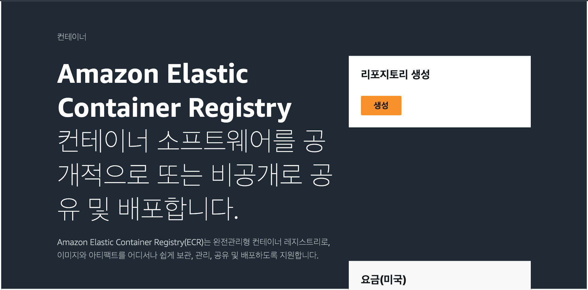{width="6.5in" height="3.216666666666667in"}

위 설명에 맞는 그림을 삽입해 주세요.

먼저 일반 설정에서는 표시 여부를 선택할 수 있습니다. 프라이빗은 해당
레포지토리에 접근할 때 IAM 권한이 있는 사용자만 접근할 수 있고, 퍼블릭은
누구나 접근할 수 있습니다. 지금은 나 이외의 다른 사람들의 접근이
필요하지 않기 때문에 '프라이빗'으로 선택합니다. 레포지토리 이름에
"my_app"을 입력하고, 하단의 [레포지토리 생성] 버튼을 클릭합니다.
나머지 설정은 변경하지 않습니다.

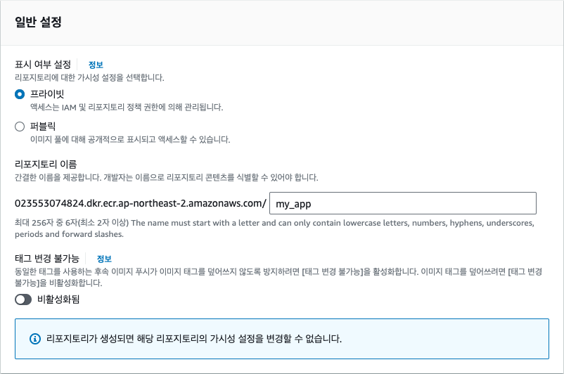{width="5.341488407699037in"
height="3.543307086614173in"}image-43.png

이제 대시보드에 'my_app' 레포지토리가 생성되었습니다. 레포지토리 이름을
클릭합니다.

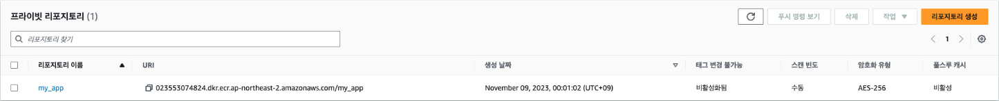{width="6.573522528433946in"
height="0.6692913385826772in"} image-44.png

우측 상단의 [푸시 명령 보기] 버튼을 클릭하면 도커 이미지를 업로드하는
방법이 나타납니다. 맥OS 또는 리눅스와 윈도우 운영 체제에서의 명령어가
약간 다르기 때문에 자신의 운영 체제에 맞는 명령어를 선택합니다. 이때,
이미 만들어져 있는 도커 이미지를 사용할 것이기 때문에 여기에서 안내되는
도커 관련 명령어는 입력하지 않습니다.

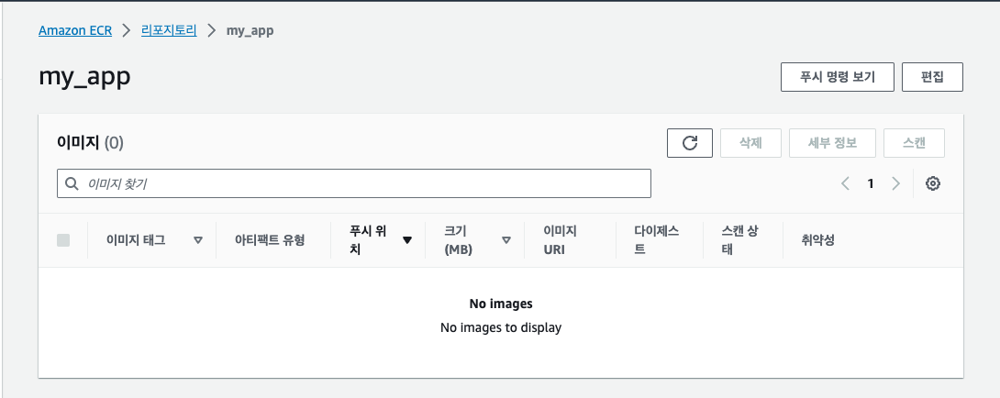{width="5.2403291776028in"
height="2.0866141732283463in"}image-45.png

2장에서 설치한 AWS CLI를 사용해 ECR에 로그인합니다. 맥/리눅스/윈도우의
명령어가 다르기 때문에 주의합니다. 아래 코드에서
`000000000000``으로`` ``표시된`` `저장소 주소를 실제 저장소 주소로
바꾸는 것도 잊지 마세요.

+-----------------------------------------------------------------------+
|     # macOS / Linux                                                   |
|     aws ecr g                                                         |
| et-login-password --region ap-northeast-2 | docker login --username A |
| WS --password-stdin 000000000000.dkr.ecr.ap-northeast-2.amazonaws.com |
|                                                                       |
|     # Windows                                                         |
|     (Get-ECRLoginCommand).Password | docker login --username A        |
| WS --password-stdin 000000000000.dkr.ecr.ap-northeast-2.amazonaws.com |
+=======================================================================+
+-----------------------------------------------------------------------+

명령어를 실행하면 다음과 같은 경고가 나타나는데, 이는 비밀번호가
암호화되지 않은 상태로 저장되기 때문입니다. 일반적으로 서비스 계정의
비밀번호를 로컬 컴퓨터에 저장하지 않고, AWS 서비스 내부에서만 ECR에
접근하기 때문에 여기에서는 무시하고 넘어갑니다. 성공적으로 로그인이
되었다면 'Login Succeeded'라는 메시지가 나타납니다.

+-----------------------------------------------------------------------+
|     WARNING! Your pa                                                  |
| ssword will be stored unencrypted in /Users/indo/.docker/config.json. |
|     Configure a credential helper to remove this warning. See         |
|     https://                                                          |
| docs.docker.com/engine/reference/commandline/login/#credentials-store |
|                                                                       |
|     Login Succeeded                                                   |
+=======================================================================+
+-----------------------------------------------------------------------+

### 도커 이미지 만들고 배포하기

이번에는 도커 이미지를 빌드하고, ECR에 업로드해 보겠습니다. 먼저 1장에서
도커와 AWS CLI를 설치한 내 컴퓨터(AWS EC2가 아닙니다)에서 빈 폴더를
원하는 위치에 하나 생성한 다음 파이썬 파일 `main.py`를 만들어주세요.
그리고 vi 에디터나 코드 편집기를 사용해 다음의 코드를 입력합니다. vi에서
파일을 저장하려면 esc를 먼저 입력한 다음 wq!를 입력합니다.

+-----------------------------------------------------------------------+
|     from fastapi import FastAPI                                       |
|                                                                       |
|     app = FastAPI()                                                   |
|                                                                       |
|     @app.get("/")                                                     |
|     def read_root():                                                  |
|         return {"Hello": "World"}                                     |
+=======================================================================+
+-----------------------------------------------------------------------+

그 다음에는 도커 이미지를 빌드하기 위한 설정 파일인 `Dockerfile``을`
만들어 보겠습니다. 파이썬 파일과 같은 위치에 생성하면 됩니다. EC2
인스턴스에서 파이썬 서버를 실행하기 위해서 설치했던 의존성과 파이썬
패키지들을 동일하게 도커 이미지에도 정의하는 과정입니다. Dockerfile의
내용은 다음과 같습니다. 각 라인이 의미하는 내용을 주석으로 표기했습니다.

+-----------------------------------------------------------------------+
|     # 도커 이미지를 생성할 기본 운영 체제 이미지                      |
|     FROM ubuntu:20.04                                                 |
|                                                                       |
|     # 도커 이미지에 패키지를 업데이트하고 파이썬 설치                 |
|     RUN apt-get update && apt-get install -y python3 python3-pip      |
|                                                                       |
|     # FastAPI와 Uvicorn을 설치                                        |
|     RUN pip3 install fastapi "uvicorn[standard]"                      |
|                                                                       |
|     # 도커 이미지에 필요한 파일을 복사                                |
|     COPY main.py /app/main.py                                         |
|                                                                       |
|     # 도커 이미지를 실행할 폴더                                       |
|     WORKDIR /app                                                      |
|                                                                       |
|     # 도커 이미지를 실행할 명령어                                     |
|     CMD ["uvicorn", "main:app", "--host", "0.0.0.0" ]                 |
+=======================================================================+
+-----------------------------------------------------------------------+

`Dockerfile`이 있는 폴더에서 다음의 명령어를 실행합니다. docker build는
이미지를 생성하는 명령어이고 뒤에 \".\"를 붙이는 것은 현재 경로에 있는
도커파일을 참조한다는 뜻입니다. -t 옵션은 이미지의 태그를 지정하는
것으로 이미지의 이름이라고 생각하면 됩니다. '000000000000'은 자신의 계정
ID로 변경해야 합니다.

+-----------------------------------------------------------------------+
|     docker build                                                      |
|  . -t 000000000000.dkr.ecr.ap-northeast-2.amazonaws.com/my_app:latest |
|     docker build                                                      |
|  . -t 000000000000.dkr.ecr.ap-northeast-2.amazonaws.com/my_app:latest |
|     [+] Building 1.7s (10/10) FINISHED                                |
|      => [internal] load .dockerignore                        0.0s     |
|      => => transferring context: 2B                          0.0s     |
|      => [internal] load build definition from Dockerfile     0.0s     |
|      => => transferring dockerfile: 261B                     0.0s     |
|      => [internal] load metadata for docker.io/library/ubun  1.6s     |
|      => [internal] load build context                        0.0s     |
|      => => transferring context: 28B                         0.0s     |
|      => [1/5] FROM docker.io/library/ubuntu:20.04@sha256:ed  0.0s     |
|     ...                                                               |
|      => exporting to image                                   0.0s     |
|                                                                       |
|     image                                   0.0s                      |
|      => => exporting layers                                  0.0s     |
|      => => writing image sha256:52e1c2337749a6409fc97d293e7           |
|      image sha256:52e1c2337749a6409fc97d293e7 0.0s                    |
|                                                                       |
|      => => naming to 000000000000.dkr.ecr.ap-northeast-2.am  0.0s     |
+=======================================================================+
+-----------------------------------------------------------------------+

도커 이미지가 정상적으로 빌드되면 도커 이미지를 컨테이너로 실행해서
제대로 작동하는지 실행해 보겠습니다. 다음의 명령어를 실행합니다. `-p`
옵션은 도커의 내부 포트 8000번을 로컬 포트(내 컴퓨터) 8000번으로
포워딩하는 옵션입니다. 즉, 내 컴퓨터에서 http://localhost:8000/ 주소로
접속하면 도커 내부의 8000번 포트로 연결됩니다. FastAPI 서버가 8000번
포트에서 작동하고 있기 때문에 8000번을 포워딩한 것입니다.

+-----------------------------------------------------------------------+
|     docker run -p 8000                                                |
| :8000 000000000000.dkr.ecr.ap-northeast-2.amazonaws.com/my_app:latest |
+=======================================================================+
+-----------------------------------------------------------------------+

웹 브라우저에서 http://localhost:8000/ 주소로 접속했을 때 다음과 같이
나타나면 서버가 정상적으로 실행된 것입니다.

+-----------------------------------------------------------------------+
|     {"Hello":"World"}                                                 |
+=======================================================================+
+-----------------------------------------------------------------------+

이제 도커 이미지를 ECR에 업로드해 보겠습니다. docker push는 이미지를
저장소에 업로드할 때 사용하는 명령어로, 그 뒤에는 업로드할 이미지의
태그를 입력하면 됩니다.

+-----------------------------------------------------------------------+
|     docker                                                            |
|  push 000000000000.dkr.ecr.ap-northeast-2.amazonaws.com/my_app:latest |
|     The push refers to                                                |
| repository [000000000000.dkr.ecr.ap-northeast-2.amazonaws.com/my_app] |
|     1a5bdedeab15: Pushed                                              |
|     ...                                                               |
|     6c3e7df31590: Pushed                                              |
|     latest: digest: sha256:7c0d41                                     |
| bf22c40ead9321605276f9876158d0eeae55fbaccc44de4288a46b553d size: 1367 |
+=======================================================================+
+-----------------------------------------------------------------------+

도커 이미지를 성공적으로 업로드하면 ECR의 my_app 레포지토리에서 이미지가
업로드된 것을 확인할 수 있습니다.

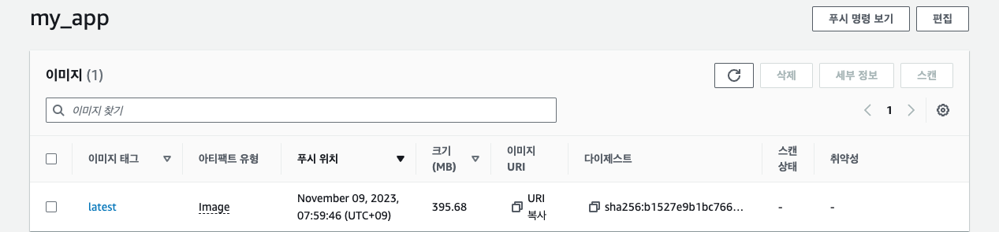{width="6.667045056867892in"
height="1.5520833333333333in"} image-52.png

### EC2에서 도커 컨테이너 실행하기

이번에는 EC2에서 방금 푸시한 도커 이미지를 다운로드하고 컨테이너를
실행해 보겠습니다. 먼저, EC2가 ECR에 접속할 수 있도록 IAM 역할을
생성하고 부여하기 위해 콘솔 검색에서 "IAM"을 입력한 후 대시보드에서
'역할' 패널로 이동합니다. 우측 상단의 [역할 생성] 버튼을 클릭합니다.

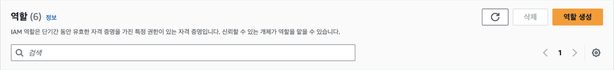{width="6.130380577427822in"
height="0.7086614173228346in"} image-63.png

신뢰할 수 있는 엔터티 유형은 AWS 서비스로 사용 사례에서 [EC2]를
선택하고, [다음] 버튼을 클릭합니다.

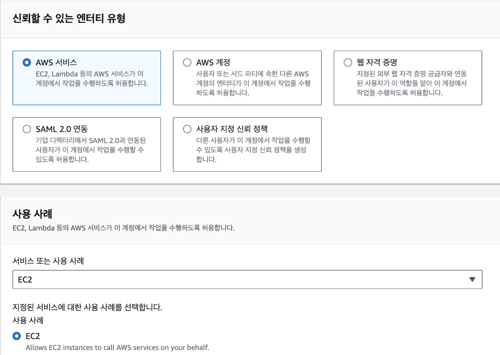{width="4.985777559055118in"
height="3.543307086614173in"} image-64.png

권한 정책에서 [AmazonEC2ContainerRegistryReadOnly]를 선택하고,
[다음] 버튼을 클릭합니다. 해당 정책은 EC2 인스턴스에서 ECR
레포지토리에 저장된 이미지를 다운로드할 수 있게 허용합니다. 하지만
이미지를 푸시하는 것은 허용되지 않습니다.

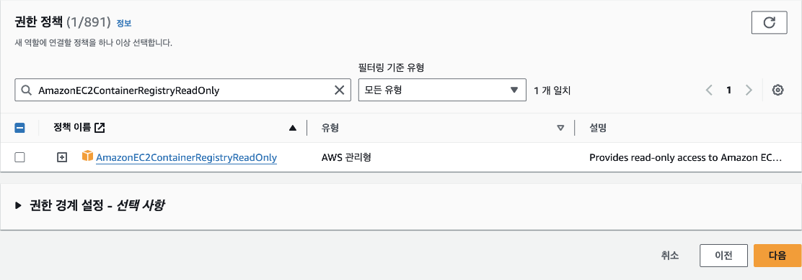{width="5.058783902012248in"
height="1.7716535433070866in"} image-66.png

역할 이름은 "ec2-ecr-role"로 입력합니다.

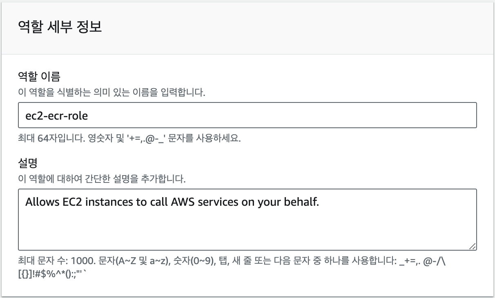{width="6.5in" height="3.915277777777778in"}

그리고 마지막으로 하단의 [역할 생성] 버튼을 클릭합니다.

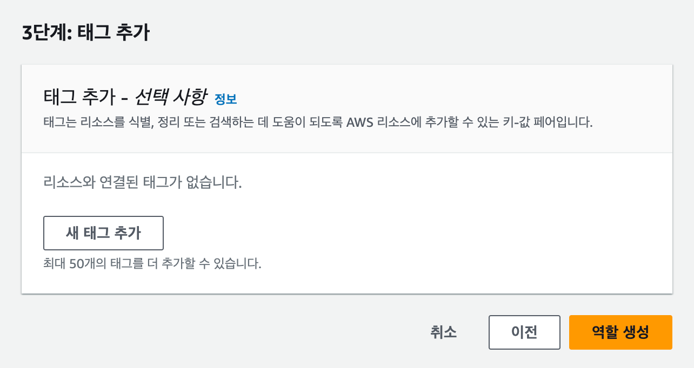{width="6.5in" height="3.452777777777778in"}

지문에 맞는 그림을 삽입해 주세요.

역할 생성이 완료되면 다시 EC2 대시보드로 돌아가서 인스턴스를 클릭하고,
[작업]-[보안]-[IAM 역할 수정]을 선택합니다.

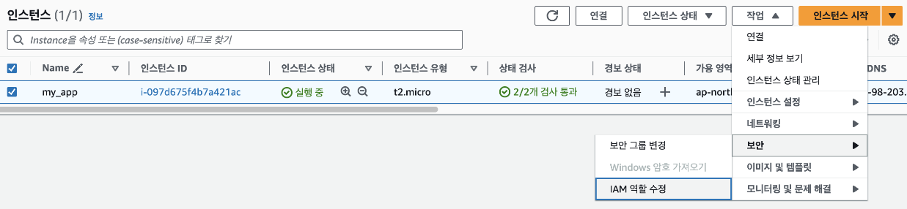{width="5.624711286089239in"
height="1.2992125984251968in"}

image-67.png

IAM 역할 목록에서 생성한 IAM 역할을 선택하고, [IAM 역할 업데이트]
버튼을 클릭합니다.

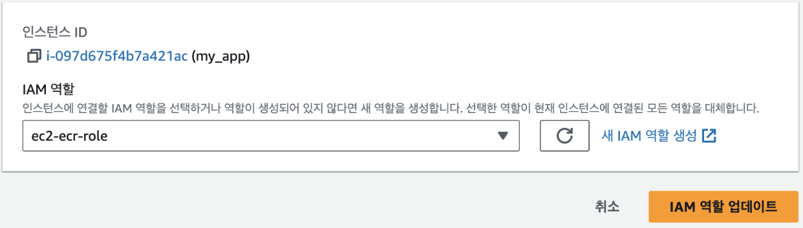{width="5.639666447944007in"
height="1.6141732283464567in"}

image-68.png

EC2에 권한이 부여되었으니 ECR에 접근이 되는지 확인해 보겠습니다. EC2
대시보드에서 인스턴스에 연결하거나 SSH를 사용해 터미널로 진입합니다.
그리고 EC2에 도커를 설치합니다. 여기서 설치하는 도커는 GUI로 도커를
관리할 수 있는 도커 데스크탑과 다르게 터미널에서 도커를 실행하고 관리할
수 있는 기능인 도커 엔진만 들어있습니다.

+-----------------------------------------------------------------------+
|     sudo apt-get install -y docker.io unzip                           |
|                                                                       |
|     curl "https:                                                      |
| //awscli.amazonaws.com/awscli-exe-linux-x86_64.zip" -o "awscliv2.zip" |
|     unzip awscliv2.zip                                                |
|     sudo ./aws/install                                                |
+=======================================================================+
+-----------------------------------------------------------------------+

도커를 설치한 다음에는 AWS CLI를 사용해 ECR에 로그인합니다.

+-----------------------------------------------------------------------+
|     aws ecr g                                                         |
| et-login-password --region ap-northeast-2 | docker login --username A |
| WS --password-stdin 000000000000.dkr.ecr.ap-northeast-2.amazonaws.com |
+=======================================================================+
+-----------------------------------------------------------------------+

만일, 다음과 같은 에러 메세지가 나오는 경우는 D`ocker` 사용자의 권한이
부족하다는

의미입니다.

+-----------------------------------------------------------------------+
|     permission denied while trying t                                  |
| o connect to the Docker daemon socket at unix:///var/run/docker.sock: |
+=======================================================================+
+-----------------------------------------------------------------------+

다음의 명령어를 실행해 `docker` 사용자를 `sudo` 권한으로 실행할 수
있도록 설정합니다. 첫 번째 부분인 \'sudo usermod -aG docker \$USER\'는
현재 사용자를 도커 그룹에 추가하는 명령입니다. 여기서 \'sudo\'는 관리자
권한으로 명령을 실행하겠다는 의미이고, \'usermod\'는 사용자 계정을
수정하는 명령어입니다. \'-aG\' 옵션은 사용자를 새 그룹에 추가한다는
의미이며, \'docker\'는 추가할 그룹의 이름입니다. \'\$USER\'는 현재
로그인한 사용자를 가리키는 환경 변수입니다. 두 번째 부분인 \'newgrp
docker\'는 현재 세션에 새로운 그룹 설정을 즉시 적용하는 명령입니다. 이
명령을 실행하면 로그아웃하고 다시 로그인할 필요 없이 바로 도커 그룹의
권한을 얻을 수 있습니다.

이 과정을 거치면 일반 사용자도 \'sudo\' 없이 도커 명령어를 실행할 수
있게 됩니다. 이는 보안상의 이유로 권장되는 설정이며, 도커를 더 편리하게
사용할 수 있게 해줍니다. 하지만 이 설정은 해당 사용자에게 높은 수준의
권한을 부여하므로, 신중하게 적용해야 합니다.

+-----------------------------------------------------------------------+
|     sudo usermod -aG docker $USER                                     |
|     newgrp docker                                                     |
+=======================================================================+
+-----------------------------------------------------------------------+

docker pull 명령어를 사용해 도커 이미지를 다운로드 받습니다. 다음의
명령어에서 '000000000000'은 자신의 계정 ID로 변경해 주세요.

+-----------------------------------------------------------------------+
|     docker                                                            |
|  pull 000000000000.dkr.ecr.ap-northeast-2.amazonaws.com/my_app:latest |
+=======================================================================+
+-----------------------------------------------------------------------+

이제 다운로드 받은 이미지로 컨테이너를 실행해 보겠습니다. `--name`
옵션을 추가해 컨테이너에 이름을 부여합니다. 잠시 후에 docker ps로 실행
중인 컨테이너를 확인해 보면 여기서 지정한 이름으로 컨테이너가 실행 중인
것을 확인할 수 있습니다.

+-----------------------------------------------------------------------+
|     docker run -p 8000:8000 --name my_app 0                           |
| 00000000000.dkr.ecr.ap-northeast-2.amazonaws.com/my_app:latest my_app |
+=======================================================================+
+-----------------------------------------------------------------------+

이제 파이썬 코드를 직접 실행한 것과 동일하게 공개 IP주소에서 서버 응답을
받을 수 있습니다. 참고로 도커 컨테이너를 실행하면 인스턴스에서 연결을
끊더라도(SSH 접속을 종료하는 경우) 명시적으로 컨테이너를 종료하지 않는
이상 계속 실행됩니다. 컨테이너를 종료하려면 컨테이너의 이름 `my_app`을
사용합니다.

+-----------------------------------------------------------------------+
|     docker stop my_app                                                |
+=======================================================================+
+-----------------------------------------------------------------------+

명령어를 실행하면 프로그램이 계속 실행 중이라 다른 명령어를 입력할 수
없을 것입니다. 터미널에 Ctrl + C를 입력하면 프로그램 실행이 종료됩니다.
이 경우 터미널이 종료되면 프로그램도 종료되기 때문에 서버 프로그램과
같이 계속 실행 중이어야 하는 프로그램은 백그라운드로 실행하면
편리합니다. 백그라운드에서 컨테이너를 계속 실행하려면 docker run 다음에
`-d` 옵션을 추가합니다. 나머지 옵션은 동일합니다.

+-----------------------------------------------------------------------+
|     docker run -d -p 8000:8000 --name my_app 0                        |
| 00000000000.dkr.ecr.ap-northeast-2.amazonaws.com/my_app:latest my_app |
+=======================================================================+
+-----------------------------------------------------------------------+

이제 다른 명령어를 입력할 수 있습니다. 실행 중인 컨테이너
목록을`docker ps`로 확인해 보면 다음과 같습니다.

+-----------------------------------------------------------------------+
|     docker ps                                                         |
|                                                                       |
|     CONTAINER ID   IMAGE                                              |
|                                     COMMAND                  CREATED  |
|     IMAGE                                                             |
|                                   COMMAND                  CREATED    |
|      STATUS         PORTS                                       NAMES |
|                                                                       |
|     6f57b28bde36   000000000000.dkr.ecr.ap-northeast-                 |
| 2.amazonaws.com/my_app:latest   "uvicorn main:app --…"   2 seconds ag |
| o   Up 2 seconds   0.0.0.0:8000->8000/tcp, :::8000->8000/tcp   my_app |
+=======================================================================+
+-----------------------------------------------------------------------+

