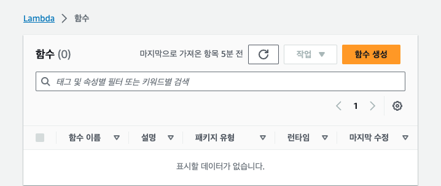
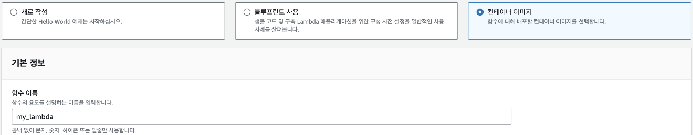
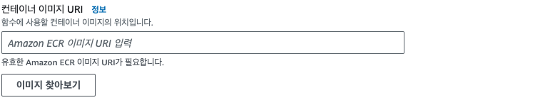
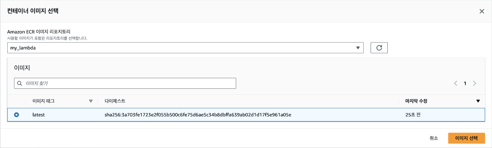
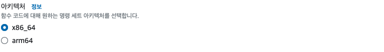
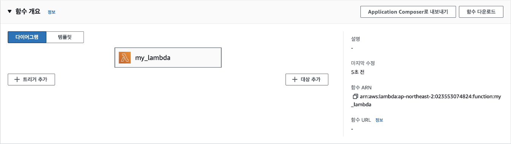
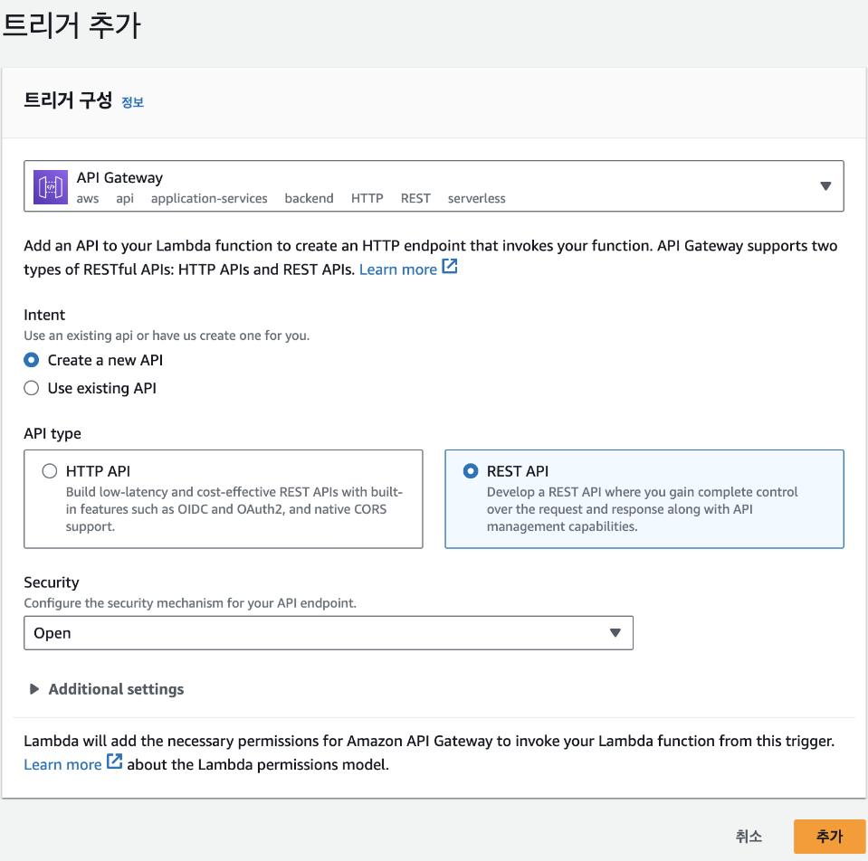
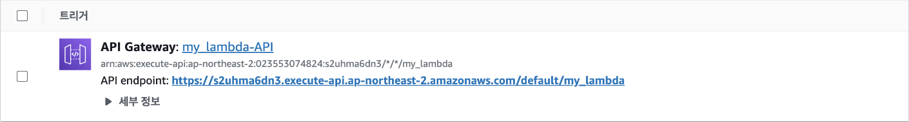

## [5] Lambda에 API 서버 만들기

이번에는 Lambda를 사용해서 API 서버를 만들어 보겠습니다. Lambda를 만드는
방법은 두 가지가 있습니다. 첫째는 지원되는 런타임을 사용해서 소스 코드를
바로 실행하는 방법입니다. Node.js, Python, Ruby, Go, Java, C# 코드를
실행할 수 있지만 Lambda 웹에서 코드를 바로 편집할 수 있는 콘솔 편집기는
Node.js, Python, Ruby만 지원합니다. 이러한 방식을 사용하는 경우 추가적인
라이브러리나 파일을 별도로 Lambda에 업로드해서 설정해야 하기 때문에
불편합니다. 둘째는 도커 이미지를 사용하는 방법입니다. 미리 만들어진 도커
이미지를 사용해 Lambda 함수를 만들 수 있습니다. 해당 방법은 Node.js,
Python, Ruby, Java, Go, .NET Core, PowerShell, Custom Runtime을
지원합니다. 이러한 방법은 미리 만들어진 도커 이미지를 사용하기 때문에
콘솔 편집기를 사용하지 않고도 다양한 언어를 사용할 수 있습니다. 또한,
도커 이미지를 사용하면 라이브러리를 미리 설치해 놓을 수 있기 때문에
라이브러리 설치에 대한 제약이 없습니다. 따라서 도커 이미지를 사용하는
방법을 추천합니다.

### API Gateway

AWS API Gateway는 다양한 클라이언트 애플리케이션이 서버리스 함수, 웹
애플리케이션, 그리고 다른 HTTP 엔드포인트와 같은 백엔드 서비스에 쉽게
접근할 수 있도록 해주는 관리형 서비스입니다. 마치 건물의 현관문과 같이,
API Gateway는 외부에서 들어오는 모든 요청을 관리하고, 적절한 백엔드
서비스로 연결해 줍니다.

API Gateway를 사용하면 개발자는 RESTful API와 WebSocket API를 쉽게
만들고 관리할 수 있습니다. 또한, API Gateway는 자동으로 API를 위한
스케일링, 모니터링, 그리고 보안 기능을 제공합니다. 예를 들어, API
Gateway는 트래픽 증가에 따라 자동으로 용량을 확장하고, API 사용량을
모니터링하여 이상 징후를 감지하고, API 키를 사용하여 API에 대한 접근을
제한하는 등의 기능을 수행합니다.

API Gateway의 가장 큰 장점 중 하나는 서버리스 아키텍처와의 뛰어난
호환성입니다. AWS Lambda와 같은 서버리스 함수와 API Gateway를 함께
사용하면 서버 관리 없이도 강력한 API를 구축할 수 있습니다. 이는 개발
생산성을 높이고 비용을 절감하는 데 큰 도움이 됩니다. 실제로 API
Gateway를 구축하는 것은 Lambda를 설정하는 과정에서 살펴보도록
하겠습니다.

### 도커 이미지 만들기

Lambda 함수를 위한 새로운 도커 이미지를 저장할 ECR 저장소를 만들어야
합니다. 이전에 EC2에서 했던 방식과 동일하게 생성하면 됩니다. 이번엔
저장소 이름을 `my_lambda`로 지정하겠습니다.

그리고 로컬 컴퓨터에서는 도커파일과 소스코드를 저장할 새로운 폴더
labmda_python을 원하는 위치에 생성합니다. 소스코드는 app.py 파일을
만들면 됩니다. Lambda와 API Gateway를 함께 사용할 때는 특별한 주의가
필요합니다. Lambda 함수가 API Gateway와 원활하게 통신하려면, 정해진
형식에 맞춰 JSON 응답을 생성해야 합니다. 이를 위해 app.py 파일에 다음과
같은 코드를 작성합니다.

이 코드는 Lambda 함수의 기본 구조를 보여줍니다. `handler` 함수는
이벤트와 컨텍스트를 입력받아, API Gateway가 이해할 수 있는 형식의 응답을
반환합니다. 여기서는 상태 코드 200(성공)과 함께 간단한 "Hello from
Lambda!" 메시지를 JSON 형식으로 반환하고 있습니다. 이렇게 구성하면 API
Gateway를 통해 Lambda 함수를 호출했을 때, 적절한 응답을 받을 수
있습니다.

```python
import json

def handler(event, context):
    return {
        "statusCode": 200,
        "body": json.dumps({"text": "Hello from Lambda!"})
    }
```

`Dockerfile`은 다음과 같이 정의합니다. AWS에서는 Lambda 함수를 실행할 때
사용할 수 있는 기본 도커 이미지를 제공합니다. 이 도커 이미지는 Lambda
함수를 실행하는데 필요한 모든 라이브러리와 실행 환경을 포함하고
있습니다. 따라서 Lambda에서 실행할 코드인 app.py 파일만 도커 이미지에
복사해서 넣으면 됩니다. LAMBDA_TASK_ROOT가 소스 코드를 넣을 경로로 미리
지정된 환경 변수입니다. 그리고 컨테이너에서 실행할 명령어는 항상
app.handler여야 app.py에 정의된 handler 함수를 정상적으로 실행할 수
있습니다.

```Dockerfile
FROM public.ecr.aws/lambda/python:3.11

# app.py 파일을 도커 이미지로 복사
COPY app.py ${LAMBDA_TASK_ROOT}

# app.py 파일에 정의된 handler 함수를 실행
CMD [ "app.handler" ]
```

<blockquote>
NOTE: AWS Lambda의 기본 이미지는 https://gallery.ecr.aws/lambda에서 전체
목록을 확인할 수 있습니다.
</blockquote>

이제 다운로드 베이스 이미지에서 파이썬 코드를 추가한 새로운 이미지를
빌드합니다. 주소 뒷부분에는 이전에 생성한 레포지토리 이름인
`/my_lambda`과 태그를 붙여줍니다. 태그에는 `:latest`를 붙여줍니다.

```bash
$ docker build -t 000000000000.dkr.ecr.ap-northeast-2.amazonaws.com/my_lambda:latest .
```

이제 로컬에서 제대로 작동하는지를 실행해 보겠습니다. 다음 명령어를 통해
컨테이너를 실행하면 Lambda 서버가 작동합니다.

```bash
$ docker run -p 9000:80 000000000000.dkr.ecr.ap-northeast-2.amazonaws.com/my_lambda:latest
```

이 서버에 터미널에서 다음과 같이 요청을 보내 보면 \"Hello from
Lambda!\"라는 응답을 받을 수 있습니다.

```bash
$ curl "http://localhost:9000/2015-03-31/functions/function/invocations" -d '{}'
```

윈도우 환경에 curl이 설치되어 있지 않다면 다음 명령어를 사용하세요.

```bash
Invoke-WebRequest -Uri "http://localhost:9000/2015-03-31/functions/function/invocations" -Method Post -Body '{}' -ContentType "application/json"
```

컨테이너가 정상적으로 작동하는 것을 확인했다면 도커 이미지를 저장소에
푸시하겠습니다. 실행이 완료되었을 때 마지막에 `sha256:\...` 과 같이
결과값이 나오면 정상적으로 저장소에 이미지가 푸시된 것입니다.

```bash
$ docker push 000000000000.dkr.ecr.ap-northeast-2.amazonaws.com/my_lambda:latest
```

### Lambda 함수 만들기

이제 Lambda 함수를 만들어 보겠습니다. 서비스 검색창에 "Lambda"를
검색해서 해당 서비스 페이지로 들어간 다음, Lambda 함수 페이지에서 [함수
생성] 버튼을 클릭합니다.



Lambda 함수의 종류는 3가지 중에 선택할 수 있습니다. 여기에서는 도커
이미지를 사용할 것이므로 '컨테이너 이미지'를 선택하고, 함수 이름에는
"my_lambda"로 입력합니다.



그 다음은 어떤 이미지를 사용할지 입력해야 하는데, ECR에서 주소를
복사해도 되지만 [이미지 찾아보기] 버튼을 클릭하면 쉽게 이미지를 찾을
수 있습니다.



레포지토리 이름을 선택하면 업로드한 이미지가 나타납니다. 해당 이미지를
선택하고, 우측 하단의 [이미지 선택] 버튼을 클릭합니다.



아키텍처 선택은 `x86_64`로 설정하고, [함수 생성] 버튼을 클릭합니다.



함수 생성 버튼을 클릭하고 나면 다음 그림처럼 함수에 대한 전반적인 설명을
볼 수 있는 함수 개요 패널로 이동되게 됩니다.



Lambda 함수가 생성된 것을 확인했으니 이제 해당 함수가 실행될 조건을
추가해야 합니다. 여기에서는 HTTP 요청이 들어올 때마다 해당 함수가
실행되도록 하겠습니다. 화면에서 [트리거 추가]를 클릭한 후 트리거
구성에서 [API Gateway]를 선택하고, 'Create a new API'를 클릭해 API를
새로 생성합니다. 계속해서 API type은 'REST API'로, Security는 '
Open'으로 선택합니다. 이렇게 설정하면 API 주소를 아는 사람은 누구나 API
요청을 보낼 수 있어서 보안 상 취약하지만, 지금은 넘어가겠습니다. 그 다음
[추가] 버튼을 클릭합니다.



이제 추가된 트리거(my_lambda-API)에서 API로 요청을 보낼 주소인 API
Endpoint를 확인할 수 있습니다.



해당 주소로 웹 브라우저에 접속하면 Lambda 함수가 실행되고, 실행된 결과는
현재 설정한 것처럼 json 형태의 응답으로 오게 됩니다.

```JSON
{
    "text": "Hello from Lambda!"
}
```
