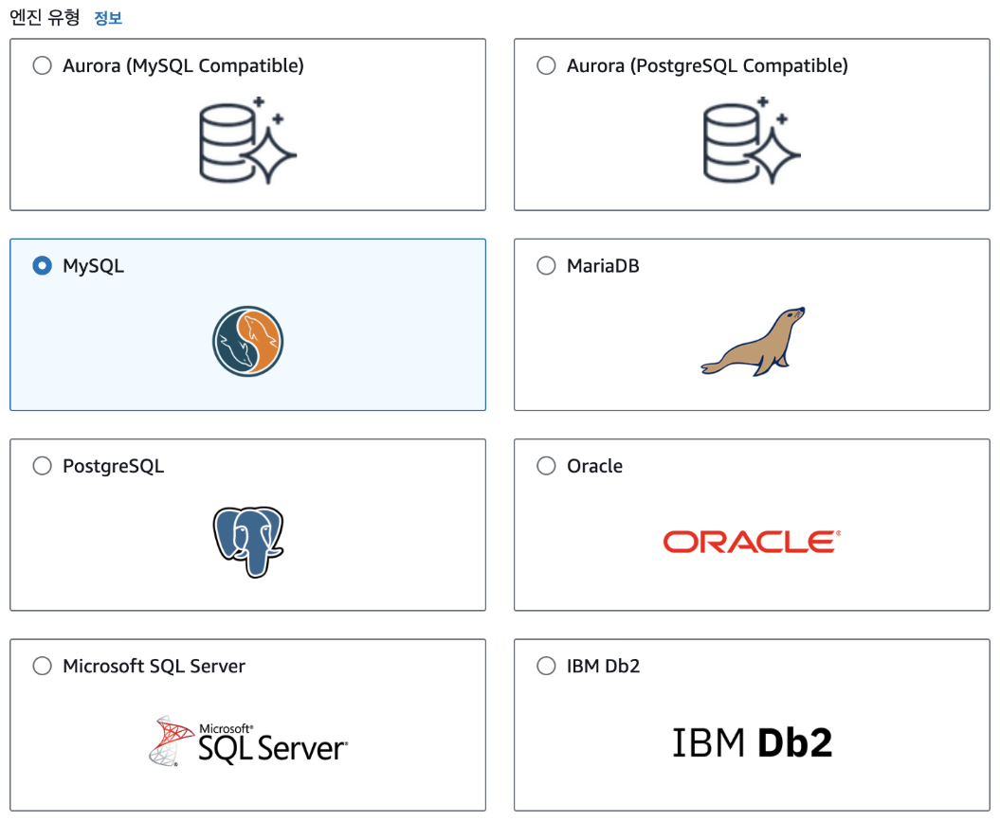
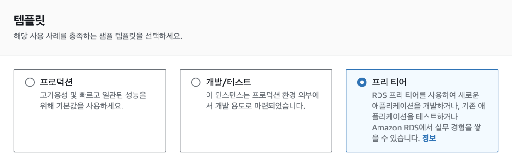
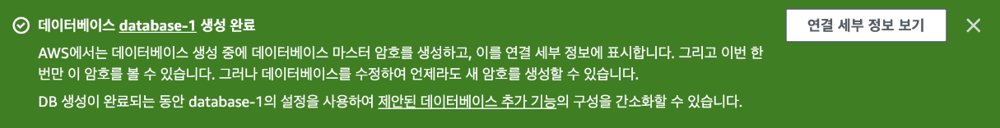
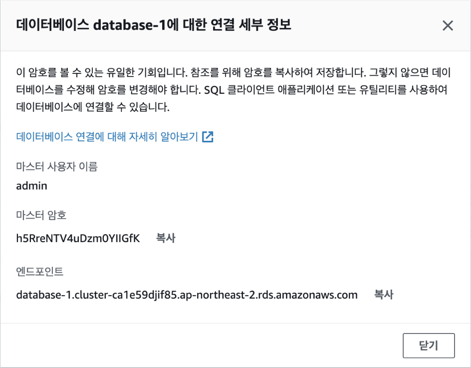

## [1] 데이터베이스와 스토리지의 개념

### 데이터베이스의 개념과 특징

데이터베이스는 쿼리, 업데이트 및 조작할 수 있는 구조화된 데이터를
안정적으로 저장해야 할 때 필요합니다. 그리고 엑셀 스프레드시트와 유사한
행과 열로 구성된 테이블이라는 형태로 데이터를 구성합니다. 이러한 조직
구조를 통해 데이터베이스 내의 정보를 빠르게 검색 및 분석해 인사이트와
패턴을 찾을 수 있습니다.

데이터베이스의 구조화된 특성은 시간이 지나도 데이터의 무결성과 일관성을
보장합니다. 데이터베이스는 SQL과 같은 쿼리 언어를 사용해 데이터를 저장,
변경 및 접근할 수 있습니다. 또한, 트랜잭션(Transaction)을 지원해 하나의
데이터베이스 변경 과정이 성공적으로 끝나거나 실패하는 경우에는 데이터가
변경되지 않도록 보장합니다. 데이터를 지속적으로 저장하면서도 데이터의
무결성을 유지해야 하는 애플리케이션의 경우 데이터베이스가 필수적입니다.
이러한 데이터베이스의 유형은 크게 관계형 데이터베이스와 NoSQL
데이터베이스의 두 가지 종류로 나눌 수 있습니다.

### 관계형 데이터베이스의 특징


관계형 데이터베이스는 데이터를 테이블 형태로 저장하는 데이터베이스로
테이블 간의 관계를 정의할 수 있습니다. 테이블은 행과 열로 구성되어
있으며, 각 행은 고유한 키를 가지고 있습니다. 예를 들어, 사용자 정보를
저장하는 테이블과 상품 정보를 저장하는 테이블이 있다고 가정할 때
사용자가 상품을 구매하면 사용자 정보 테이블과 상품 정보 테이블 간의
관계를 정의해 사용자가 구매한 상품 정보를 저장할 수 있습니다. 관계형
데이터베이스는 이러한 관계를 정의할 수 있기 때문에 데이터를 효율적으로
저장할 수 있습니다. 관계형 데이터베이스를 사용하기 위해서 EC2에 직접
데이터베이스 서버를 구축하는 방법도 있지만, AWS의 대표적인 관계형
데이터베이스 서비스인 RDS를 사용하면 좀더 편리합니다. 두 가지 방법의
장단점을 비교해 보면 다음과 같습니다.

+------+--------------------------------+------------------------------+
| 구분 | EC2에 데이터베이스 구축 | RDS 사용 |
+======+================================+==============================+
| 장점 | \- 서버 하드웨어에 대한 전체 | \- 데이터베이스 관리 기능 |
| | 제어 가능 | 제공 |
| | | |
| | \- 데이터베이스 엔진 및 버전 | \- 높은 가용성 보장 |
| | 선택의 자유 | |
| | | \- 자동 백업 및 복구 지원 |
| | \- 사용량이 적다면 더 저렴함 | |
+------+--------------------------------+------------------------------+
| 단점 | \- 백업 및 재해 복구 구현 필요 | \- AWS가 결정한 데이터베이스 |
| | | 엔진 및 하드웨어만 사용 가능 |
| | \- 가용성 보장을 위한 추가 | |
| | 작업 필요 | \- 데이터 이동에 제약이 있을 |
| | | 수 있음 |
+------+--------------------------------+------------------------------+

RDS는 데이터베이스 서버를 직접 관리하는 번거로움 없이 AWS에서 관리하는
데이터베이스를 사용할 수 있다는 장점이 있지만, EC2에서 직접 구축하는
경우 많은 유연성과 제어가 가능하고, 사용량이 매우 작다면 EC2를 사용하는
것이 더 저렴할 수도 있습니다. 하지만 대부분의 경우 RDS를 사용하는 것이
더 편리하고 데이터가 항상 보존되기 때문에 안전합니다. 이제 RDS에서
MySQL을 사용해 데이터베이스를 구축할 것입니다.

관계형 데이터베이스를 사용하려면 SQL이라는 언어를 사용해야 합니다. SQL은
데이터베이스 관리, 데이터 조회 및 수정 등을 수행할 수 있는 도구입니다.
이 책에서는 데이터베이스와 관련해서 간단한 작업만 수행하기 때문에 지금은
SQL을 몰라도 괜찮지만, 현업에서 데이터베이스를 많이 다룬다면 필수적으로
배워야 하는 언어입니다.

### NoSQL 데이터베이스의 특징


NoSQL 데이터베이스는 관계형 데이터베이스와 달리 테이블 형태로 데이터를
저장하지 않고, 키-밸류(Key-Value) 형태로 데이터를 저장합니다. 관계형
데이터베이스의 테이블 대신 컬렉션(Collection)이라는 개념을 사용합니다.
컬렉션은 테이블과 비슷한 개념이지만, 테이블과 달리 스키마(Schema)를
가지고 있지 않습니다. 따라서 컬렉션에 저장되는 데이터는 모두 다른 형태일
수 있습니다. 예를 들어, 사용자 정보를 저장하는 컬렉션에는 이름, 나이,
성별 등의 정보가 저장될 수 있고, 상품 정보를 저장하는 컬렉션에는 상품명,
가격, 재고 등의 정보가 저장될 수 있습니다. 이러한 특징 때문에 NoSQL
데이터베이스는 관계형 데이터베이스보다 유연하게 데이터를 저장할 수
있습니다. AWS의 대표적인 NoSQL 데이터베이스 서비스로는 DynamoDB와
DocumentDB가 있습니다. 두 서비스의 특징을 정리해 보면 다음과 같습니다.

---

| 구분             | Amazon DynamoDB              | Amazon DocumentDB            |
| ---------------- | ---------------------------- | ---------------------------- |
| \*\*데이터베이스 | 키-밸류 스토어 엔진          | MongoDB 호환 고성능 엔진     |
| 엔진\*\*         |                              |                              |
| **성능**         | 모든 요청에 한 자릿수 밀리   | 확장 가능한 인메모리 최적화  |
|                  | 초의 지연 시간을 제공하고,   | 아키텍처로 대규모 데이터     |
|                  | 수요에 따라 확장해 성능 손실 | 세트에 대해 데이터베이스가   |
|                  | 없이 초당 2천만 건 이상의    | 쿼리를 빠르게 평가할 수 있음 |
|                  | 요청을 처리할 수 있음        |                              |
| **가용성**       | 고유한 스토리지 모델로       | 3개의 가용성 영역에 데이터   |
|                  | 고가용성을 제공              | 사본 6개를 자동으로 복제해   |
|                  |                              | 99.99%의 가용성을 제공       |

---

만일, 서비스의 규모가 작다면 DynamoDB를 사용하는 것이 더 저렴하고,
서비스의 규모가 크다면 DocumentDB를 사용하는 것이 더 저렴합니다. 이는
DocumentDB가 DynamoDB보다 저렴한 가격에 보다 높은 성능을 제공하기
때문입니다.

---

| 구분          | 데이터베이스        | 오브젝트 스토리지                 |
| ------------- | ------------------- | --------------------------------- |
| 데이터 종류   | 관계형, 정형 데이터 | 비정형, 정적 데이터(사진, 동영상) |
| 업데이트 주기 | 자주 업데이트       | 가끔 업데이트                     |
| 동시성        | 엄격함              | 엄격하지 않음                     |

---

### 스토리지의 개념과 특징


스토리지 서비스는 대량의 데이터를 안정적으로 저장할 때 필수적인 기능으로
파일, 이미지, 동영상, 로그 데이터, 백업 및 아카이브와 같은 비정형
데이터를 위한 중앙 집중식 저장 공간을 의미합니다. 비정형 데이터란
데이터의 크기와 형태를 미리 알 수 없다는 의미로 일반적인 파일을 생각하면
됩니다. 또는, 드롭 박스나 구글 드라이브와 같이 파일을 업로드해서 공유할
수 있는 서비스와 비슷합니다.

클라우드 스토리지 서비스는 여러 서버와 시설에 데이터를 복제해 장애로부터
데이터를 보호함으로써 고가용성을 제공하는 것이 필수적입니다. 또한,
필요할 때마다 스토리지 용량을 쉽게 확장할 수 있어 많은 양의 데이터를
빈번하게 접근해야 하는 경우에 적합합니다. 최근 중요성이 커지고 있는
AI/ML 관련 서비스를 구축할 때 필요한 데이터셋 또는 모델을 저장하고
관리하는데 많이 사용되고 있습니다.

### S3(Simple Storage Service)

S3은 AWS에서 제공하는 오브젝트 스토리지 서비스입니다. 오브젝트
스토리지는 쉽게 말해서 문서, 이미지, 비디오 같은 컴퓨터 파일을 저장하는
공간입니다. 저장 공간 측면에서 S3은 사실상 무제한 데이터를 저장할 수
있습니다. 또한 각 오브젝트에 쉽게 접근할 수 있는 다양한 방법을 제공하고
있습니다. 오브젝트를 웹 브라우저에서 바로 다운로드 받는 것은 물론이고
다른 AWS 서비스에서도 간단한 방법으로 오브젝트를 업로드하고 다운로드할
수 있습니다.

S3은 데이터를 저장할 때 버킷(Bucket)이라는 개념을 사용합니다. 버킷은
S3에 데이터를 저장할 때 사용하는 저장소로 S3에 저장되는 모든 데이터의
컨테이너입니다. 버킷은 모든 AWS 리전에서 전역적으로 고유한 이름을 가져야
합니다. 즉, 하나의 리전에서 사용한 이름은 다른 리전에서 사용할 수
없습니다.

<blockquote>
[TIP] S3 Glacier

S3의 비용을 절감하기 위해 사용되는 서비스로 S3과 동일한 인터페이스를
제공하지만, 데이터를 저장하는 시간과 데이터를 검색하는 시간이 오래
걸립니다. 따라서 데이터를 자주 접근하지 않는 경우에 사용됩니다. 예를
들어, 1년에 한 번씩만 접근하는 데이터를 S3 Glacier에 저장하면 S3에
저장하는 것보다 훨씬 저렴하게 데이터를 저장할 수 있습니다.

</blockquote>

## [2] MySQL 만들기

이번에는 MySQL 데이터베이스를 만들어 보겠습니다. AWS RDS 대시보드로
이동한 후 우측 상단에서 [데이터베이스 생성] 버튼을 클릭합니다.


image-72.png

데이터베이스 생성 방식 선택에서 '표준 생성'을 선택합니다. 손쉬운 생성은
좀더 간편한 방식이지만 프리 티어를 사용하는 등의 설정을 하려면 '표준
생성'을 선택해야 합니다.


엔진 유형에서는 'MySQL'을 선택합니다. 참고로 엔진 버전은 바로 밑에서
확인할 수 있는데, 여기에서는 MySQL 8.0.33으로 진행하지만 최신 버전을
사용하면 됩니다.



프리 티어를 적극적으로 활용하기 위해 템플릿은 '프리 티어'로 선택합니다.



[설정] 탭에서 DB 클러스터 식별자로 기본값인 "database-1"이라는 이름을
입력합니다. DB 클러스터 식별자는 데이터베이스를 구분하기 위한
이름입니다.


자격 증명 설정에서 마스터 사용자 이름에 기본값인 "admin"을 입력하고,
'암호 자동 생성'을 체크(선택)해 무작위로 생성되는 안전한 암호를
사용합니다. 실제 서비스에서도 암호를 직접 설정하는 대신 무작위 암호를
사용하는 것이 좋습니다. 암호는 추후 데이터베이스에 접속할 때 사용됩니다.


인스턴스 구성에서 DB 인스턴스 클래스는 가장 작은 크기인
[db.t2.micro]를 선택합니다.


데이터를 저장할 스토리지에서는 최솟값인 '20GiB'로 설정합니다.


마지막으로 [연결] 탭에서 VPC가 EC2와 동일한 VPC와 보안 그룹으로
설정되어 있는지를 확인합니다. 데이터베이스가 생성된 다음에는 VPC를
변경할 수 없기 때문에 반드시 확인해야 합니다. EC2의 VPC를 확인하려면 EC2
대시보드의 [인스턴스 세부 정보]-[네트워킹]에서 VPC ID를 클릭하면 VPC
이름을 확인할 수 있습니다. 별도 VPC를 생성하지 않았다면 기본값인
'default'를 사용하면 됩니다. 보안 그룹 역시 EC2와 동일한 이름을
선택했는지 확인합니다.


이제 [데이터베이스 생성] 버튼을 클릭합니다. 데이터베이스가 생성되는
데는 5\~10분 정도의 시간이 소요됩니다. 데이터베이스가 생성되면 [연결
세부 정보 보기] 버튼을 클릭해 데이터베이스에 연결할 수 있는 접속 정보를
확인합니다.



image-80.png

해당 정보는 단 한 번만 확인할 수 있으므로 반드시 기록해야 합니다. 마스터
사용자 이름, 마스터 암호, 엔드포인트의 3가지를 복사해 둡니다.



마지막으로 EC2 인스턴스에서 RDS에 연결하기 위해서는 보안 그룹의 인바운드
규칙을 수정해야 합니다. EC2와 RDS에 공통으로 설정된 보안 그룹에서
인바운드 규칙에 다음의 규칙을 추가합니다. RDS MySQL는 접속 시 3306번
포트를 사용하기 때문에 보안 그룹에서 해당 포트 번호의 접속을 허용하는
것입니다.


EC2 터미널에 접속해 `mysql-client`를 설치합니다. `mysql-client`는
`mysql` 명령줄 도구를 터미널에서 사용할 수 있도록 해주는 패키지입니다.
다음의 명령어를 실행합니다. `mysql` 명령어는 MySQL 서버에 접속해
데이터베이스를 관리하거나 데이터를 조회 및 수정 등을 할 수 있습니다.
참고로, 현업에서는 `mysql` 명령줄 도구보다 그래픽 화면이 지원되는 MySQL
Workbench나 DBeaver와 같은 도구를 좀더 많이 사용합니다.

```bash
$ sudo apt install mysql-client
```

이제 EC2 인스턴스로 접속해 RDS에 연결해 보겠습니다. 이전에 복사해둔
마스터 사용자 이름, 마스터 암호, 엔드포인트를 사용합니다. 다음의
명령어를 실행합니다. 이때, `-h` 뒤의 엔드포인트는 복사해둔 것으로
바꾸어야 합니다. 명령어는 `admin` 사용자로 데이터베이스 엔드포인트에
접속하고, `-p` 옵션을 사용해 비밀번호로 인증한다는 의미입니다.

```bash
$ mysql -u admin -h database-1.cluster-something.ap-northeast-2.rds.amazonaws.com -p
```

명령어를 입력하면 암호를 입력하라는 메시지가 나타납니다. 이때, 복사해둔
마스터 암호를 입력합니다.

```bash
$ Enter password:
```

접속이 성공하면 다음과 같이 `mysql>` 프롬프트가 나타납니다.

```bash
Welcome to the MySQL monitor.  Commands end with; or \g.
Your MySQL connection id is 113
Server version: 8.0.28 Source distribution

Copyright (c) 2000, 2023, Oracle and/or its affiliates.

Oracle is a registered trademark of Oracle Corporation and/or its
affiliates. Other names may be trademarks of their respective
owners.

Type 'help;' or '\h' for help. Type '\c' to clear the current input statement.

mysql>
```

이제 데이터베이스와 테이블을 만들어 보겠습니다. 먼저, `MY_APP`
데이터베이스를 생성하되 명령어는 다음과 같습니다.

```bash
mysql> CREATE DATABASE MY_APP;
Query OK, 1 row affected (0.00 sec)
```

`MY_APP` 데이터베이스를 사용하겠다는 명령어는 다음과 같습니다.

```bash
mysql> USE MY_APP;
Database changed
```

`Users` 테이블을 생성하는 명령어는 다음과 같습니다.

```bash
mysql> CREATE TABLE Users (
    ->     id INT NOT NULL AUTO_INCREMENT,
    ->     name VARCHAR(255) NOT NULL,
    ->     age INT NOT NULL,
    ->     PRIMARY KEY (id)
    -> );
Query OK, 0 rows affected (0.02 sec)
```

이제 데이터베이스 설정이 완료되었습니다.
