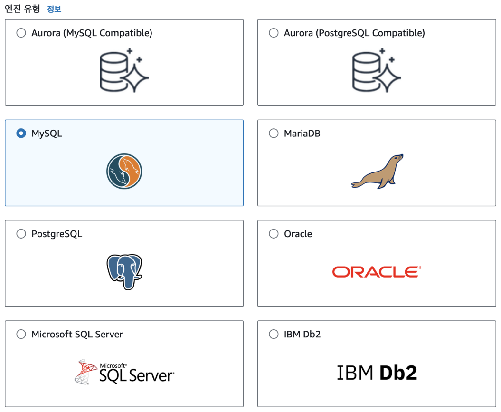
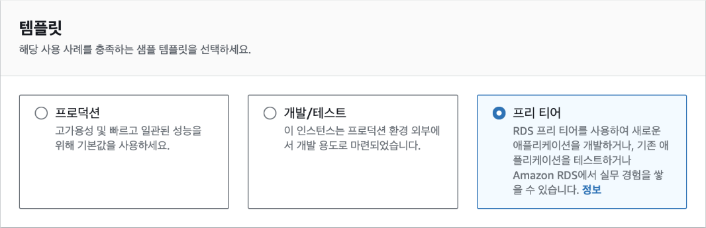
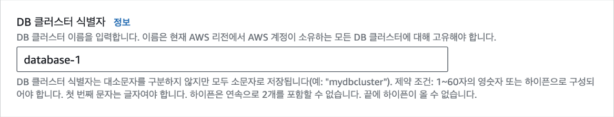
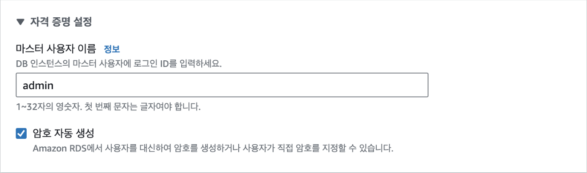
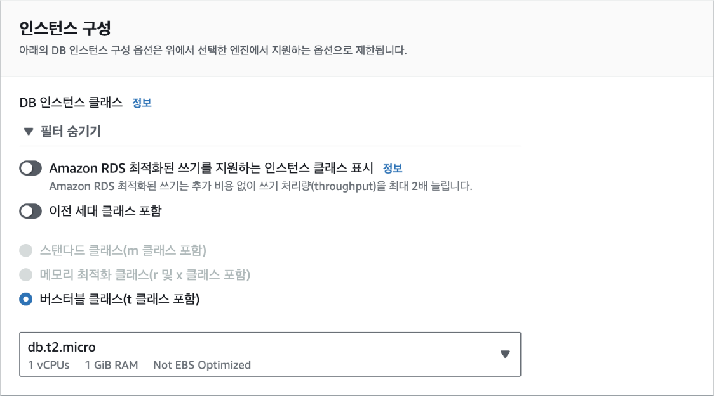
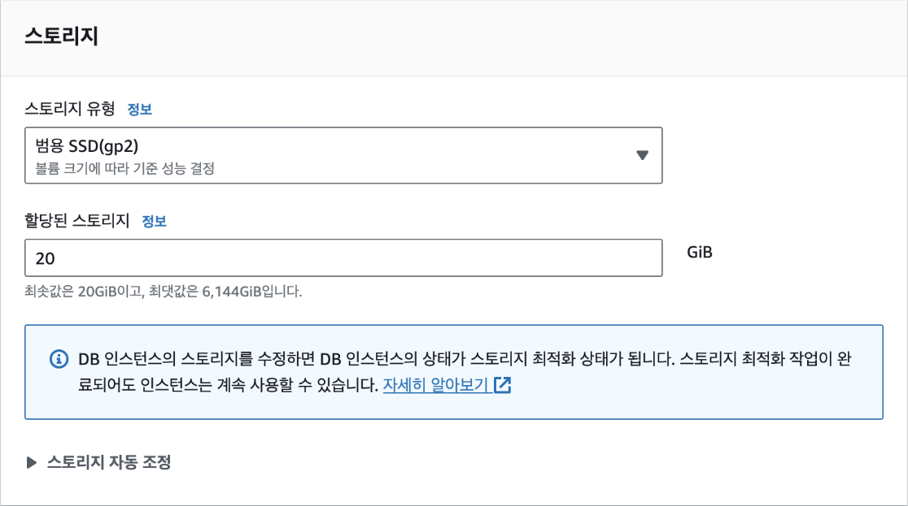
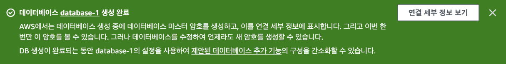
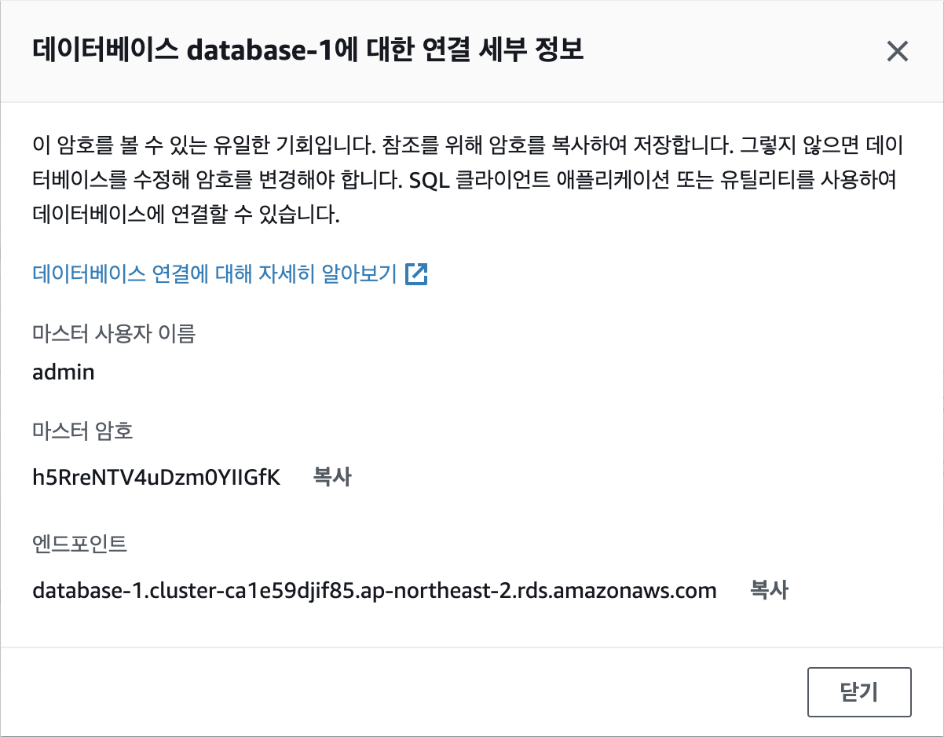

## [2] MySQL 만들기

이번에는 MySQL 데이터베이스를 만들어 보겠습니다. AWS RDS 대시보드로
이동한 후 우측 상단에서 [데이터베이스 생성] 버튼을 클릭합니다.


데이터베이스 생성 방식 선택에서 '표준 생성'을 선택합니다. 손쉬운 생성은
좀더 간편한 방식이지만 프리 티어를 사용하는 등의 설정을 하려면 '표준
생성'을 선택해야 합니다.


엔진 유형에서는 'MySQL'을 선택합니다. 참고로 엔진 버전은 바로 밑에서
확인할 수 있는데, 여기에서는 MySQL 8.0.33으로 진행하지만 최신 버전을
사용하면 됩니다.



프리 티어를 적극적으로 활용하기 위해 템플릿은 '프리 티어'로 선택합니다.



[설정] 탭에서 DB 클러스터 식별자로 기본값인 "database-1"이라는 이름을
입력합니다. DB 클러스터 식별자는 데이터베이스를 구분하기 위한
이름입니다.



자격 증명 설정에서 마스터 사용자 이름에 기본값인 "admin"을 입력하고,
'암호 자동 생성'을 체크(선택)해 무작위로 생성되는 안전한 암호를
사용합니다. 실제 서비스에서도 암호를 직접 설정하는 대신 무작위 암호를
사용하는 것이 좋습니다. 암호는 추후 데이터베이스에 접속할 때 사용됩니다.



인스턴스 구성에서 DB 인스턴스 클래스는 가장 작은 크기인
[db.t2.micro]를 선택합니다.



데이터를 저장할 스토리지에서는 최솟값인 '20GiB'로 설정합니다.



마지막으로 [연결] 탭에서 VPC가 EC2와 동일한 VPC와 보안 그룹으로
설정되어 있는지를 확인합니다. 데이터베이스가 생성된 다음에는 VPC를
변경할 수 없기 때문에 반드시 확인해야 합니다. EC2의 VPC를 확인하려면 EC2
대시보드의 [인스턴스 세부 정보]-[네트워킹]에서 VPC ID를 클릭하면 VPC
이름을 확인할 수 있습니다. 별도 VPC를 생성하지 않았다면 기본값인
'default'를 사용하면 됩니다. 보안 그룹 역시 EC2와 동일한 이름을
선택했는지 확인합니다.


이제 [데이터베이스 생성] 버튼을 클릭합니다. 데이터베이스가 생성되는
데는 5~10분 정도의 시간이 소요됩니다. 데이터베이스가 생성되면 [연결
세부 정보 보기] 버튼을 클릭해 데이터베이스에 연결할 수 있는 접속 정보를
확인합니다.




해당 정보는 단 한 번만 확인할 수 있으므로 반드시 기록해야 합니다. 마스터
사용자 이름, 마스터 암호, 엔드포인트의 3가지를 복사해 둡니다.



마지막으로 EC2 인스턴스에서 RDS에 연결하기 위해서는 보안 그룹의 인바운드
규칙을 수정해야 합니다. EC2와 RDS에 공통으로 설정된 보안 그룹에서
인바운드 규칙에 다음의 규칙을 추가합니다. RDS MySQL는 접속 시 3306번
포트를 사용하기 때문에 보안 그룹에서 해당 포트 번호의 접속을 허용하는
것입니다.


EC2 터미널에 접속해 `mysql-client`를 설치합니다. `mysql-client`는
`mysql` 명령줄 도구를 터미널에서 사용할 수 있도록 해주는 패키지입니다.
다음의 명령어를 실행합니다. `mysql` 명령어는 MySQL 서버에 접속해
데이터베이스를 관리하거나 데이터를 조회 및 수정 등을 할 수 있습니다.
참고로, 현업에서는 `mysql` 명령줄 도구보다 그래픽 화면이 지원되는 MySQL
Workbench나 DBeaver와 같은 도구를 좀더 많이 사용합니다.

```bash
sudo apt install mysql-client
```

이제 EC2 인스턴스로 접속해 RDS에 연결해 보겠습니다. 이전에 복사해둔
마스터 사용자 이름, 마스터 암호, 엔드포인트를 사용합니다. 다음의
명령어를 실행합니다. 이때, `-h` 뒤의 엔드포인트는 복사해둔 것으로
바꾸어야 합니다. 명령어는 `admin` 사용자로 데이터베이스 엔드포인트에
접속하고, `-p` 옵션을 사용해 비밀번호로 인증한다는 의미입니다.

```bash
mysql -u admin -h database-1.cluster-something.ap-northeast-2.rds.amazonaws.com -p
```

명령어를 입력하면 암호를 입력하라는 메시지가 나타납니다. 이때, 복사해둔
마스터 암호를 입력합니다.

```plaintext
Enter password:
```

접속이 성공하면 다음과 같이 `mysql>` 프롬프트가 나타납니다.

```plaintext
Welcome to the MySQL monitor. Commands end with `;` or `\g`.
Your MySQL connection id is 113
Server version: 8.0.28 Source distribution

Copyright (c) 2000, 2023, Oracle and/or its affiliates.

Oracle is a registered trademark of Oracle Corporation and/or its
affiliates. Other names may be trademarks of their respective
owners.

Type 'help;' or '\h' for help. Type '\c' to clear the current input statement.

mysql>
```

이제 데이터베이스와 테이블을 만들어 보겠습니다. 먼저, `MY_APP` 데이터베이스를 생성하되 명령어는 다음과 같습니다.

```sql
mysql> CREATE DATABASE MY_APP;
Query OK, 1 row affected (0.00 sec)
```

`MY_APP` 데이터베이스를 사용하겠다는 명령어는 다음과 같습니다.

```sql
mysql> USE MY_APP;
Database changed
```

`Users` 테이블을 생성하는 명령어는 다음과 같습니다.

```sql
mysql> CREATE TABLE Users (
    -> id INT NOT NULL AUTO_INCREMENT,
    -> name VARCHAR(255) NOT NULL,
    -> age INT NOT NULL,
    -> PRIMARY KEY (id)
    -> );
Query OK, 0 rows affected (0.02 sec)
```

이제 데이터베이스 설정이 완료되었습니다.

