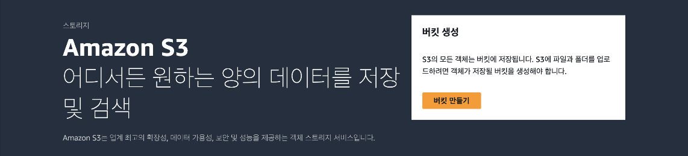
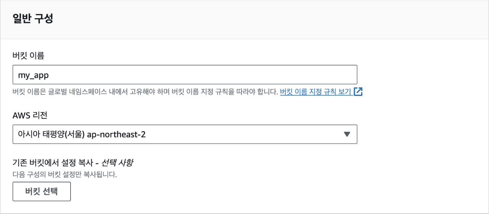
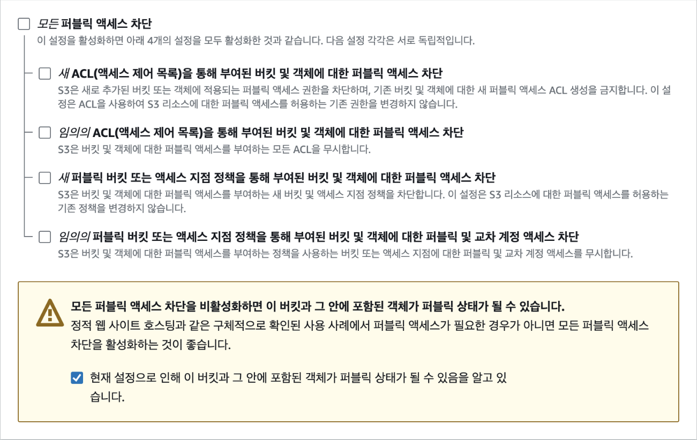
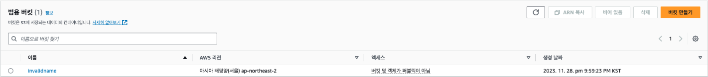
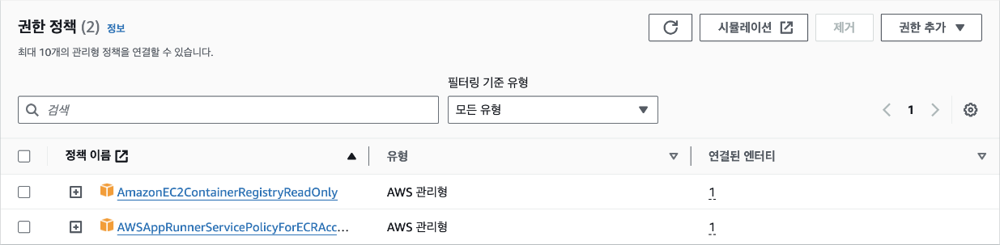
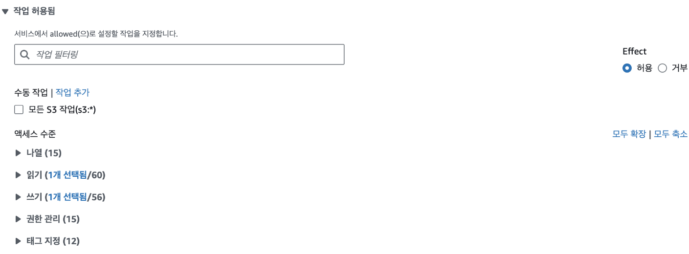
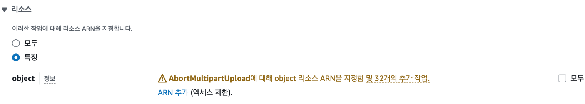
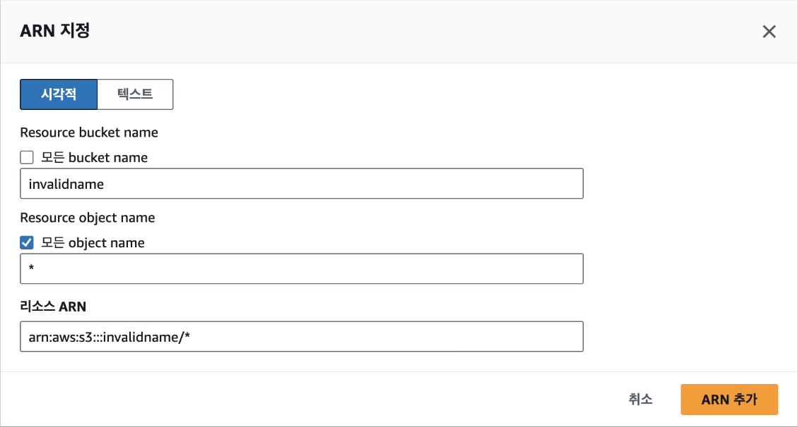
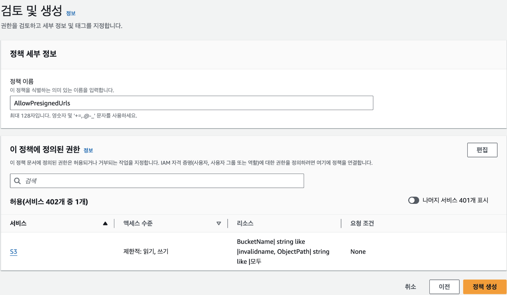

## [3] S3 만들기

기본적으로 모든 S3 버킷과 오브젝트(저장된 파일)는 비공개이고, 접근
권한이 있는 인증된 사용자만 접근할 수 있습니다. 물론, S3은 특정 상황의
경우에 인터넷을 통해 버킷과 오브젝트를 다양한 수준으로 공개할 수 있는
옵션도 제공합니다. S3의 접근 제어 메커니즘에는 전체 S3 버킷 또는 개별
오브젝트를 공개적으로 접근할 수 있도록 하는 버킷 정책과 접근 제어
목록(ACL)이 있습니다. 예를 들면, 외부 사용자가 인터넷에서 파일을
다운로드할 수 있게 하거나 정적 웹 사이트를 S3를 통해 호스팅하는 경우에
접근 권한을 부여할 수 있습니다.

그러면 S3 버킷을 만들고 EC2에 연결해 보겠습니다. S3 콘솔로 이동한 후
[버킷 만들기] 버튼을 클릭합니다.



버킷 이름은 계정 이름과 같이 AWS 내에서 중복되지 않은 유일한 이름이어야
합니다. 본인 계정 내에서의 중복이 아닌 AWS에 존재하는 모든 버킷의 이름과
달라야 합니다.



그리고 S3 버킷과 버킷 내의 오브젝트를 외부에서 접근하는 '퍼블릭 액세스',
즉 인터넷을 통해 접근할 수 있는지를 설정합니다. 기본적으로 보안을 위해
모든 퍼블릭 액세스가 차단되지만 버킷의 오브젝트를 외부에서도 다운로드할
수 있도록 하기 위해서 미리 서명된 URL(Presigned URL)을 사용합니다. 미리
서명된 URL을 사용하면 별도의 인증 과정 없이도 특정 오브젝트에 제한된
시간 동안 접근할 수 있습니다. URL을 생성할 때 오브젝트를 읽기 전용으로만
접근하거나 읽기, 수정, 삭제 등의 전체 권한을 부여할 수도 있습니다.
따라서 AWS 외부에서 오브젝트에 접근할 경우 해당 방법이 가장 안전한
방법입니다.

퍼블릭 액세스를 허용하는 것은 매우 특별한 설정으로 버킷 내의 오브젝트에
중요하거나 민감한 정보가 있는 경우는 절대 퍼블릭 액세스를 허용해서는
안됩니다. 만일, 예외적으로 버킷과 모든 오브젝트를 퍼블릭으로 설정하려면
다음과 같이 체크 박스를 모두 해제하고, 하단의 경고 메시지에 체크 표시를
설정합니다.



나머지 설정은 기본으로 두고 버킷을 생성합니다. S3 대시보드에 다음과 같이
새로운 버킷이 생성된 것을 알 수 있습니다. 여기에서 '액세스'가 '버킷 및
객체가 퍼블릭이 아님'임을 꼭 확인해야 합니다.



EC2와 Lambda가 연동하는 단계로 넘어가기 전에 S3 버킷과 오브젝트에 파일을
업로드할 수 있도록 권한을 추가해야 합니다. EC2의 경우는 기존에 만들었던
ec2-ecr-role에 권한을 추가하고, Lambda는 새로운 역할을 생성합니다. IAM
대시보드에서 ec2-ecr-role의 '권한 - 권한 정책' 패널로 이동합니다. 현재는
다음과 같이 2개의 정책만 있습니다. 우측의 [권한 추가] 버튼을 클릭하고,
[인라인 정책 생성]을 선택합니다.



<blockquote>
[TIP] 정책 생성

정책 연결에서는 미리 만들어져 있는 정책을 편리하게 사용할 수 있습니다.
예를 들어, 'AmazonS3FullAccess' 정책을 역할에 부여하면 해당 역할을
부여받은 서비스는 S3의 모든 버킷과 객체에 대해 읽고 쓰고 삭제하는 등의
모든 작업을 할 수 있는 권한을 받게 됩니다. 하지만 너무 많은 권한을
부여하는 것은 의도치 않은 결과를 발생시킬 떄가 많습니다. 가급적이면 정책
연결을 사용하지 않고, 인라인 정책을 직접 생성해서 필요한 버킷 또는
객체에 대해 특정 작업만 할 수 있도록 정책을 생성하는 것이 좋습니다.

</blockquote>

인라인 정책은 시각적 모드와 JSON 모드를 선택해 생성할 수 있습니다. AWS
정책에 익숙하지 않은 경우는 시각적 모드를 통해 원하는 정책을 직접
설정하는 것이 편리합니다. 먼저 시각적 모드로 정책을 만들어본 다음 JSON
모드를 살펴보겠습니다. 기본적으로는 시각적 모드가 선택되어 있기 때문에
바로 시작할 수 있습니다. 정책을 추가할 서비스 목록에서 S3를 선택한 다음
오브젝트를 업로드하고 다운로드할 수 있도록 작업을 추가합니다. 작업
필터링 입력란에 "PutObject", "GetObject"을 입력하고 각각 선택합니다. 총
2개의 작업이 선택되어 다음과 같은 화면이 되어야 합니다.



그 다음 작업의 대상이 될 버킷을 지정해야 합니다. 리소스 하단에서 'ARN
추가'를 클릭합니다.



여기에서는 이전에 생성한 버킷 이름을 입력하고, 오브젝트는 전체를
의미하는 "\*"를 입력한 다음 [ARN 추가] 버튼을 클릭합니다. '모든 bucket
name'을 선택할 경우는 모든 버킷이 작업 대상이 되기 때문에 주의해야
합니다.



마지막으로 정책 내용을 검토합니다. 정책 이름에 "AllowPresignedUrls"을
입력하고, [정책 생성] 버튼을 클릭하면 정책이 만들어집니다.



만일, 시각적 모드가 아닌 JSON 모드를 사용해 정책을 만드는 경우는 다음과
같이 입력하면 됩니다. 시각적 모드에서 설정한 것처럼 PutObject와
GetObject 작업을 invalidname 버킷의 모든 오브젝트에 허용한다는 의미로
해당 코드는 생성된 정책에서 '정책 편집'을 클릭해 확인할 수도 있습니다.

```json
{
    "Version": "2012-10-17",
    "Statement": [
        {
            "Sid": "AllowPresignedUrls",
            "Effect": "Allow",
            "Action": ["s3:PutObject", "s3:GetObject"],
            "Resource": "arn:aws:s3:::invalidname/*"
        }
    ]
}
```

