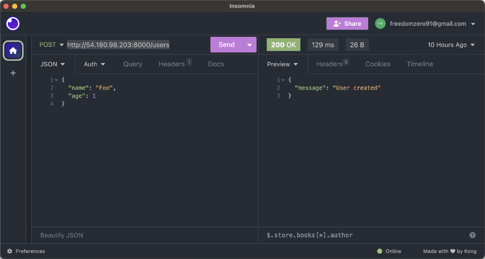
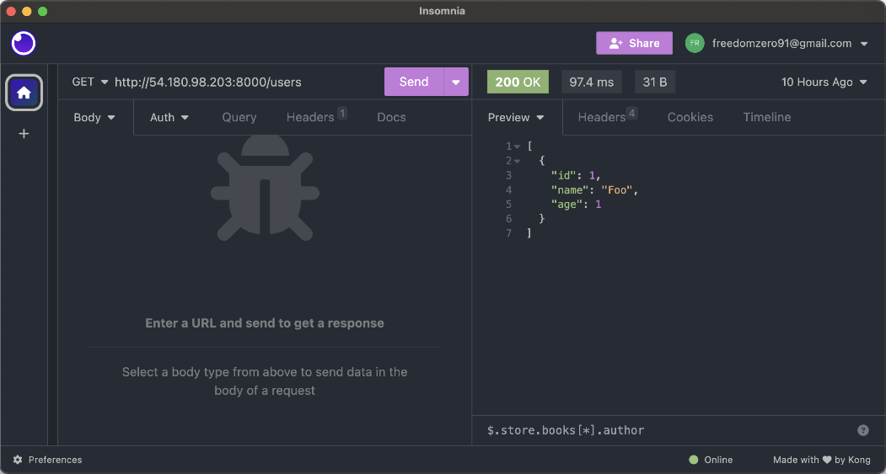
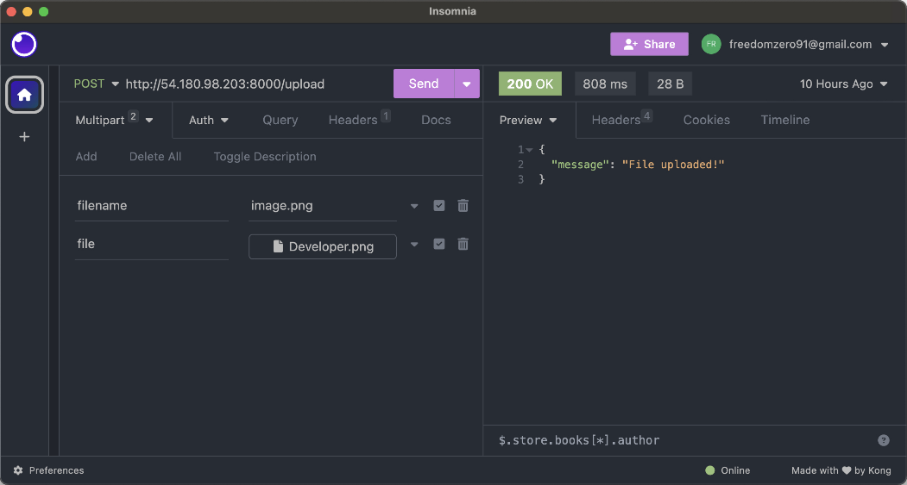
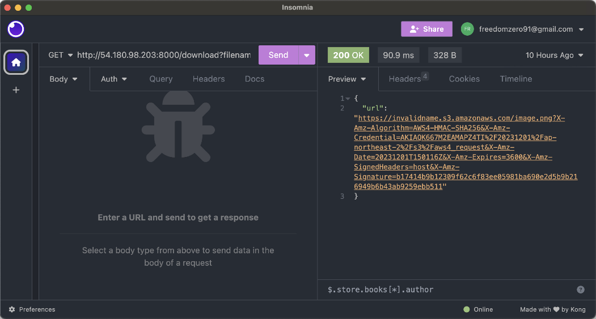

## [4] EC2와 연동하기

이제 EC2 인스턴스에서 FastAPI 서버를 실행해 RDS와 S3에 접근이 가능한지
확인해 보겠습니다. MySQL에서는 테이블에 데이터를 추가하고 읽을 수
있는지를 확인해 보고, S3에서는 파일을 업로드하고 미리 서명된 URL을
생성할 수 있는지를 확인해 보겠습니다. 파이썬에서 AWS 서비스를 사용하기
위해서는 `boto3``이`라는 라이브러리를 사용합니다. EC2 인스턴스로 접속한
다음, 터미널에서 다음과 같이 `boto3``을` 설치합니다.

```bash
pip install boto3
```

그리고 이전에 만들어 두었던 `main.py` 파일의 내용을 수정하겠습니다.
이때, 코드에서 다음의 값들은 자신의 환경에 맞게 수정해야 합니다.


- `DB_HOST` : 데이터베이스 엔드포인트
- `DB_USER` : 데이터베이스 사용자 이름
- `DB_PASS` : 데이터베이스 사용자 암호
- `DB_NAME` : 데이터베이스 이름(앞에서 `CREATE DATABASE MY_APP;`으로
  생성한 이름)
- `BUCKET_NAME` : S3 버킷 이름

`main.py`에 입력할 코드는 다음과 같습니다.

```python
from tempfile import SpooledTemporaryFile

import pymysql
import boto3
from fastapi import FastAPI, Depends, UploadFile, Form, File
from pydantic import BaseModel

app = FastAPI()

DB_HOST = "database-1.cluster-ca1e59djif85.ap-northeast-2.rds.amazonaws.com"
DB_USER = "admin"
DB_PASS = "h5RreNTV4uDzm0YIIGfK"
DB_NAME = "MY_APP"

BUCKET_NAME = "invalidname"


class User(BaseModel):
    id: int = None
    name: str
    age: int


def get_db_client():
    conn = pymysql.connect(host=DB_HOST, user=DB_USER, passwd=DB_PASS, db=DB_NAME)
    return conn


@app.get("/users")
async def get_users(client=Depends(get_db_client)) -> list[User]:
    cur = client.cursor()
    cur.execute("SELECT * FROM Users;")
    rows = cur.fetchall()

    return [User(id=row[0], name=row[1], age=row[2]) for row in rows]


@app.post("/users")
async def create_user(user: User, client=Depends(get_db_client)):
    cur = client.cursor()
    sql = "INSERT INTO Users (name, age) VALUES (%s, %s);"
    cur.execute(sql, (user.name, user.age))
    client.commit()
    return {"message": "User created"}


@app.post("/upload")
async def upload_file(file: UploadFile = File(...), filename: str = Form(...)):
    temp_file = SpooledTemporaryFile()

    content = await file.read()
    temp_file.write(content)
    s3 = boto3.client("s3")
    s3.upload_fileobj(temp_file, BUCKET_NAME, filename)

    temp_file.close()

    return {"message": "File uploaded!"}


@app.get("/download")
async def download_file(filename: str):
    s3 = boto3.client("s3")
    try:
        presigned_url = s3.generate_presigned_url(
            "get_object",
            Params={"Bucket": BUCKET_NAME, "Key": filename},
            ExpiresIn=3600,
        )
    except Exception as e:
        print(e)
        return None

    return {"url": presigned_url}
```

이제 서버를 실행하기 위해 다음의 명령어를 실행합니다. 하나의
컴퓨터에서는 하나의 포트와 하나의 프로그램만 사용이 가능합니다. 따라서
이전에 도커로 실행 중인 서버가 있다면 8000번 포트를 사용중인 프로그램이
있다는 의미이기 때문에 해당 컨테이너를 먼저 종료해야 파이썬 서버를
실행할 수 있습니다. `docker ps`로 해당 컨테이너의 ID를 찾은 다음
`docker stop <ID>`를 입력하면 됩니다.

```bash
python3 -m uvicorn main:app --host 0.0.0.0
```

서버에 접속해 요청을 보내기 위해서는 Insomnia에서 총 4개의 Request를
생성합니다. 먼저 데이터베이스에 값을 추가하는 엔드포인트를 만들어
보겠습니다. 메소드는 POST, 주소는
`http://<서버 주소>:8000/users`와 같이 입력합니다. 그리고 Body
탭에서 JSON을 선택하고 다음과 같이 입력합니다.

```json
{
    "name": "Foo",
    "age": 1
}
```

요청이 정상적으로 수행되면 다음과 같이 "User created"라는 응답을 받을 수
있습니다.



방금 생성된 값을 읽어오는 엔드포인트를 테스트해 보겠습니다. 메소드는
GET, 주소는 `http://<서버 주소>:8000/users`와 같이 입력합니다.
그러면 방금 생성한 값이 응답으로 돌아옵니다.



이번에는 S3에 이미지 파일을 업로드해 보겠습니다. 메소드는 POST, 주소는
`http://<서버 주소>:8000/upload`와 같이 입력합니다. 그리고 Body
탭에서 'Multipart Form'을 선택합니다. 첫 번째 항목 키는 `filename`, 값은
image.png이고, 두 번째 항목 키는 `file`입니다. 값의 경우는 우측의 목록
단추를 눌러 업로드할 'File'을 선택합니다. 파일을 선택하고 요청을 보내면
"File uploaded!" 응답을 받게 됩니다.



방금 업로드한 파일을 다운로드 받을 수 있는 사전 서명된 URL을
받아보겠습니다. 메소드는 GET, 주소는
`http://<서버 주소>:8000/download?filename=image.png`와 같이
입력합니다. 응답으로 URL이 오게 되는데 해당 주소로 접속해 보면 아까
업로드한 파일을 인터넷에서 다운로드 받을 수 있습니다.



