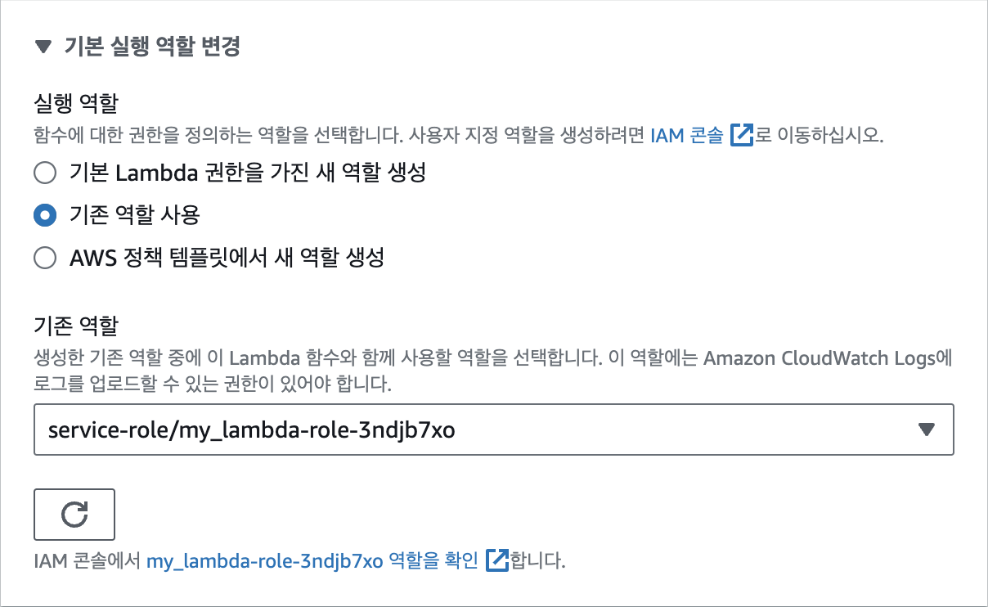
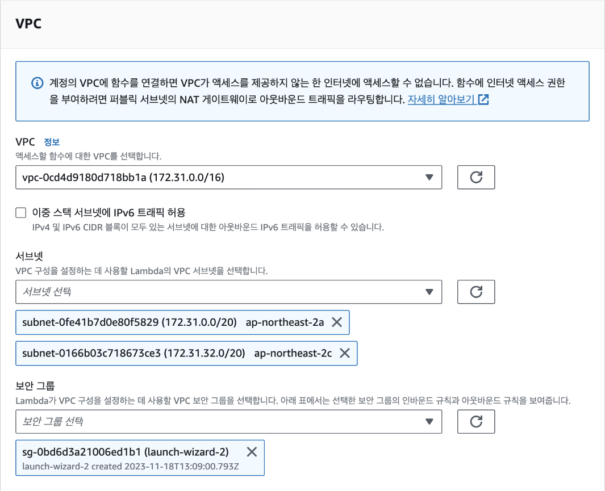
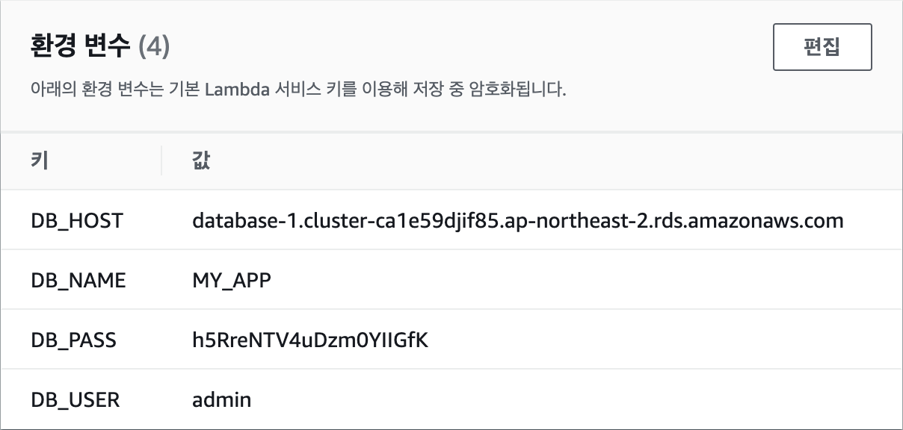
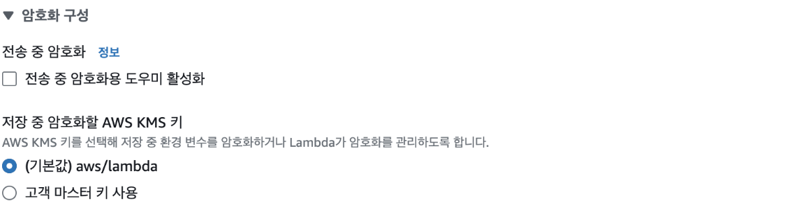
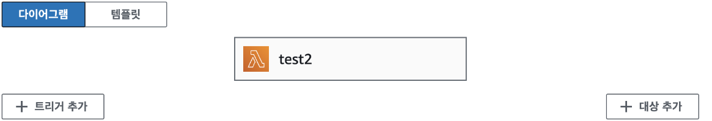
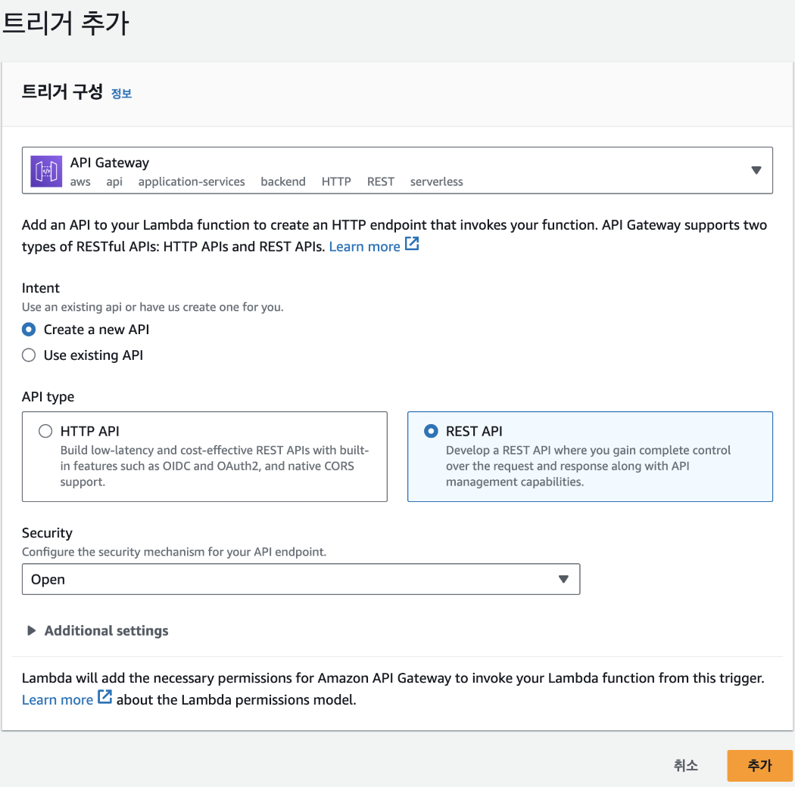
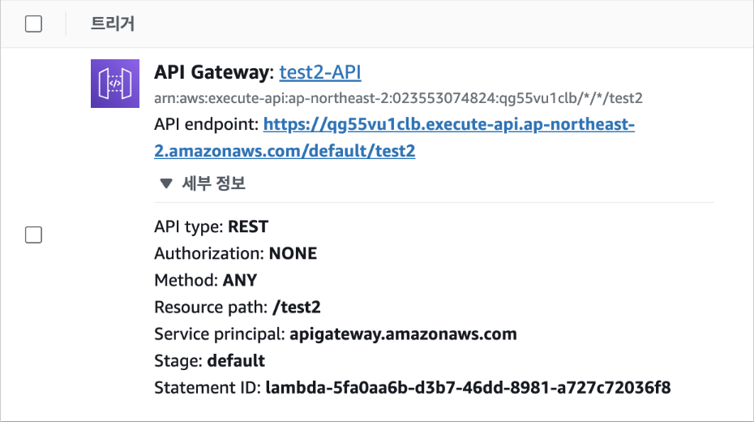
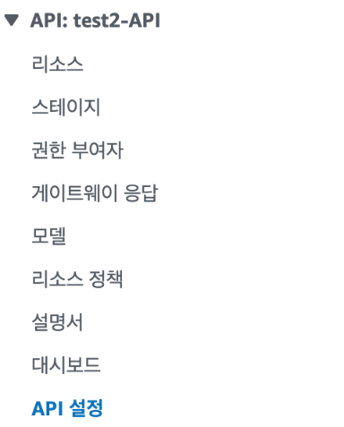
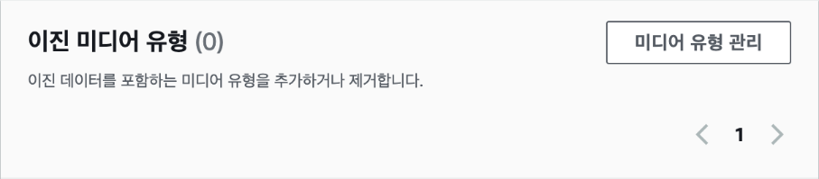
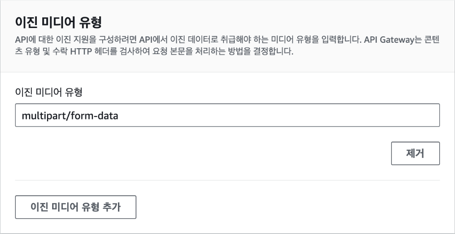

## [5] Lambda와 연동하기

Lambda를 사용하기 위해서는 방금 살펴본 EC2 코드를 두 개의 Lambda 로
분할해서 하나의 함수가 하나의 기능만 갖도록 해야 합니다. 그러기 위해서
MySQL을 사용하는 도커 이미지와 S3을 사용하는 도커 이미지를 각각
빌드하겠습니다. 첫 번째로 MySQL을 사용하는 도커 이미지를 빌드하기 위해
Lambda 코드를 작성했던 폴더를 VSCode로 연 다음 `app_rds.py` 파일을
다음과 같이 생성합니다.

```python
import json
import os

import pymysql
from pymysql.err import OperationalError

DB_HOST = os.environ["DB_HOST"]
DB_USER = os.environ["DB_USER"]
DB_PASS = os.environ["DB_PASS"]
DB_NAME = os.environ["DB_NAME"]


def lambda_handler(event, context):
    try:
        conn = pymysql.connect(host=DB_HOST, user=DB_USER, passwd=DB_PASS, db=DB_NAME)
    except OperationalError:
        return {"error": "Could not connect to MySQL database"}

    http_method = event["httpMethod"]
    if http_method == "GET":
        return get_users(conn)
    elif http_method == "POST":
        user_data = json.loads(event["body"])
        return create_user(user_data, conn)


def get_users(conn):
    cur = conn.cursor()
    cur.execute("SELECT * FROM Users;")
    rows = cur.fetchall()

    return {"statusCode": 200, "body": json.dumps({"users": rows})}


def create_user(user, conn):
    cur = conn.cursor()
    sql = "INSERT INTO Users (name, age) VALUES (%s, %s);"
    cur.execute(sql, (user["name"], user["age"]))
    conn.commit()

    return {"statusCode": 200, "body": "User created successfully!"}
```

그리고 MySQL을 사용하는 도커 이미지를 빌드하기 위해 `Dockerfile_rds`를
다음과 같이 생성합니다.

```Dockerfile
FROM public.ecr.aws/lambda/python:3.11

RUN pip3 install pymysql

COPY app_rds.py ${LAMBDA_TASK_ROOT}/lambda_function.py

CMD [ "lambda_function.lambda_handler" ]
```

해당 도커파일로부터 도커 이미지를 빌드하고 ECR의 my_lambda 레포지토리에
푸시합니다. 이때, 이미지 태그를 `rds`로 설정합니다.

```bash
docker build -f Dockerfile_rds -t 000000000000.dkr.ecr.ap-northeast-2.amazonaws.com/my_lambda:rds .
docker push 000000000000.dkr.ecr.ap-northeast-2.amazonaws.com/my_lambda:rds
```

만일, 다음과 같이 에러가 발생하는 경우는 AWS CLI를 사용해 다시
로그인해야 합니다.

```plaintext
"denied:
Your authorization token has expired. Reauthenticate and try again."

```

> 3장에서 `aws ecr get-login-password ...` 명령어를 찾아보세요.

이제 푸시된 이미지를 가지고 새로운 Lambda 함수(rds)를 컨테이너 이미지로
생성합니다. 이때, 실행 역할은 기존 역할을 선택하면 되는데, 예전에
만들었던 my_lambda-role로 자동으로 설정되는 것을 볼 수 있습니다.

이때, 실행 역할에서 '기존 역할 사용'을 선택하고, 기존 역할에서 예전에
만들었던 my_lambda-role를 설정합니다.



그 다음 Lambda가 MySQL에 접근하고 사용할 수 있도록 역할에 권한을
부여해야 합니다. IAM 대시보드에서 역할 my_lambda-role에 다음의 두 정책을
추가합니다.

- `AmazonRDSDataFullAccess` : MySQL을 사용할 수 있는 권한
- `AWSLambdaVPCAccessExecutionRole` : MySQL이 존재하고 VPC에 접근할 수
  있는 권한

다시 Lambda로 돌아와서 [구성]-[VPC]-[VPC 편집]에서 VPC와 보안
그룹을 설정합니다. VPC와 보안 그룹은 EC2와 동일한 것을 선택하고,
서브넷은 현재 리전에서 사용 가능한 서브넷 중 RDS 이름이 붙어있지 않은 두
개를 선택합니다.



이전과 다르게 소스 코드에는 데이터베이스 연결에 필요한 정보를 입력하지
않았습니다. 연결에 필요한 정보를 환경 변수로부터 읽어오도록 되어 있기
때문에 추후 데이터베이스 연결 정보가 바뀌는 경우 소스 코드는 그대로 두고
환경 변수만 바꿔주면 됩니다. 특히, 비밀번호와 같은 민감한 정보는 소스
코드에 포함시키기보다 환경 변수로 두는 것이 좋은 방법입니다. 환경 변수는
[구성]-[환경 변수]에서 추가할 수 있습니다. 환경 변수는 다음과 같이
4개를 추가합니다.



이때, 하단의 암호화 구성에서 환경 변수를 암호화해 저장할 수 있습니다.
AWS KMS(Key Manage Service)에서 AWS가 관리하는 암호화 키인
`aws/lambda`를 기본값으로 선택하면 됩니다. 이렇게 암호화된 환경 변수는
Lambda 함수가 실행될 때 자동으로 복호화 되어 사용됩니다. KMS 관리 키가
아닌 사용자 지정 키를 사용할 수도 있지만 추가 요금이 발생합니다.



마지막 단계로 API 게이트웨이를 연결합니다. 화면 상단의 다이어그램에서
[트리거 추가] 버튼을 클릭합니다.



트리거 추가에서는 [API Gateway]를 선택한 후 Intent는 'Create a new
API', API type은 'REST API'를 각각 선택합니다. HTTP API는 좀더 저렴하고
기본적인 기능만 제공하기 때문에 단순한 애플리케이션에 적합합니다. 반면
REST API는 다양한 편의 기능을 갖추고 있어서 추후 파일을 업로드하고
다운로드 받을 때 유용합니다. Security는 'Open'을 선택해 추가 인증 없이
API 호출이 가능하도록 합니다. 참고로 현업에서는 Bearer token 등을
사용해서 애플리케이션 단위로 인증하거나 OIDC를 사용해 클라우드 전체
단위로 인증을 수행하는 것이 일반적입니다.



[추가] 버튼을 클릭하면 다음과 같이 API Endpoint를 확인할 수 있는데,
나중에 해당 주소로 API 요청을 보내면 Lambda 함수가 실행됩니다.



이제 Lambda 함수를 테스트해 보겠습니다. 소스 코드에서 HTTP 메소드를
`event` 파라미터로부터 읽어오도록 설정했는데, 해당 정보는 API
게이트웨이에서 제공하는 것이기 때문에 Lambda 함수를 테스트하려면 반드시
API Gateway에서 제공되는 엔드포인트를 사용해야 합니다. 예를 들어서
엔드포인트가
`https://s2uhma6dn3.execute-api.ap-northeast-2.amazonaws.com/default/rds`라면
GET 요청을 통해 유저 목록을 받을 수 있고, POST 요청을 통해 새로운 유저를
추가할 수 있습니다.

이번에는 S3을 사용하는 Lambda를 만들어 보겠습니다. S3 버킷에 파일을
업로드하고, 미리 서명된 URL의 생성 코드를 `app_s3.py` 파일로 분리합니다.
`app_s3.py` 파일은 다음과 같습니다.

```python
import json
import base64
from io import BytesIO
from tempfile import SpooledTemporaryFile

from multipart import parse_form_data
import boto3

BUCKET_NAME = "invalidname"

s3 = boto3.client("s3")


def lambda_handler(event, context):
    http_method = event["httpMethod"]

    if http_method == "POST":
        form, files = parse_form_data(
            {
                "CONTENT_TYPE": event["headers"]["content-type"],
                "REQUEST_METHOD": "POST",
                "wsgi.input": BytesIO(base64.b64decode(event["body"])),
            }
        )
        return upload_file(files["file"].file.read(), form["filename"])

    elif http_method == "GET":
        filename = event["queryStringParameters"]["filename"]
        return download_file(filename)


def upload_file(data, filename):
    temp_file = SpooledTemporaryFile()
    temp_file.write(data)

    s3.upload_fileobj(temp_file, BUCKET_NAME, filename)
    temp_file.close()

    return {"statusCode": 200, "body": "File uploaded!"}


def download_file(filename):
    try:
        url = s3.generate_presigned_url(
            "get_object",
            Params={"Bucket": BUCKET_NAME, "Key": filename},
            ExpiresIn=3600,
        )
    except Exception as e:
        print(e)
        return {"statusCode": 500, "error": "Failed to generate download URL"}

    return {"statusCode": 200, "body": json.dumps({"url": url})}
```

이제 다음의 내용으로 `Dockerfile_s3` 파일을 생성합니다.

```dockerfile
FROM public.ecr.aws/lambda/python:3.11

RUN pip3 install boto3 multipart

COPY app_s3.py ${LAMBDA_TASK_ROOT}/lambda_function.py

CMD [ "lambda_function.lambda_handler" ]
```

도커 이미지를 빌드하고 ECR의 my_lambda 레포지토리에 푸시합니다. 이때,
이미지 태그를 `s3`로 설정합니다.

```bash
docker build -f Dockerfile_s3 -t 000000000000.dkr.ecr.ap-northeast-2.amazonaws.com/my_lambda:s3 .
docker push 000000000000.dkr.ecr.ap-northeast-2.amazonaws.com/my_lambda:s3
```

이제 푸시된 이미지를 가지고 새로운 Lambda 함수 s3을 컨테이너 이미지로
생성합니다. 이때, 실행 역할은 예전에 만들었던 my_lambda-role로
설정합니다. 이번에도 IAM 대시보드에서 역할 권한을 수정해야 합니다. 역할
my_lambda-role에 인라인 정책으로 다음을 추가합니다.

```json
{
    "Version": "2012-10-17",
    "Statement": [
        {
            "Sid": "AllowPresignedUrls",
            "Effect": "Allow",
            "Action": ["s3:PutObject", "s3:GetObject"],
            "Resource": "arn:aws:s3:::invalidname/*"
        }
    ]
}
```

이제 API Gateway를 생성하고 연결합니다. MySQL을 사용하는 Lambda와
동일하게 트리거에 API Gateway를 설정합니다. API Gateway를 연결했다면 API
Gateway 대시보드로 이동한 후 좌측 메뉴 목록에서 [API 설정]을
선택합니다.



페이지 중간에서 '이진 미디어 유형' 패널을 찾아 [미디어 유형 관리]를
클릭합니다.



이진 미디어는 문서나 이미지 같은 일반 파일 데이터를 의미합니다. API가
호출될 때 `Content-Type` 헤더를 통해서 전송되는 데이터 종류를 알 수
있는데, 여기에서 이진 미디어 유형을 정의하면 해당 값이 헤더로 들어오는
경우 API Gateway가 해당 데이터를 자동으로 추출해서 Lambda로 전송합니다.



이제 Insomnia로 Lambda에 이미지 파일을 전송해 S3에 업로드한 후 사전
서명된 URL을 받을 수 있는지 테스트합니다. 테스트 방법은 EC2를 사용해서
S3에 파일을 업로드하는 것과 동일합니다. 다만, 엔드포인트가 공개 IP주소가
아닌
`https://s2uhma6dn3.execute-api.ap-northeast-2.amazonaws.com/default/s3`인
점에 주의해야 합니다.

