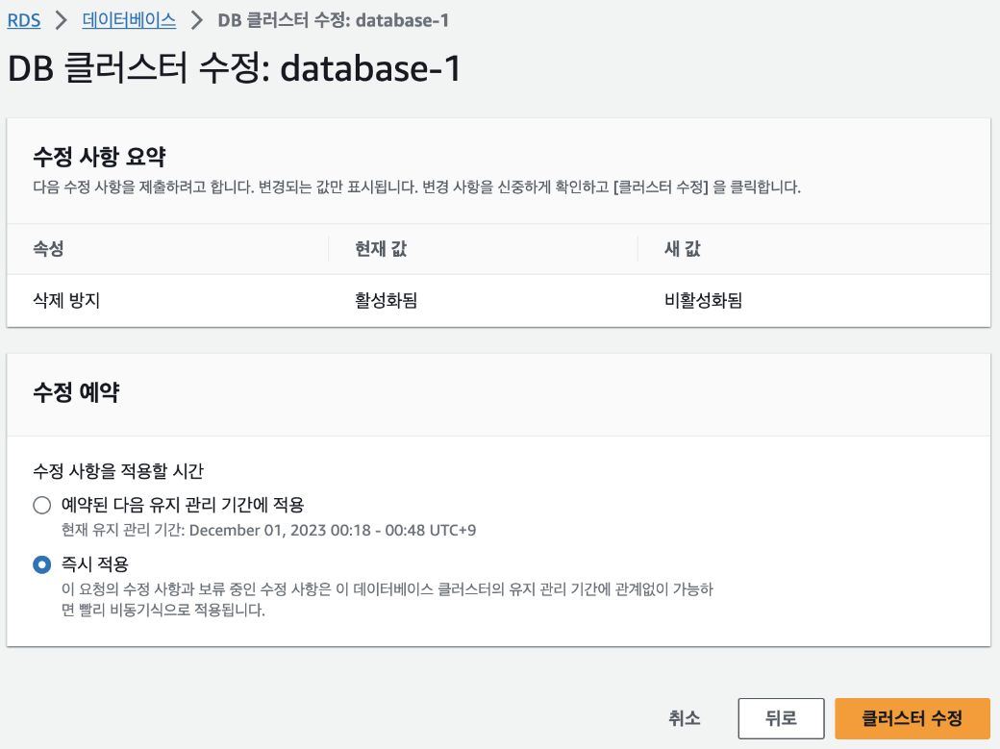
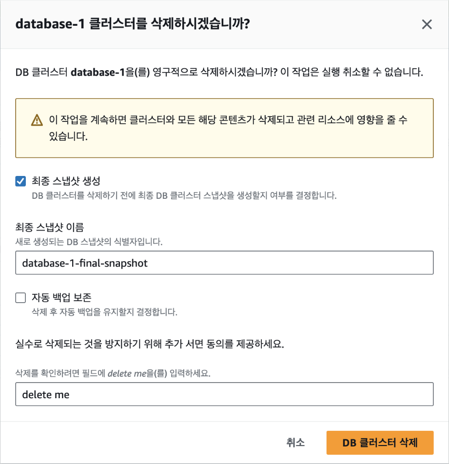

## [6] RDS 삭제하기

Amazon RDS 데이터베이스를 사용하지 않으면 이를 삭제해야 추가 비용이
발생하지 않습니다. 나중에 사용할 수 있도록 데이터를 저장하려면 DB
인스턴스의 최종 스냅샷을 만듭니다. RDS DB 인스턴스가 삭제되면 데이터를
복구할 수 없으므로 데이터가 더 이상 필요하지 않은 경우에만 삭제합니다.
DB 인스턴스를 삭제하면 이와 연결된 자동화된 백업, 읽기 복제본 및 DB
매개변수 그룹도 삭제됩니다. 인스턴스를 삭제하는 단계는 다음과 같습니다.

RDS는 실수로 인해 중요한 데이터가 삭제되는 것을 막기 위해 기본적으로
삭제 방지가 활성화되어 있습니다. 따라서 가장 먼저 '삭제 방지 활성화'를
해제합니다.

해당 변경 사항을 적용할 수 있는 시간을 예약할 수도 있습니다. 여기에서는
즉시 적용하기 위해 [클러스터 수정] 버튼을 클릭하면 데이터베이스의 삭제
가능 상태가 됩니다.

리더/라이터 인스턴스를 삭제해야 클러스터를 삭제할 수 있기 때문에 각
인스턴스를 먼저 삭제합니다. 인스턴스를 삭제하는 데는 약간의 시간이
소요됩니다. 하지만 인스턴스가 완전히 삭제되길 기다릴 필요 없이
인스턴스가 삭제 중이더라도 클러스터를 삭제할 수 있습니다. 삭제 과정은
다음과 같습니다.

- RDS 콘솔에서 DB 인스턴스를 선택하고, 필요 시 [작업]-[스냅샷
  만들기]를 선택합니다.

- DB 인스턴스에서 먼저 삭제해야 하는 읽기 복제본이 없는지 확인합니다.
  읽기 복제본이 있는 경우는 해당 복제본을 먼저 삭제합니다.

- RDS 콘솔에서 삭제할 DB 인스턴스를 선택하고, [작업]-[삭제]를
  선택합니다.

- 최종 스냅샷의 생성 여부를 선택합니다(1단계에서 아직 생성하지 않은
  경우). 데이터가 더 이상 필요하지 않은 경우 스냅샷을 생성하지 않도록
  선택할 수 있습니다.

- DB 인스턴스가 삭제된 후 자동 백업 비용이 청구되지 않도록 백업을
  비활성화합니다. [수정]-[백업]으로 이동해 백업 보존 기간을 0일로
  설정합니다.

- 페이지 하단에서 [삭제] 버튼을 클릭합니다.

- 삭제되는 동안 DB 인스턴스는 '삭제 중' 상태로 표시됩니다. 삭제가
  완료되면 DB 인스턴스는 RDS 콘솔에서 사라집니다.

