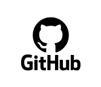
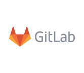
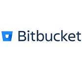
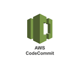

## [1] Git과 CI/CD의 기능

### Git의 개념

Git은 소스 코드 관리에 사용되는 분산 버전 관리 시스템입니다. Git을
사용하면 여러 개발자들이 동시에 코드를 수정할 수 있고, 각각의 변경
사항을 반영한 다른 버전의 코드를 유지할 수 있습니다. 따라서 대부분의
현대적인 소프트웨어 개발에서는 Git을 사용합니다. 이렇게 Git으로 관리되는
프로젝트 폴더 또는 코드베이스를 깃 레포지토리(줄여서 깃 레포) 또는 깃
저장소라고 부릅니다.

Git은 다른 사람들과의 협업을 위해 사용하는 프로그램이기 때문에 로컬
환경에서만 깃을 사용하는 것은 큰 의미가 없을 수 있습니다. 따라서 여러
사람이 함께 코드 변경 사항을 업로드하고 다운로드 받을 수 있는 원격
서버가 필요합니다. 요즘에는 이러한 원격 서버를 서비스 형태로 제공되는
경우가 많습니다. 대표적인 깃 저장소 서비스는 다음과 같습니다.

- 

- GitHub는 가장 크고 가장 인기 있는 Git 레포지토리 호스팅 서비스로,
  무료 계정으로 사용할 수 있는 공개 레포지토리와 팀을 위한 고급 협업
  기능을 제공합니다.

- 

- GitLab은 회사 내부 프로젝트에 적합한 무료 티어에서 무제한 비공개
  레포지토리와 CI/CD 파이프라인을 제공하는 오픈 코어 Git 레포지토리
  관리자입니다.

- 

- Atlassian의 Bitbucket은 최대 5명의 사용자로 구성된 소규모 팀에게
  무제한 비공개 Git 레포지토리를 무료로 제공하며, Jira와 같은 다른
  Atlassian 서비스와 긴밀하게 통합됩니다.

- 

- AWS CodeCommit은 확장성이 뛰어나고 안전한 Git 레포지토리 호스팅
  서비스로, Amazon Web Services에서 완전히 관리하며 다른 AWS 제품과
  원활하게 통합됩니다.

- 

- Gerrit은 코드 리뷰 워크플로우를 위해 특별히 구축된 오픈 소스 Git
  레포지토리 관리 솔루션으로, 세분화된 액세스 제어, 코드 리뷰 도구 및
  Jenkins와의 통합을 제공합니다.

이 책에서는 Git을 사용해 코드를 저장할 곳으로 가장 유명하고 많이
사용되는 서비스인 GitHub를 이용합니다.

<blockquote>
TIP: 왜 GitHub인가?

- 방대한 에코시스템과 오픈 소스 커뮤니티 : 최대 규모의 개발자
  커뮤니티는 통합, 학습 리소스, 기여자 및 협업 플랫폼에 대한 전반적인
  추진력을 높여줍니다.

- 협업에 적합한 기능 : GitHub는 코드 리뷰, 작업 추적, @멘션, 위키 및
  기타 기능을 통해 팀 협업을 지원하여 그룹이 효율적으로 코드를 함께
  작업할 수 있도록 돕습니다.

- 강력한 확장 및 통합 : GitHub는 모든 것을 혼자서 처리하려고 하지 않고
  앱, 작업 및 강력한 API를 통해 개발자가 사용하는 다른 도구와의 사용자
  지정 및 연결을 강화합니다. 이러한 유연성이 핵심입니다.
</blockquote>

### CI(Continuous Integration)의 개념

지속적 통합(CI)은 개발자가 코드의 변경 사항을 저장소에 푸시할 때마다
자동으로 테스트를 실행하고 빌드를 수행하는 프로세스입니다. CI의 목표는
코드 변경 사항이 생길 때마다 빌드와 테스트를 자동으로 실행해서 그에 대한
피드백을 개발자에게 제공합니다. 만일, 빌드와 테스트에 문제가 없으면 해당
변경 사항은 저장소의 메인 브랜치에 머지되게 됩니다.

프로젝트에 CI가 설정되어 있으면 새로운 코드에 대한 문제점을 빠르게
발견할 수 있습니다. 특히 포맷이나 린팅 같은 스타일 문제도 검사하기
때문에 코드 품질을 높게 유지할 수 있다는 장점이 있습니다.

### CD(Continuous Delivery/Deployment)의 개념

지속적 배포(CD)는 CI에서 한 단계 더 나아가 변경 사항을 프로덕션 환경
또는 개발 환경에 자동으로 배포하는 것입니다. CI/CD의 목표는 코드 변경
사항을 신속하게 통합 및 배포해 전체 릴리즈 시간을 단축하고, 보다 빠른
피드백을 제공하는 것입니다.

NOTE_주요 CI/CD 도구

- Jenkins: 오픈 소스 CI/CD 서버로, 다양한 플러그인을 통해 확장
  가능합니다.

- GitHub Actions: GitHub에서 제공하는 CI/CD 솔루션으로, GitHub
  레포지토리와 긴밀하게 통합되어 있습니다.

- GitLab CI/CD: GitLab에서 제공하는 CI/CD 솔루션으로, GitLab과의
  통합이 뛰어납니다.

- AWS CodePipeline: AWS에서 제공하는 CI/CD 서비스로, AWS 생태계와
  긴밀하게 통합되어 있습니다.

- Azure DevOps: Microsoft에서 제공하는 CI/CD 서비스로, Azure
  클라우드와 긴밀하게 통합되어 있습니다.

