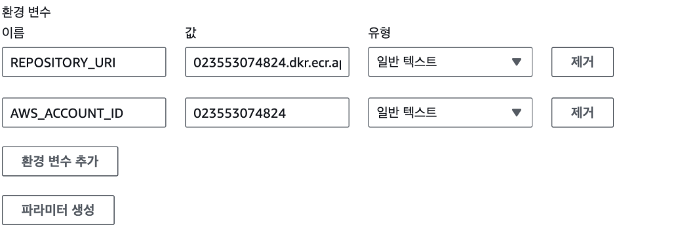
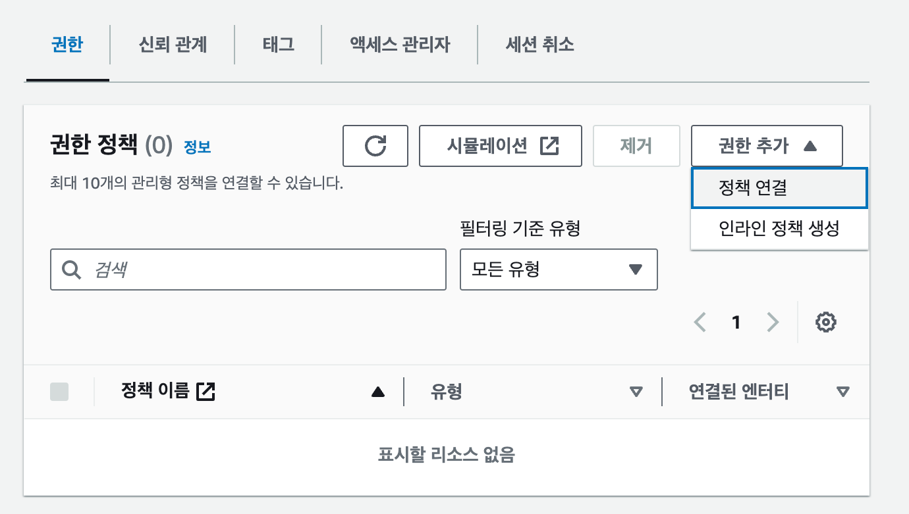
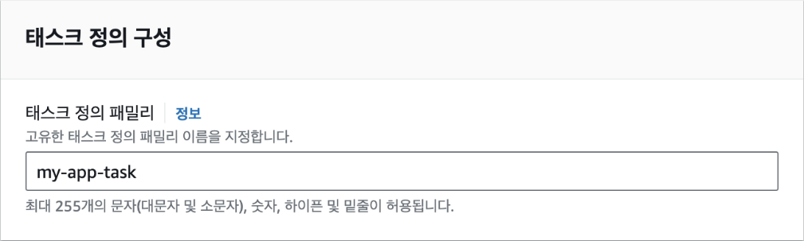
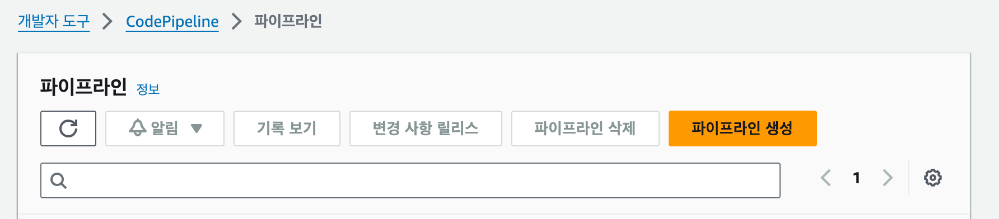
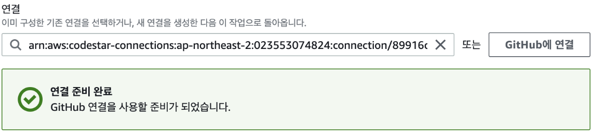
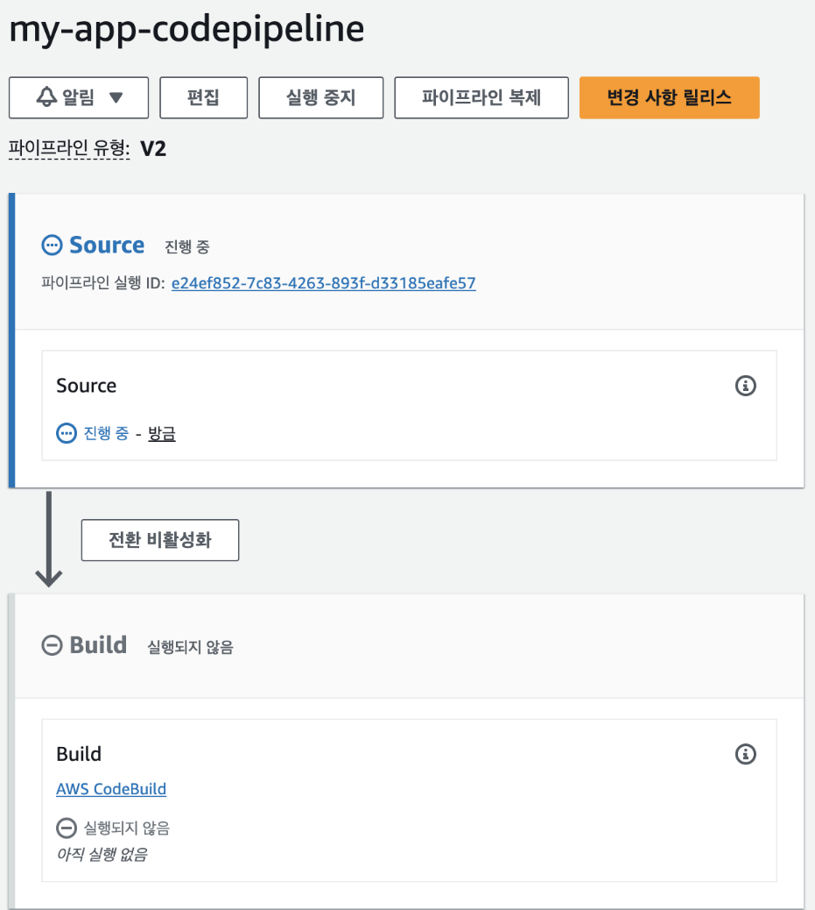
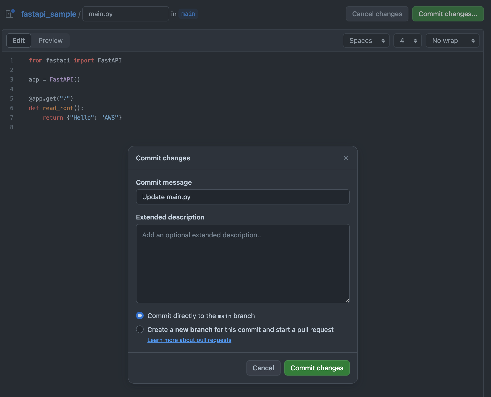

## [3] ECS CI/CD 파이프라인


CI/CD 파이프라인에서 도커는 가장 필수적인 요소입니다. 어플리케이션을
업데이트할 때에는 소스 코드만 업데이트 되는 경우도 있지만 소스 코드가
실행되는 환경이 변경되는 경우도 있습니다. 예를 들어, 운영 체제의
라이브러리를 새롭게 설치하거나 환경 변수를 변경하는 등의 작업이 이에
해당합니다. EC2 인스턴스에 새로운 패키지를 설치하거나 운영체제를
변경해야 한다면 아예 새로운 인스턴스를 생성해야 하는 상황도 발생합니다.
어플리케이션을 개발하거나 운영할 때 도커를 사용하는 것처럼CI/CD에서
사용하는 서비스들에서도 도커로 환경을 구성하는 것이 일반적입니다.

이번 절에서 살펴볼 EC2의CI/CD 파이프라인은 다음과 같은 순서로 서비스를
생성하고 설정합니다.


도커 이미지를 사용하면 서버에 직접 소스 코드를 배포하는 번거로움 없이,
새로운 이미지를 빌드하여 간편하게 배포할 수 있습니다. 이는 서버 관리
부담을 줄이고 배포 속도를 향상시키는 데 큰 도움이 됩니다.

AWS ECS는 이러한 도커 이미지를 효율적으로 관리하고 배포하기 위한 고성능
컨테이너 관리 서비스입니다. ECS를 이용하면 EC2 인스턴스를 직접 관리하지
않고도 도커 컨테이너를 실행할 수 있어 운영 편의성을 높일 수 있습니다.
ECS는 크게 EC2 모드와 Fargate 모드 두 가지로 나뉘는데, EC2 모드는
사용자가 직접 EC2 인스턴스를 관리해야 하지만 Fargate 모드는 AWS가 EC2
인스턴스를 자동으로 관리해 주므로 더욱 간편하게 사용할 수 있습니다.
특히, Fargate 모드는 사용한 만큼만 비용을 지불하는 서버리스 모델이기
때문에 소규모 서비스나 변동성이 큰 서비스에 적합합니다.

### Github 설정

여기에서 사용하는 깃허브 저장소에는 루트 주소 `/`로 GET 요청을 보내면
"Hello World"를 리턴하는 FastAPI 코드와 해당 코드를 실행할 수 있도록
준비된 도커 파일이 있습니다.

https://github.com/Indosaram/fastapi_sample

해당 저장소를 내 깃허브 계정으로 포크(Fork)해서 사용하겠습니다. 포크란
저장소의 현재 상태를 내 계정의 깃허브 저장소로 복사해 오는 것을
의미합니다. 깃허브에 회원가입 또는 로그인이 되어있지 않다면 회원가입
또는 로그인이 필요합니다. 저장소를 포크하려면 깃허브 저장소 우측
상단에서 다음과 같이 [Fork] 버튼을 클릭합니다.


그러면 포크해온 저장소 이름을 변경할 수 있습니다. 원하는 이름을
입력하거나 기존의 이름을 사용해도 됩니다. 이름을 결정했다면 화면 우측
하단의 [Create fork] 버튼을 클릭합니다.


이제 GitHub 쪽에서의 설정은 끝났습니다. 이 레포지토리를 AWS와 연결하기
위해서 다시 AWS 콘솔로 돌아가 작업을 계속하겠습니다.

### Codebuild 생성

콘솔에서 Codebuild를 검색해 해당 서비스 페이지로 이동합니다. 그리고
프로젝트 생성 버튼을 클릭합니다.


프로젝트 구성에서 프로젝트 이름에 "my_app_build"를 입력합니다.


그 다음 소스1 - 기본에서 GitHub를 선택합니다. 처음 1회는 CodeBuild
서비스가 GitHub 계정에 접근할 수 있도록 권한을 부여해 주는 과정이
필요합니다. 새로 열린 웹 브라우저 페이지에서 다음과 같이 [Authorize
aws-codebuild] 버튼을 클릭합니다.


AWS로 돌아와서 [확인] 버튼을 클릭하면 연결 처리가 완료됩니다.


레포지토리에서 '내 GitHub 계정의 레포지토리'를 선택하고, GitHub
레포지토리에서 추가하려는 레포지토리 주소를 직접 입력하거나 목록에서
선택합니다. 이전에 포크해왔던 레포지토리를 선택하면 됩니다.


커밋 웹훅(webhook)은 저장소에 새로운 커밋이 생성되었을 때 호출되어
Codebuild를 트리거할 수 있는 웹 주소입니다. 프로그램이나 브라우저로 해당
주소로 접속하면 미리 설정된 작업이 작동되는 방식을 웹훅이라고 합니다.
예전에는 웹훅을 생성해서 Codebuild를 트리거하는 것이 일반적이었지만,
주소만 있으면 누구나 빌드를 실행할 수 있다는 문제가 있습니다. 이와 같은
보안상의 이유로 현재는 안전한 OAuth 방식이 권장되고 있습니다. 우리는
이미 위에서 GitHub와 CodeBuild를 OAuth 방식으로 연결했기 때문에 별도로
웹훅을 설정할 필요는 없습니다.


AWS CodeBuild의 환경 이미지는 빌드를 실행하는데 필요한 런타임 환경과
도구를 제공하는 사전에 구성된 도커 이미지를 말합니다. 여기에는
프로그래밍 언어와 함께 AWS CLI 같은 빌드를 실행하는데 필요한 여러 가지
프로그램이 설치되어 있습니다. 환경에서는 'Ubuntu'를 운영 체제로
선택하고, 런타임은 'Standard'를 선택합니다. 이미지는 가장 최신 버전인
'7.0'을 선택하고, 이미지 버전은 '항상 최신 이미지'를 사용합니다. 지금은
CodeBuild에서 도커 이미지를 빌드하고, ECR에 푸시해야 하기 때문에 '권한이
있음'의 플래그를 체크(선택)합니다. 서비스 역할은 '새 서비스 역할'을
선택하고, 역할 이름에 "my-app-codebuild"를 입력합니다.


BuildSpec은 빌드를 수행할 때 필요한 정보를 담고 있는 파일입니다.
Codebuild는 기본적으로 저장소의 루트 경로에 위치한 `buildspec.yml`
파일을 찾아서 빌드를 수행합니다. 이전에 포크해 두었던 저장소를 살펴보면
해당 파일이 이미 존재하는 것을 알 수 있습니다. 이 파일의 내용에 대해서는
뒤에서 자세히 설명하겠습니다. 지금은Codebuild 작업이
`buildspec.yml`파일에 정의된다는 것만 알아도 충분합니다. 저장소에 파일을
만들지 않고 Codebuild 콘솔에서 직접 파일을 입력하는 것도 가능하지만 추후
유지보수가 어렵기 때문에 권장되는 방법은 아닙니다.


그 다음으로 '추가 구성'에서 환경 변수 2개를 설정합니다.
`REPOSITORY_URI`는 도커 이미지를 푸시할 ECR 저장소의 이름으로 현재
저장소 주소는
`000000000000.dkr.ecr.ap-northeast-2.amazonaws.com/my_app`입니다.
`AWS_ACCOUNT_ID`는 AWS의 계정 아이디로 `000000000000`와 같이 저장소
주소 맨 앞의 숫자 12자리를 의미합니다. 나머지 설정은 그대로 두고 [빌드
프로젝트 생성] 버튼을 클릭하면 빌드 프로젝트가 생성됩니다.



CodeBuild가 정상적으로 생성되었는지 확인하기 전 CodeBuild 프로젝트에
적절한 권한을 부여해야 합니다. IAM 대시보드에서 '역할'을 클릭하고,
'my-app-codebuild'를 선택합니다.


그 다음 '권한 정책' 패널에서 '권한 추가' - '정책 연결'을 클릭합니다.



여기에는 다음과 같은 권한을 추가합니다. 해당 권한은 AWS의 컨테이너
이미지 저장소인 Amazon ECR에 대한 모든 권한을 부여하는 관리형
정책입니다. 이 권한을 가진 IAM 사용자나 역할은 ECR에서 이미지를 읽고
쓰고, 저장소를 관리하고, 이미지 스캔 설정을 변경하는 등 모든 작업을
수행할 수 있습니다. 즉, ECR에 대한 완전한 접근 권한을 갖게 됩니다.

AmazonEC2ContainerRegistryFullAccess

이제 다시 Codebuild 콘솔로 돌아가서 우리가 만든 프로젝트 my-app-build의
이름을 클릭해 프로젝트 내부로 이동합니다.


image-135.png

다음 우측 상단에서 '빌드 시작'을 클릭해 테스트를 진행할 수 있습니다.


위 그림의 이름에는 my-app-build로 되어 있는데.. 확인을 부탁드립니다.
그림을 추가했습니다

약 5분 정도 기다리면 다음과 같이 빌드가 정상적으로 수행된 것을 확인할 수
있습니다.


빌드가 성공하기는 했는데, 구체적으로 Codebuild에서 어떤 작업을 수행한
걸까요? 빌드 작업 내용은 모두 저장소에 위치한 `buildspec.yml`에 정의되어
있습니다. 해당 파일의 코드 내용은 다음과 같습니다.

```yaml
version: 0.2 # 빌드 스펙 버전

phases: # 빌드 단계
    install: # 설치 단계
        runtime-versions: # 런타임 버전으로 여기서는 파이썬 버전을 의미함
            python: 3.11
        commands: # 런타임 설치 명령어
            - pip install -r requirements.txt
    pre_build: # 빌드 전 단계로 여기서는 테스트를 수행함
        commands:
            - pytest test_main.py # pytest를 사용해 test_main.py 파일을 실행함
    build: # 빌드 단계로 여기서는 도커 이미지를 빌드함
        commands: # ECR에 로그인하고 도커 이미지를 빌드하고 푸시함
            - >
                aws ecr get-login-password --region $AWS_DEFAULT_REGION |
                docker login --username AWS --password-stdin $AWS_ACCOUNT_ID.dkr.ecr.$AWS_DEFAULT_REGION.amazonaws.com
            - docker build -t $REPOSITORY_URI:latest .
            - docker push $REPOSITORY_URI:latest

artifacts: # 빌드 결과물로 여기서는 도커 이미지를 사용하기 때문에 생략
    files:
        - "**/*"
    discard-paths: no
```

이처럼 빌드 작업을 파일 형태로 관리하게 되면, 빌드 프로세스를 명확하게
정의하고 재현 가능하게 만들 수 있습니다. buildspec.yml 파일은 빌드 환경
설정, 빌드 단계, 테스트, 배포 등 빌드의 모든 과정을 YAML 형식으로
상세하게 기술하여, 팀 내 개발자들이 빌드 과정을 쉽게 이해하고 공유할 수
있도록 돕습니다. 또한, 버전 관리 시스템에 함께 관리하여 빌드 변경 이력을
추적하고, 필요에 따라 이전 버전의 빌드를 복원하는 것도 가능합니다. 이를
통해 빌드 프로세스의 투명성을 높이고, 빌드 실패 시 문제를 빠르게
진단하고 해결할 수 있습니다.

<blockquote>
    <h3>NOTE: YAML형식이란?</h3>

YAML(YAML Ain't Markup Language)은 데이터를 저장하거나 설정 파일을
작성할 때 사용하는 간단한 포맷입니다. 사람이 읽고 쓰기 쉽게
설계되었으며, 들여쓰기를 사용해 계층 구조를 나타내는 것이 특징입니다.
키-값 쌍으로 데이터를 표현하며, JSON과 유사하지만 더 가독성이 좋고
간결합니다. 예를 들어, JSON에서 중괄호와 콜론을 사용해 데이터를 표현하는
대신, YAML은 공백과 콜론 뒤에 값을 배치해 좀 더 직관적인 구조를
제공합니다. 이를 통해 복잡한 설정 파일이나 데이터 구조를 쉽게 관리할 수
있습니다.

</blockquote>

### ECS 클러스터와 로드 밸런서 생성


<인터넷에서 가져온 그림이라 재작성 필요>

그린-블루 배포는 소프트웨어 개발 시 업데이트를 배포할 때 자주 사용되는
전략입니다. 블루 환경에서는 애플리케이션의 현재 버전을 실행하고, 그린
환경에서는 새 버전을 실행하는 두 개의 동일한 환경이 포함됩니다. 배포하는
동안 사용자 트래픽은 블루 환경에서 그린 환경으로 점진적으로 이동합니다.
이러한 접근 방식은 애플리케이션의 가용성을 높이고, 새 버전에 문제가
발생할 경우 쉽게 롤백할 수 있도록 해 배포의 위험을 줄입니다. 그린
환경에서의 새 버전이 철저한 테스트를 거쳐 안정적인 것으로 확인되면 모든
애플리케이션 트래픽이 그린 환경으로 이동합니다. 그런 다음 블루 환경은
잠재적인 롤백을 위해 대기 상태로 유지하거나 프로덕션에서 제거해 다음
업데이트를 위한 템플릿이 되도록 준비할 수 있습니다. 이번에는 ECS
클러스터를 생성하는 방법과 ECS 클러스터에 CodeBuild로부터 생성된 새로운
도커 이미지를 그린-블루 배포 방식을 사용해 배포하는 방법을
알아보겠습니다.

먼저 ECS 클러스터를 생성합니다. Elastic Container Service 대시보드로
이동한 다음 [클러스터 생성] 버튼을 클릭합니다.


콘솔에서 클러스터 이름에 "my-app-cluster"를 입력하면 네임스페이스는
자동으로 같은 이름으로 설정됩니다. 클러스터 이름은 클러스터를 고유하게
식별하는 문자열이며, 네임스페이스는 클러스터 내에서 서비스 간의 논리적인
구분을 위한 공간입니다. 기본적으로 클러스터 이름과 네임스페이스는
동일하게 설정되지만, 필요에 따라 다르게 설정할 수 있습니다.
네임스페이스를 사용하면 하나의 클러스터 내에 다양한 프로젝트를 구분하여
관리할 수 있다는 장점이 있습니다.


ECS는 실행할 수 있는 백엔드로 Fargate 또는 EC2 인스턴스를 선택할 수
있습니다. 여기에서는 'AWS Fargate'를 선택합니다.


클러스터 생성에는 3~5분 정도가 소요됩니다. 클러스터가 생성되는 동안
화면 좌측 메뉴에서 [태스크 정의]를 선택해 태스크 정의 페이지로 이동한
다음 [새 태스크 정의 생성] 버튼을 클릭합니다. 태스크는 실행 중인
컨테이너의 집합체입니다. 쉽게 말해, 하나의 애플리케이션을 구성하는 여러
컨테이너를 하나의 단위로 묶어서 관리하는 것을 태스크라고 생각하면
됩니다. 예를 들어, 웹 애플리케이션을 구성하는 웹 서버 컨테이너,
데이터베이스 컨테이너 등을 하나의 태스크로 묶어서 실행할 수 있습니다.
태스크는 특정 작업을 수행하기 위해 필요한 모든 컨테이너를 포함하며,
이러한 컨테이너들은 서로 통신하고 협력하여 애플리케이션을 구동합니다.


태스크 정의 패밀리는 추후 ECS에서 사용할 작업의 이름입니다. 여기에서는
"my-app-task"로 입력합니다.



인프라 요구 사항은 태스크가 실행될 도커 컨테이너의 리소스를 의미합니다.
Fargate를 시작 유형으로 운영 체제와 아키텍처는 Linux/X86_64로
선택합니다. 태스크 크기는 .5 vCPU와 1GB 메모리를 선택합니다. 태스크
크기가 커지면 비용 역시 늘어나기 때문에 태스크에 알맞은 크기를 설정하는
것이 중요합니다. 태스크 역할은 비워두면 되는데, 추후 다른 태스크를 만들
때 해당 태스크가 S3이나 RDS와 같은 다른 AWS 서비스에 접근해 작업하는
경우 적절한 역할 권한을 생성하고, 여기에서 역할을 부여해 줍니다. 태스크
실행 역할은 ECS가 직접 새로운 역할을 생성하도록 합니다. Amazon ECS에서
태스크 역할과 태스크 실행 역할은 모두 중요하지만 서로 다른 용도로
사용됩니다.

- **태스크 역할** : ECS 작업 컨테이너에서 실행되는 애플리케이션 코드에

    > 사용됩니다. 이를 통해 태스크의 컨테이너가 컨테이너 내부에서 AWS
    > 자격 증명을 사용하지 않고도 AWS API를 호출하기 위한 IAM 역할을
    > 맡을 수 있습니다. 즉, 컨테이너 내부의 애플리케이션이 Amazon SNS에
    > 알림을 보내거나 S3 버킷에 액세스하는 등 다른 AWS 서비스에 액세스할
    > 수 있습니다. 작업 역할은 'ecs-tasks.amazonaws.com' 서비스와의 신뢰
    > 관계를 포함합니다.

- **태스크 실행 역할** : ECS 서비스의 ECR에서 이미지를 가져오고
    > 컨테이너 로그를 CloudWatch로 보내는 등의 작업을 수행합니다.
    > 사용자를 대신해 AWS API 호출을 수행할 수 있는 권한을 Amazon ECS
    > 컨테이너 및 Fargate 에이전트에 부여합니다. ECS 에이전트는 ECS
    > 클러스터의 작업과 모든 오버헤드를 관리합니다. 실행 역할은 ECS
    > 작업의 작업 정의에서 찾을 수 있습니다.

> 결론적으로 태스크 역할은 컨테이너가 AWS API를 호출할 수 있도록
> 허용하는 반면, 태스크 실행 역할은 태스크가 다른 AWS 서비스에 액세스할
> 수 있도록 허용합니다.


다음으로는 컨테이너를 생성하기 위해 컨테이너 이미지를 설정합니다. 이름은
"my-app"으로 이미지 URI는 ECR 저장소에 저장된 이미지의 URI를 선택합니다.
CodeBuild에서 도커 이미지를 빌드하고, 푸시하도록 되어 있는 URI를
사용하면 됩니다. 그리고 컨테이너 포트에는 현재 FastAPI 앱이 사용중인
8000번 포트를 입력합니다.


나머지 설정은 기본값으로 두고 [생성] 버튼을 클릭하면 태스크가
생성됩니다. 태스크가 만들어진 다음에는 태스크 세부 페이지에서 [JSON]
탭으로 이동해 작업 정의 파일을 다운로드 받습니다. 다운로드 받은 파일
이름을 `taskdef.json` 으로 바꾸고 레포지토리에 있는 `taskdef.json`
파일에 덮어씁니다. 만일, json 파일에 'tags' 필드가 있다면 해당 라인을
삭제합니다. 그 다음 새로운 커밋을 만들고 푸시해 두면 됩니다.


이제 해당 태스크를 기반으로 방금 만들었던 클러스터에 서비스를 생성해
보겠습니다. 방금 생성한 태스크를 선택한 다음, 우측 상단에서
[배포]-[서비스 생성]을 선택합니다.


배포 구성에서 태스크 정의는 방금 생성한 태스크 [my-app-task]를
선택합니다.


서비스 이름에 "my-app-service"를 입력합니다.


빨간 글자에 해당하는 그림이 있었으면 좋겠습니다.

원하는 태스크는 1로 설정합니다.


배포 옵션을 클릭해서 열어보면 배포 유형을 선택할 수 있습니다. 배포
유형을 '블루/그린 배포'로 선택합니다. 그런데 하단에 "CodeDeploy의
서비스 역할"을 입력하도록 되어 있습니다. 아직 CodeDeploy와 ECS를
연결하는 서비스 역할이 존재하지 않기 때문에 IAM에서 새로운 역할을
생성하겠습니다.


IAM 콘솔의 "역할" 메뉴에서 "역할 생성" 버튼을 눌러 새로운 역할을
생성하고, 다음과 같이 사용 사례를 'CodeDeploy -- ECS'로 선택합니다.


권한은 'AWSCodeDeployRoleForECS'가 자동으로 선택됩니다.
AWSCodeDeployRoleForECS는 AWS CodeDeploy 서비스가 사용자를 대신하여 ECS
블루/그린 배포를 수행하는 데 필요한 광범위한 권한을 제공하는 AWS 관리형
정책입니다. 이 정책은 CodeDeploy에게 S3 객체 읽기, Lambda 함수 호출, SNS
주제 게시, ECS 서비스 업데이트와 같은 지원 서비스에 대한 전체 액세스
권한을 부여하며, ECS 서비스 설명, 작업 세트 생성 및 관리, Elastic Load
Balancing 리소스 조작, CloudWatch 경보 설명 등 ECS 블루/그린 배포에
필요한 다양한 작업을 수행할 수 있도록 합니다.

그리고 역할 세부 정보에서 역할 이름에 "ecs-codedeploy-role"를 입력합니다.


다시 서비스 생성으로 돌아와서 서비스 역할에 방금 생성된 역할의 ARN을
복사해서 붙여넣기 합니다.


네트워킹은 기존 EC2 인스턴스에서 설정한 것과 동일한 VPC, 서브넷, 보안
그룹을 선택하면 됩니다.


로드 밸런싱에서 그린과 블루 각각에 트래픽을 나눠서 전달해줄 Application
Load Balancer를 추가합니다. 로드 밸런서 이름은 my-app-load-balancer입니다.


<blockquote>
    <h3>NOTE: ECS 로드 밸런서의 종류</h3>

| 유형 | 프로토콜    | 주요 기능                     | 주요 사용 시나리오                             |
| ---- | ----------- | ----------------------------- | ---------------------------------------------- |
| ALB  | HTTP, HTTPS | 컨텐츠 기반 라우팅, 쿠키 기반 | 웹 애플리케이션, HTTP 기반 서비스              |
|      |             | 스티킹, SSL 터미네이션        |                                                |
| NLB  | TCP, UDP    | 낮은 지연 시간, 높은 처리량   | 고성능 네트워킹 서비스, TCP 기반 서비스        |
| GLB  | HTTP, HTTPS | API Gateway와 통합, 서버리스  | 서버리스 아키텍처, API Gateway와 연동된 서비스 |
|      |             | 애플리케이션                  |                                                |

</blockquote>

리스너에서 로드 밸런서가 연결할 포트 번호로 8000번을 설정합니다.
프로토콜은 HTTP로 유지합니다.


대상 그룹은 각각 배포가 실행될 그룹을 의미합니다. 그룹은 각자의 배포
버전을 가지고 있어서, 모든 대상 그룹이 같은 버전을 사용할 수도, 서로
다른 버전을 사용할 수도 있습니다. 그린-블루 배포 방식에서는 두 개의
그룹이 처음에 만들어지고 평상시에는 두 개의 그룹이 모두 같은 버전의 그린
배포를 실행하고 있습니다. 나중에 새로운 버전이 생기면 두 그룹 중 하나를
블루 배포로 변경해 새로운 버전을 배포합니다. 여기에서는 각 대상 그룹
이름에 "my-app-group-1"과 "my-app-group-2"를 입력합니다.


모든 설정이 마무리되면 [생성] 버튼을 클릭합니다. 그 결과 서비스가
생성되고 즉시 배포가 실행됩니다. 서비스 배포에는 약 15분 정도
소요됩니다. 서비스 생성 시 배포 방법을 반드시 'Blue green deployment'로
선택해야 합니다. 여기에서 롤링 업데이트 방식을 선택하는 경우 추후
CodeDeploy에서 다음과 같은 오류가 발생할 수 있으니 주의합니다.


EC2 대시보드로 이동해 로드 밸런서 가중치를 변경해야 합니다. EC2 대시보드
좌측 메뉴의 "로드 밸런싱" - "로드 밸런서"를 클릭합니다.


그 다음, 생성한 로드 밸런서 목록에서 방금 생성한 리스너를 클릭해 상세
페이지로 이동합니다. 그리고 하단의 [리스너 관리]-[리스너 편집]을
선택합니다.


대상 그룹의 가중치는 그룹 1이 '100%', 그룹 2는 '0%'가 되도록 수정합니다.
이렇게 하면 초기 배포 시 모든 컨테이너가 그룹1에 속하게 되고 따라서 모두
같은 버전을 사용할 수 있게 됩니다. 정리하자면 특정 시점에 하나의 버전만
서비스에 노출시키기 위한 전략입니다.


### CodeDeploy 생성

로드 밸런서 서비스가 생성 완료되면 CodeDeploy로 이동해 새로운 배포
애플리케이션을 생성합니다.


애플리케이션 구성에서 다음과 같이 이름과 컴퓨팅 플랫폼을 설정하고,
[애플리케이션 생성] 버튼을 클릭합니다.


배포 그룹은 서비스가 배포될 대상으로 배포 그룹 이름에
"my-app-deploy-group"을 입력하고, 서비스 역할은 이전에 생성한
ecs-codedeploy-role의 ARN을 입력합니다.


환경 구성은 이전에 생성했던 ECS 클러스터와 서비스 이름을 선택합니다.


로드 밸런서의 구성은 다음과 같이 설정합니다.


배포 설정에서는 기존 태스크를 종료하기 전에 대기할 시간을 지정할 수
있습니다. 태스크에서 어떤 작업을 하는 중이거나 태스크를 종료하기 전
정리해야 하는 작업들이 있는 경우 유용한 설정입니다. 대기 시간의 기본값은
1시간인데 빠른 배포를 위해 5분으로 설정하겠습니다. 이제 새로운 버전이
나오게 되면 이전 버전의 그룹은5분 후에 삭제될 것입니다.


이제 배포 그룹이 생성되었습니다. GitHub에서 새로운 커밋이 업로드되면
이에 해당하는 도커 이미지가 빌드될 것이고, 그린/블루 배포를 통해 ECS
클러스터의 인스턴스가 자동으로 업데이트될 것입니다.

### CodePipeline 생성

CodePipeline으로 Github - CodeBuild - CodeDeploy를 하나로 연결해
보겠습니다. CodePipeline 페이지에서 '파이프라인 생성' 버튼을
클릭합니다.



Step 1에서는 파이프라인에 대한 정보를 작성합니다. 먼저 파이프라인 이름을
"my-app-codepipeline"으로 입력합니다. 그러면 하단의 서비스 역할 이름도
자동으로 선택되게 됩니다. 이제 '다음' 버튼을 클릭해 Step2로
넘어갑니다.


빨간색 내용에 맞는 그림이 있었으면 좋겠습니다.

Step 2에서는 소스 코드를 어디에서 불러올지를 설정합니다. 소스 공급자
목록 중에서 GitHub(버전 2)를 선택하면 아래에 새 패널들이 나타납니다.


연결에서는 우측의 [GitHub에 연결] 버튼을 클릭합니다.


새롭게 열리는 연결 생성 페이지에서 연결 이름을 my-app-github 로
입력합니다. 그리고 우측 하단의 GitHub에 연결 버튼을 클릭합니다.


새로운 창이 하나 열리고, AWS에서 GitHub에 접근할 권한을 부여할 것인지를
물어봅니다. Authorize AWS Connector for GitHub 버튼을 클릭해 권한을
부여합니다.


그러면 다시 AWS 콘솔 페이지로 돌아오게 됩니다. 우측 하단의 연결 버튼을
누르면 GitHub 연결 과정이 끝나게 됩니다. CodePipeline 페이지에서 "연결
준비 완료" 메시지를 통해 정상적으로 연결이 되었음을 알 수 있습니다.



그 다음 레포지토리 이름을 선택하고, 하단에서 브랜치 이름을 'main'으로
선택하면 저장소의 main 브랜치에 새로운 커밋이 푸시되는 경우 파이프라인이
자동으로 동작합니다.


상세한 트리거 설정 내용은 트리거 패널에서 볼 수 있습니다. 트리거 유형과
이벤트 유형을 통해 파이프라인이 실행될 조건을 정의합니다. 필터 유형과
브랜치/태그를 사용하여 특정 브랜치나 태그에 대한 변경 사항이 발생했을
때만 파이프라인이 실행되도록 설정할 수 있습니다. 파일 경로를 지정하면
특정 파일이나 디렉토리에 변경이 있을 때만 파이프라인이 실행됩니다.

예를 들어, main 브랜치의 src/components 디렉토리에 변경 사항이 발생했을
때만 파이프라인이 실행되도록 설정하려면 다음과 같이 설정할 수 있습니다.

- 트리거 유형: 필터 지정

- 이벤트 유형: 푸시

- 필터 유형: 브랜치

- 브랜치: main

- 파일 경로: src/components

이렇게 설정하면, main 브랜치의 components 디렉토리에 코드를 변경하고
push하면 자동으로 파이프라인이 실행되어 빌드와 배포가 진행됩니다.


다음 단계로 넘어가기 위해 [다음] 버튼을 클릭합니다.

빌드 -- 선택 사항에서 파이프라인이 트리거되었을 때 수행할 작업을
선택해야 합니다. 빌드 공급자 밑의 드롭 메뉴를 클릭한 다음 미리 만들어둔
AWS CodeBuild 를 선택합니다.


다음으로 넘어가기 전에 프로젝트 이름을 클릭해 CodeBuild 프로젝트를
선택해야 합니다.


이제 다음 단계로 넘어가기 위해 [다음] 버튼을 클릭합니다.

Step4는 배포 스테이지 추가입니다. 배포 단계에서 중요한 점은 CodeDeploy가
아닌 Amazon ECS(Blue/Green)을 선택해야 한다는 점입니다. ECS에서
설정해놓은 그린-블루 배포를 CodeDeploy가 실제로 수행한다고 생각하면
됩니다.


그 다음은 ECS 작업 정의와 CodeDeploy AppSpec 파일을 기본으로 선택할 수
있는 SourceArtifact를 각각 선택합니다. 이는 소스 코드 루트 경로에
존재하는 해당 파일을 참조한다는 의미입니다.


지금까지의 과정을 검토하고 [생성] 버튼을 클릭하면 파이프라인이
생성됩니다. 파이프라인 목록에서 방금 생성한 my-app-codepipeline을
클릭하면 각 스텝의 수행 과정을 볼 수 있습니다. 각 스텝은 정상적으로
수행되면 파란색에서 초록색으로 바뀌게 됩니다.



### 실전 테스트

새로운 커밋을 만들고 푸시했을 때 CodePipeline이 자동으로 빌드되면서
테스트 및 배포까지 수행하는지 테스트해 보겠습니다. 먼저 기존 ECS 서버에
동작 중인 FastAPI 서버에 요청을 보내 보겠습니다. ECS에 요청을 보낼
주소를 찾으려면 서비스에서 my-app-service를 선택한 후 [Configuration
and networking] 탭으로 이동합니다.


화면 하단의 'DNS 이름'에서 로드 밸런서로 연결되는 주소를 확인할 수
있습니다.


해당 주소 뒤에 포트 번호(8000)를 붙여서 GET 요청을 보내거나 '주소
열기'를 클릭해 8000번 포트를
"http://my-app-loadbalancer-2087195924.ap-northeast-2.elb.amazonaws.com:8000/"와
같이 추가하면 다음과 같은 응답을 받을 수 있습니다.

```json
{
    "Hello": "World"
}
```

이제 GitHub 저장소로 접속한 후 `main.py` 파일을 선택합니다.


그러면 main.py파일의 소스 코드를 확인할 수 있습니다. 화면 우측 상단에서
연필 모양 아이콘을 클릭하면 소스 코드를 수정할 수 있습니다.


코드 내용은 다음과 같이 함수의 리턴 값이 `{"Hello": "AWS"}`가 되도록
수정합니다.

```python
from fastapi import FastAPI

app = FastAPI()

@app.get("/")
def read_root():
    return {"Hello": "AWS"}
```

그리고 우측 상단의 'Commit changes...' 버튼을 클릭합니다. 그러면
새로운 커밋을 만들 수 있도록 커밋 메시지와 설명을 적는 창이 나타납니다.
지금 만든 커밋은 특별한 목적 없이 만든 커밋이기 때문에 메시지와 설명을
추가하지 않고 바로 Commit changes 버튼을 눌러 커밋을 생성하겠습니다.



이제 CodePipeline이 자동으로 실행되고 파이프라인이 성공적으로 종료되면
새로운 버전의 배포가 완료된 것입니다. 이전과 같은 FastAPI의 주소로
접속했을 때 응답으로 `{"Hello": "AWS"}`가 리턴되는 것을 확인할 수
있습니다.

