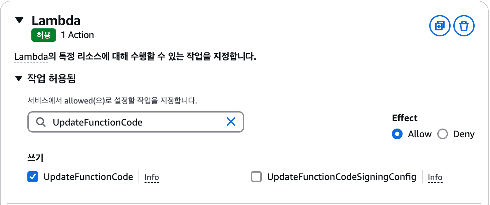
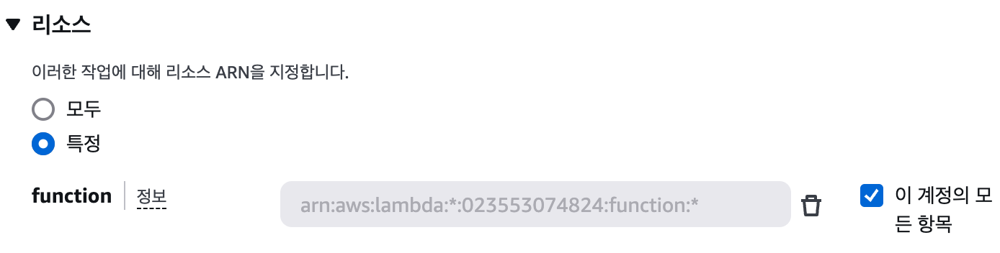

## [4] Lambda CI/CD 파이프라인


Lambda의 CI/CD는 ECS와 약간 차이점이 있습니다. CodeDeploy를 사용하지
않고 CodeBuild에서 바로 Lambda를 업데이트한다는 점입니다. 원칙적으로는
CodeDeploy를 통해 함수를 업데이트하는 것이 올바르지만, 명령어 한 줄을
추가해서 업데이트가 가능하기 때문에 여기서는 간단한 방법을 소개하도록
하겠습니다.

여기에서는 다음의 깃허브 저장소를 내 깃허브 계정으로 포크(Fork)해서
사용하겠습니다.

https://github.com/Indosaram/lambda_sample

해당 저장소의 코드는 Lambda 함수를 정의한 app.py와 이미지를 빌드할
Dockerfile , 그리고 Codebuild를 위한 buildspec.yml 파일로 구성되어
있습니다. ECS와 마찬가지로 Lambda에서도 도커 이미지를 활용한 효율적인
빌드와 배포를 구성해 보겠습니다.

### Codebuild 생성

콘솔에서 Codebuild를 검색해 해당 서비스 페이지로 이동합니다. 그리고
프로젝트 생성 버튼을 클릭합니다.


프로젝트 구성에서 프로젝트 이름에 "my_lambda_build"를 입력합니다.


코드를 불러올 소스 섹션에서는 방금 포크해온 Github 저장소를 선택합니다.


ECS에서 설정했던 것과 마찬가지로, 환경에서는 'Ubuntu'를 운영 체제로
선택하고, 런타임은 'Standard'를 선택합니다. 이미지는 가장 최신 버전인
'7.0'을 선택하고, 이미지 버전은 '항상 최신 이미지'를 사용합니다. 서비스
역할은 '새 서비스 역할'을 선택하고, 역할 이름에 "my-lambda-codebuild"를
입력합니다.


다음 섹션으로 넘어가기 전에, 하단의 '추가 구성'에서 환경 변수 2개를
설정합니다. `REPOSITORY_URI`는 도커 이미지를 푸시할 ECR 저장소의
이름으로 현재 저장소 주소는
`000000000000.dkr.ecr.ap-northeast-2.amazonaws.com/my_lambda`입니다.
`AWS_ACCOUNT_ID`는 AWS의 계정 아이디로 `000000000000`와 같이 저장소
주소 맨 앞의 숫자 12자리를 의미합니다.


Buildspec의 경우는 저장소의 루트 경로에 위치한 buildspec.yml 파일을
찾아서 빌드를 수행하도록 하겠습니다. 이전에 포크해 두었던 저장소를
살펴보면 해당 파일이 이미 존재하는 것을 알 수 있습니다.


해당 파일은 Lambda 이미지를 빌드할 수 있도록 올바르게 수정된 파일입니다.
ECS와는 다르게, 설치 단계인 install과 빌드 이전에 테스트를 수행하는
단계인 `pre-build`가 없이 곧바로 도커 이미지 빌드로 진입하도록 되어
있습니다. 그리고 빌드를 마치고 곧바로 Lambda 함수를 업데이트하는
명령어가 `post_build`에 정의되어 있습니다. 여기서 `--function-name` 은
Lambda 함수의 이름을 의미합니다.

```yaml
version: 0.2

phases:
    build:
        commands:
            - >
                aws ecr get-login-password --region $AWS_DEFAULT_REGION | docker login --username AWS --password-stdin $AWS_ACCOUNT_ID.dkr.ecr.$AWS_DEFAULT_REGION.amazonaws.com
            - docker build -t $REPOSITORY_URI:latest .
            - docker push $REPOSITORY_URI:latest
    post_build:
        commands:
            - aws lambda update-function-code --function-name my_lambda --image-uri $REPOSITORY_URI:latest

artifacts:
    files:
        - "**/*"
    discard-paths: no
```

나머지 설정은 그대로 두고 [빌드 프로젝트 생성] 버튼을 클릭하면 빌드
프로젝트가 생성됩니다.

CodeBuild가 정상적으로 생성되었는지 확인하기 전 CodeBuild 프로젝트에
적절한 권한을 부여해야 합니다. IAM 대시보드에서 '역할'을 클릭하고,
'my-lambda-codebuild'를 선택합니다.


그 다음 '권한 정책' 패널에서 '권한 추가' - '정책 연결'을 클릭합니다.


여기에는 다음과 같은 권한을 추가합니다. 해당 권한은 AWS의 컨테이너
이미지 저장소인 Amazon ECR에 대한 모든 권한을 부여하는 관리형
정책입니다. 이 권한을 가진 IAM 사용자나 역할은 ECR에서 이미지를 읽고
쓰고, 저장소를 관리하고, 이미지 스캔 설정을 변경하는 등 모든 작업을
수행할 수 있습니다. 즉, ECR에 대한 완전한 접근 권한을 갖게 됩니다.

AmazonEC2ContainerRegistryFullAccess


그리고 CodeBuild에서 Lambda 함수를 직접 업데이트할 수 있도록 인라인
정책을 하나 더 추가합니다. 페이지 우측의 [권한 추가] - [인라인 정책
생성]을 클릭합니다.


정책 편집기에서 Lambda를 검색하고 목록에서 선택합니다.


허용할 작업을 지정하기 위해 검색창에 UpdateFunctionCode를 입력하고
하단에 나타난 패널에서 "쓰기" 체크박스에 체크합니다.



그러면 아래쪽에서 다음과 같은 경고가 발생하는 것을 볼 수 있습니다.
기본값으로 "특정"이 체크되어 있는데, 이 정책으로는 Lambda 함수만을
변경할 수 있도록 한다는 의미입니다. 만일 "모두"를 체크하면 해당 계정의
모든 기능에 대한 접근 권한을 얻게 됩니다. 어차피 이 정책으로는
Lambda만을 조정할 것이기 때문에 "특정"을 선택해도 충분합니다.


그 다음 우측의 "이 계정의 모든 항목" 체크박스를 클릭하면 모든 Lambda
함수에 대한 쓰기 권한을 부여할 수 있게 됩니다. 그리고 [다음] 버튼을
클릭해 다음 단계로 이동합니다.



> **NOTE**
>
> "이 계정의 모든 항목"을 선택했을 때의 ARN을 자세히 살펴봅시다.
>
> `arn:aws:lambda:*:023553074824:function:*`
>
> 이 ARN에는 와일드카드(\*)가 2개 포함되어 있는데, 앞에서부터 순서대로 리전과 함수명을 의미합니다. 예를 들어 특정 리전을 조건으로 추가하려면
>
> `arn:aws:lambda:ap-northeast-2:023553074824:function:*`
>
> 과 같이 할 수 있습니다. 만일 내 계정의 전체 함수가 아닌 특정 함수에만 권한을 지정하려면
>
> `arn:aws:lambda:ap-northeast-2:023553074824:function:my_lambda`
>
> 과 같이 하면 됩니다.

최종적으로 만들어진 권한을 검토합니다. 정책 이름으로는
codebuild-lambda-update를 입력하고, [정책 생성] 버튼을 클릭해 해당
역할에 새로운 정책을 추가합니다.


이제 다시 Codebuild 콘솔로 돌아가서 우리가 만든 프로젝트
my-lambda-build의 이름을 클릭해 프로젝트 내부로 이동합니다.


그 다음 우측 상단에서 '빌드 시작'을 클릭해 테스트를 진행할 수 있습니다.


약 1분 정도 기다리면 다음과 같이 빌드가 정상적으로 수행된 것을 확인할 수
있습니다.


### 역할 생성

CodeDeploy로 넘어가기 전에, 해당 서비스에서 사용할 새로운 역할을
생성하겠습니다. 콘솔에서 IAM으로 이동해 "역할" 메뉴에서 [역할 생성]
버튼을 눌러 새로운 역할을 생성합니다.


### CodePipeline 생성 {#codepipeline-생성-2}

CodePipeline으로 Github - CodeBuild - CodeDeploy를 하나로 연결해
보겠습니다. CodePipeline 페이지에서 '파이프라인 생성' 버튼을
클릭합니다.


Step 1에서는 파이프라인 유형을 선택하는데, Build custom pipeline유형을
선택하고 '다음' 버튼을 클릭해 Step2로 넘어갑니다.


Step 2에서는 파이프라인 이름을 "my-lambda-codepipeline"으로 입력합니다.
그러면 하단의 서비스 역할 이름도 자동으로 선택되게 됩니다. 이제 '다음'
버튼을 클릭해 Step3로 넘어갑니다.


Step 3에서는 소스 코드를 어디에서 불러올지를 설정합니다. 소스 공급자
목록 중에서 GitHub(버전 2)를 선택하면 아래에 새 패널들이 나타납니다.
여기서는 ECS에서 CodePipeline을 설정할 때 만들었던 Github 연결을
재사용하는데, 만일 Github와의 연결이 설정되어 있지 않다면 6.3절을
참고하시기 바랍니다.


포크한 저장소 이름과 기본 브랜치를 선택합니다.


트리거는 모든 코드 변경 사항에 대해서 실행되도록 기본값으로 두고
[다음] 버튼을 클릭합니다.


"빌드 -- 선택 사항"에서 파이프라인이 트리거되었을 때 수행할 작업을
선택해야 합니다. 빌드 공급자 밑의 드롭다운 메뉴를 클릭한 다음, 미리
만들어둔 AWS CodeBuild 를 선택합니다. 프로젝트 이름은 이전에 생성해둔
my_lambda_build를 선택합니다. 그리고 [다음] 버튼을 클릭합니다.


Add test stage는 별다른 설정 없이 [다음] 버튼을 클릭해 넘어갑니다.


Step 6는 빌드한 도커 이미지를 배포하기 위한 설정을 하는 단계입니다.
하지만 우리는 이미 CodeBuild에서 새로운 도커 이미지를 Lambda에 적용하는
것까지 완료했기 때문에 이 단계는 건너뛸 수 있습니다. [배포 스테이지
건너뛰기]를 클릭합니다.


파이프라인 설정 내역을 검토하고 마지막으로 하단의 [파이프라인 생성]
버튼을 클릭합니다. CodePipeline 콘솔에서 방금 생성한 파이프라인의 실행
상태를 확인할 수 있습니다. 생성 시 자동으로 빌드가 시작되며 다음 그림과
같이 모두 성공하는 것을 알 수 있습니다.


<blockquote>
    <h3> NOTE: Codepipeline 템플릿 </h3>

AWS CodePipeline에서 제공하는 템플릿은 사용자가 배포, 지속적
통합(CI), 자동화를 쉽게 설정할 수 있도록 미리 정의된 워크플로우입니다.
이 템플릿을 활용하면 복잡한 설정 없이 빠르게 파이프라인을 구축할 수
있습니다.

배포 카테고리에서는 Push to ECR, Deploy to ECS Fargate, Deploy to
CloudFormation 템플릿을 제공합니다. Push to ECR은 새로운 컨테이너
이미지를 Amazon Elastic Container Registry(ECR)로 빌드 및 푸시하는
워크플로우이며, Deploy to ECS Fargate는 ECR에 저장된 이미지를 Amazon
ECS Fargate 클러스터로 배포하는 템플릿입니다. Deploy to
CloudFormation은 AWS CloudFormation 템플릿을 배포하는 자동화
프로세스입니다.

지속적 통합(CI) 카테고리에서는 코드 변경 사항을 자동으로 빌드하고
테스트하는 프로세스를 구축하는 템플릿을 제공합니다. 자동화 카테고리는
배포 및 운영 작업을 자동화하는 다양한 워크플로우를 포함하고 있습니다.

템플릿을 선택하면 해당 카테고리에 맞는 기본적인 설정이 자동으로
적용되므로, 필요에 맞게 커스터마이징하여 사용할 수 있습니다.


</blockquote>

### 실전 테스트

새로운 커밋을 만들고 푸시해 보겠습니다. CodePipeline이 자동으로
빌드되면서 테스트 및 배포까지 수행하는지 테스트해 보겠습니다. 일단 현재
상태의 Lambda는 호출 시 다음과 같은 응답을 받게 됩니다. API 게이트웨이로
연결된 엔드포인트로 요청을 보내 보세요.

```json
{
    "text": "Hello from Lambda!"
}
```

이제 소스 코드의 app.py를 다음과 같이 수정한 다음, 커밋을 만들고
푸시합니다.

```python
import json

def handler(event, context):
    return {
        "statusCode": 200,
        "body": json.dumps({"text": "Updated message from Lambda!"})
    }
```

푸시가 완료되고 나면 CodeCommit과 CodeBuild가 자동으로 트리거됩니다.
빌드까지 완료되고 나면 다시 같은 엔드포인트로 요청을 보내 보겠습니다.
그러면 이번에는 업데이트된 메시지가 도착하는 것을 알 수 있습니다.

```json
{
    "text": "Updated message from Lambda!"
}
```
