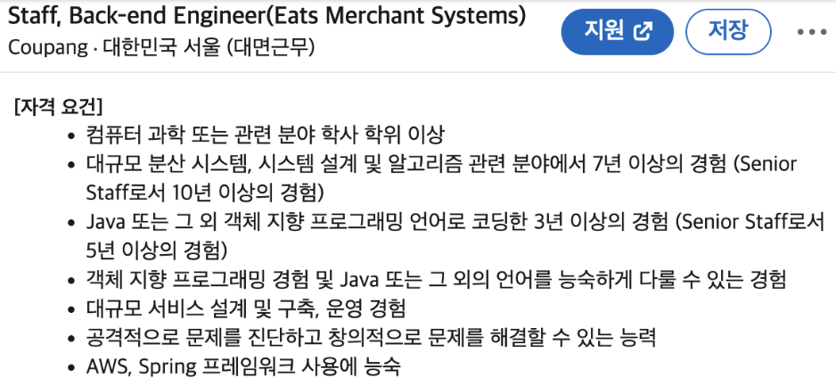
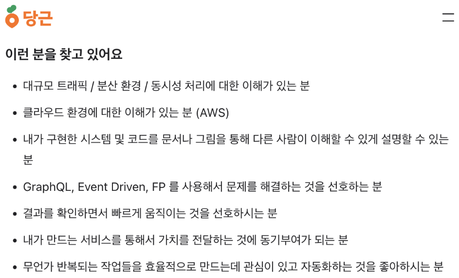
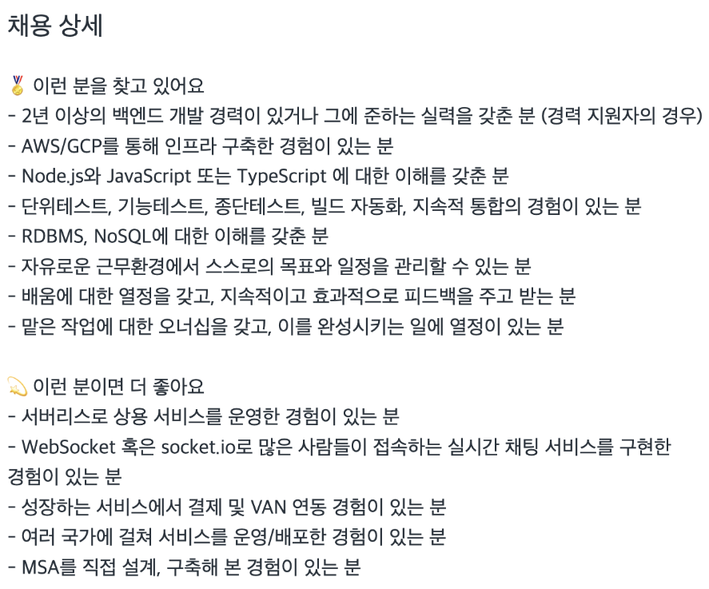

# 7장 마치며

지금까지 AWS의 주요 컴퓨팅 서비스들인 EC2, Lambda에 데이터베이스 서비스
RDS와 오브젝트 스토리지인 S3을 연결해 백엔드 서버를 배포하는 방법을
학습하고, CodePipeline을 이용해 새로운 도커 이미지를 ECS 클러스터에
자동으로 빌드하고 배포하는 과정을 살펴보았습니다. 부록에서는 주니어
개발자들이 앞으로 AWS를 계속 사용하고 공부할 때 알아두면 좋을 몇 가지
주제들을 다뤄보려고 합니다.

## [1] AWS 자격증

AWS에서는 다양한 기능을 제공하고 각 서비스들을 사용하기 위해 해당
서비스에 대한 이해가 필요합니다. 하지만 서비스의 종류가 다양하고 여러
서비스들을 연결해서 사용할 때 여러 가지 구성을 올바르게 설정하는 것은
매우 어려운 일입니다. 그래서 AWS는 자격증을 통해 AWS 서비스에 대한
이해도를 측정하고, AWS 서비스를 사용하는데 필요한 기본적인 지식을 갖춘
사람들을 인증하는 공식 자격증을 운영하고 있습니다.

### 자격증을 따야 할까요?

결론부터 말하자면 '아니오' 입니다. 실제 현업에서 AWS를 사용하는 많은
직군들의 채용 공고를 살펴보면 퍼블릭 클라우드에서의 작업 경험을 묻거나
특정 서비스의 사용 경험이 있는지를 묻는 경우는 있어도 해당 자격증이 지원
요건에 들어가는 경우는 매우 찾아보기 어렵습니다. 예시로 대기업, 유니콘,
소규모 스타트업 세 곳의 채용 공고를 살펴보겠습니다.

쿠팡에서는 AWS 서비스 자체에 대한 능숙한 경험을 자격 요건으로 하고
있습니다. 하지만 다른 자격 요건을 살펴보면 대규모 분산 시스템을 구축하는
능력이 더욱 중요하다는 것을 알 수 있습니다. 따라서 쿠팡에서는 대규모
분산 시스템을 AWS 위에서 구축할 수만 있다면 특별한 자격증을 요구하지는
않습니다.

당근마켓 역시 '클라우드 환경에 대한 이해'라는 표현으로 해당 자격 요건을
두루뭉술하게 표현하고 있습니다.

소규모 스타트업인 클라썸의 경우에는 AWS 또는 GCP를 사용한 경험을 묻고
있습니다. 주목할 점은 선호 자격 요건에 서버리스에 대한 경험을 묻고
있다는 점입니다.

세 회사는 규모나 업력이 크게 다른 IT 기업들인데도 불구하고 채용 공고에서
AWS 또는 클라우드 관련 경험에 자격증을 명시하고 있지 않습니다. 즉.
현업에서는 자격증 유무보다는 전반적인 클라우드 사용 경험, 그리고
클라우드를 사용해 실제 문제를 해결할 수 있는 능력이 더욱 중요하다는
의미입니다. 자격증이 아닌 실제 경험과 능력을 더 중요하게 보는 경향은
비단 AWS에만 국한되지 않습니다. 많은 비전공 출신 개발자들이 정보처리기사
자격증을 따야 하는지를 묻곤 하는데, 중요한 것은 자격증을 취득했는지가
아니라 정보처리기사에서 다루고 있는 주제들에 대해 익숙하게 내용을 활용할
수 있는지입니다. 마찬가지로 AWS 자격증 역시 해당 과정에서 다루고 있는
내용은 협업에서도 매우 유용한 것들입니다. 자격증만을 위해서 공부하기
보다는 실제 업무에 어떻게 활용할 수 있을지를 고민하면서 공부하는 것을
추천합니다.

### 자격증의 종류

AWS 자격증은 크게 기본 자격증과 전문 자격증으로 나뉩니다. 기본 자격증은
AWS 서비스를 사용하는데 필요한 기본적인 지식을 갖춘 사람들을 대상으로
하고, 전문 자격증은 특정 분야의 전문가를 대상으로 합니다. AWS 자격증은
공통적으로 Cloud Practitioner로 시작해 각기 전문 분야로 나누어 집니다.
백엔드 개발자라면 Software Development Engineer 또는 Application
Architect 중 자신에게 맞는 트랙을 선택하면 됩니다. AWS 자격증을 어떤
순서로 공부해야 하는지를 직군별로 정리해 놓은 AWS 공식 자료가 있으니
참고하시길 바랍니다.

https://d1.awsstatic.com/training-and-certification/docs/AWS_certification_paths.pdf

## [2] 모니터링 도구

클라우드 시스템을 사용할 때 중요한 것 중 하나가 바로 모니터링
도구입니다. 모니터링이란 애플리케이션 또는 서버의 상태를 확인하거나
로그를 읽고 문제가 발생했을 때 원인을 분석할 수 있는 등 다양한 기능을
포함합니다. AWS에서도 다양한 사용 사례에 맞는 서비스를 제공하고
있습니다.

### Cloudwatch 사용법

CloudWatch는 가장 기본적인 모니터링 서비스로 주로 상태 감시나 로깅을
위해서 사용합니다. 대부분의 서비스에 연결해서 사용할 수 있기 때문에
AWS에서 반드시 알아 두어야 하는 서비스입니다. 특히 문자, 이메일, 슬랙
알림 등 외부 서비스와 연동해서 경고(Alert)를 실시간으로 개발자에게 알릴
수 있는 기능을 내장하고 있어서 편리합니다.

### Metric Explorer 리소스 모니터링

Metric Explorer는 CloudWatch의 핵심 기능 중 하나로 AWS 리소스의 성능
데이터를 시각적으로 탐색할 수 있습니다. 이를 통해 특정 시간 동안의
리소스 사용량을 확인하거나 여러 리소스 간의 성능을 비교하는 등의 작업을
수행할 수 있습니다.

### 서드파티 모니터링 도구

AWS에서 제공하는 서비스 이외에도 애플리케이션의 상태를 캡처해서 제공하는
트레이스나 로그 및 데이터 시각화 관련 도구 등 다양한 서드파티 모니터링
도구가 존재합니다. 업계에서는 다양한 종류의 도구들을 사용하고 있기
때문에 본인이 원하는 회사에서 사용하는 도구를 공부하는 것을 추천합니다.
대표적인 모니터링 도구를 카테고리별로 정리해보면 다음과 같습니다.

- 트레이싱 : Sentry, Jaeger, Opentelemetry
- 로깅 : Loki, Prometheus
- 시각화 도구 : 그라파나

## [3] IaaS

이 책에서는 AWS 서비스를 구성할 때 콘솔을 통해 직접 설정하는 방식을
사용했습니다. 해당 방식은 클라우드를 처음 접하거나 공부할 때는
편리하지만 서비스를 지속적으로 운영할 때는 불편한 점이 있습니다. 예를
들어, 서비스를 구성하는데 사용한 설정을 다른 사람과 공유하기가 어렵고,
설정을 변경할 때마다 콘솔을 통해 직접 변경해야 하는 등의 문제가
있습니다. 이런 문제를 해결하기 위해 AWS는 IaaS(Infrastructure as a
Service)를 제공합니다. IaaS는 코드를 통해 클라우드 서비스의 구성을
정의할 수 있습니다. AWS에서는 CloudFormation이라는 서비스에서 코드를
작성해 인프라를 구성할 수 있습니다. 이외에도 Terraform이나 Pulumi 같은
서드파티 IaaS도 존재합니다. 현업에서는 주로 Terraform을 사용하는 경우가
많은데, CloudFormation은 AWS 서비스만 정의할 수 있지만 Terraform은 AWS
이외에도 GCP나 Azure 같은 퍼블릭 클라우드를 사용할 때도 Terraform을
사용할 수 있습니다.
